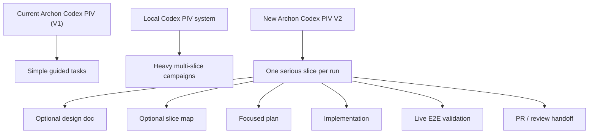
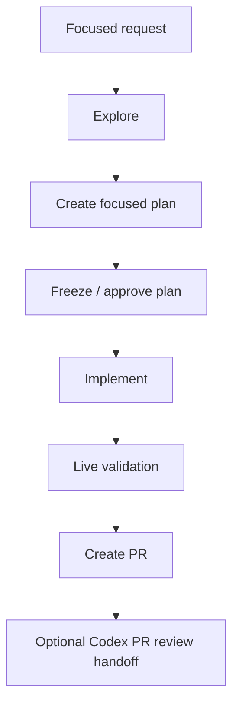
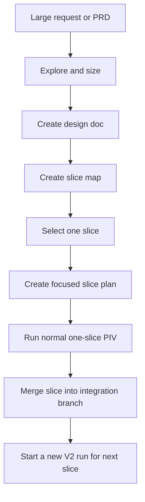
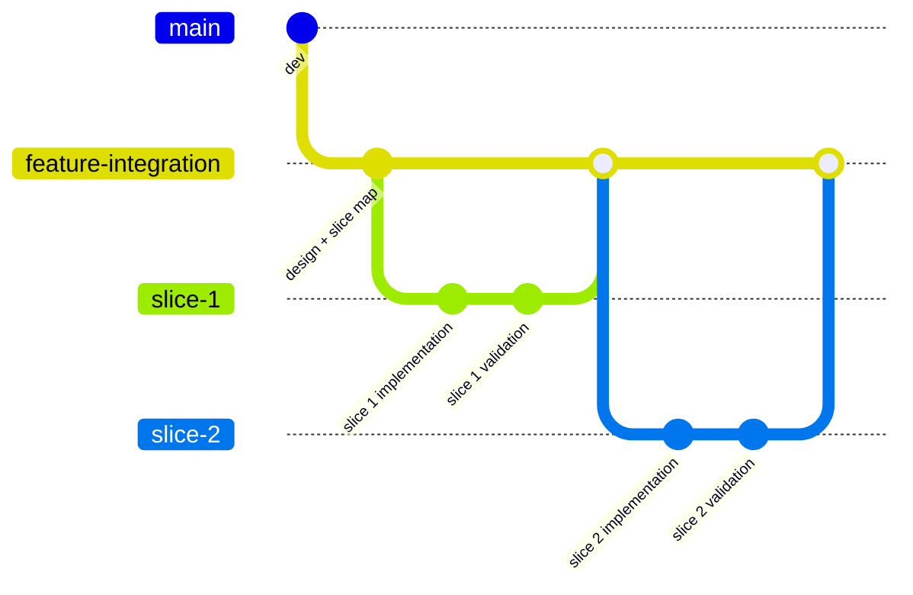

# Design Doc: Codex PIV V2 Workflow

## 1. Purpose

Define a middle-ground Codex PIV workflow for Archon.

This document captures the current design direction:

- keep the current `archon-piv-loop-codex` as the simple V1 lane
- keep the local Codex workflow system for heavy multi-slice campaign work
- create `archon-piv-loop-codex-v2` as an Archon-native one-slice workflow
  with stronger planning, typed gates, live validation, and optional PR-review
  handoff

This is a design anchor, not yet an implementation plan.

## 2. Short Version

Codex PIV V2 should be:

- more structured than current Archon Codex PIV
- much lighter than the local Codex campaign/orchestrator system
- native to Archon's workflow engine and web UI
- scoped to one executable slice per run
- able to create a design doc and slice map when the incoming request is too
  large for one run
- able to execute exactly one selected slice from plan to PR/review handoff



## 3. Workflow Tier Model

### 3.1 V1: Simple Archon Codex PIV

Use `archon-piv-loop-codex` for bounded tasks where a single guided plan is
enough.

Strengths:

- simple Archon-native operator flow
- visible workflow run in Archon
- existing Codex-specific prompt discipline
- low ceremony

Weaknesses:

- still too prompt-signal dependent
- weaker task-state tracking
- limited planning depth
- no first-class design-doc or slicing lane
- live E2E expectations are not strong enough yet

### 3.2 Local Heavy PIV

Keep the local Codex workflow system for large, strict, multi-slice campaigns.

Strengths:

- campaign state
- plan sidecars
- freeze gates
- task status ledger
- snapshot gates
- deterministic validation and closeout artifacts
- strong resume semantics

Weaknesses:

- too heavy for normal Archon product usage
- difficult to explain
- depends on many local scripts and state surfaces
- not yet a simple user-facing workflow model

### 3.3 V2: Middle-Ground Archon Codex PIV

Use `archon-piv-loop-codex-v2` for serious but still one-slice work.

Target:

- one run executes one selected slice
- large requests can be decomposed first, but V2 does not own the whole
  campaign automatically
- the operator manually starts the next V2 run for the next slice
- integration branch accumulation remains explicit and human-controlled

## 4. Operator Model

V2 should support two entry modes.

### Mode A: Focused Request

The input is already small enough.



### Mode B: Large Request / PRD

The input is too large for one PIV run.



V2 should not run all slices automatically. It may create a slice map, but one
workflow run should execute one selected slice.

## 5. Integration Branch Model

For multi-slice features, V2 should assume an explicit integration branch.



Default operating rule:

- one slice branch per V2 run
- one PR per slice, unless the operator explicitly chooses final-integration
  PR style
- merge decisions stay human-owned
- the next slice run starts from the updated integration branch

Integration-branch contract:

- the selected integration branch is not only the branch a slice starts from; it
  is also the default PR base for that slice run
- V2 must persist that branch as durable run context and carry it through branch
  creation, implementation, and finalization
- when V2 uses Archon's existing PR creation helper, it must set the PR base
  explicitly through the runtime surface Archon already honors for base-branch
  selection, such as `$BASE_BRANCH`, `ARCHON_BASE_BRANCH`, or a direct successor
  field wired into the same helper path
- a slice run must not start from `feature-integration` and then silently open
  its PR against repo default branch detection
- if the operator chooses final-integration PR style instead of per-slice PRs,
  that choice should be explicit in slice metadata and finalization behavior

## 6. Artifact Model

V2 should create fewer artifacts than the local heavy workflow, but stronger
artifacts than V1.

Recommended artifacts:

- original PRD: `docs/prd/<feature>.prd.md` when product requirements need a
  durable requirements surface
- design doc: `docs/design/<feature>.md` when the input needs architecture,
  tradeoff, or slicing rationale
- slice map: `docs/plans/<feature>_slice_map.md`
- focused slice plan: `docs/plans/<feature>-s<n>_plan.md`
- advisory planning review sidecar:
  `docs/plans/_advisory-reviews/<feature>-s<n>_plan-peer-review.json`
- canonical frozen-plan review sidecar:
  `docs/plans/_peer-reviews/<feature>-s<n>_plan-peer-review.json`
- implementation review sidecar or PR-review packet after code is written
- live validation evidence: proposed V2 convention
  `$ARTIFACTS_DIR/e2e-reports/*`, to be confirmed in the implementation slice
  before broad adoption
- PR body draft or PR creation payload
- optional PR review handoff packet

Artifact authority should stay explicit:

- the original PRD remains the upstream requirements source; it receives durable
  feedback when requirements, accepted product decisions, or scope boundaries
  change
- the slice map owns campaign-level slice inventory, sequencing, and at-a-glance
  status across slices
- the focused slice plan remains the canonical implementation contract for one
  slice; it owns the frozen plan text, active execution status, tasks,
  validation gates, peer-review state, and closeout notes
- run-scoped validation logs, screenshots, browser traces, and other transient
  proof stay under `$ARTIFACTS_DIR`, not in version-controlled repo paths;
  durable repo docs may summarize or link to that evidence, but should not
  become the raw evidence store

Plan status should not be tracked only inside the PRD. The PRD should receive
durable feedback when a slice changes scope, resolves an important assumption,
or lands. Day-to-day execution state belongs in the slice map and focused slice
plan. This does not replace the current plan-doc-centric convention for frozen
implementation contracts; it scopes that convention to the focused slice plan
instead of the umbrella PRD or slice map.

Avoid in V2 initially:

- full campaign runner state
- automatic cross-slice advancement
- local-heavy snapshot gate machinery
- strict closeout cleanup ladder
- hidden multi-run orchestration

## 7. Plan Template Recommendation

### 7.1 Do Not Use The Current Archon V1 Template Unchanged

The current `archon-piv-loop-codex` embedded plan template is useful because it
is small and direct, but it is too light for V2.

Gaps:

- no frontmatter
- no explicit plan status controls
- no canonical current inputs section
- no unresolved-item/LBA model
- no first-class E2E gate
- no slicing metadata
- no clear doc-surface map
- no structured phase/task status model

It is still appropriate for V1, but V2 needs more control.

### 7.2 Do Not Import The Full Local Template Wholesale

The local workflow-plan template is much stronger, but it is too heavy to paste
directly into an Archon YAML prompt as the normal V2 template.

Strengths worth borrowing:

- ELI5 summary first
- plan status and controls
- explicit current inputs
- planning shape
- acceptance criteria coverage
- outcome evaluation scenarios
- E2E gate
- unresolved items / load-bearing assumptions
- phased execution plan
- documentation surface map

Parts to keep out of V2 initially:

- full sidecar authority language
- full campaign closeout semantics
- strict local workflow cleanup ladder
- broad workflow library internals

### 7.3 Recommended Basis

Create a new **Archon PIV V2 plan template**.

It should be derived from the local workflow-plan template's structure, but
reduced and adapted for Archon-native operation.

Recommended V2 plan sections:

1. YAML frontmatter
2. ELI5 Summary
3. Problem Statement
4. Solution Concept
5. Scope / Non-Goals
6. Current Inputs
7. Design / Architecture Notes
8. Slice Metadata
9. Plan Status & Controls
10. Unresolved Items / LBAs
11. Peer Review Gate
12. Phased Task Plan
13. Code Validation Commands
14. Final Live Validation Plan
15. Documentation Surface Map
16. Risks

Recommended frontmatter fields:

```yaml
---
title: <Feature Slice Plan>
kind: plan
status: draft
created: YYYY-MM-DD
updated: YYYY-MM-DD
origin: <request or parent PRD/design doc>
feature: <feature slug>
slice: <slice id>
parent_prd: docs/prd/<feature>.prd.md
slice_map: docs/plans/<feature>_slice_map.md
peer_review:
  planning_status: not_started
  implementation_status: not_started
  advisory_sidecar: ""
  frozen_plan_sidecar: ""
  implementation_review_artifact: ""
  max_iterations: 3
---
```

Plan status should use a small controlled vocabulary:

- `draft`: plan is still being shaped
- `review_needed`: plan is ready for planning peer review
- `review_revisions`: material review findings are being addressed
- `frozen`: plan is accepted as implementation input
- `active`: implementation is underway
- `implemented`: code is written and code validation has run
- `final_validated`: final live validation has passed or been waived with reason
- `closed`: slice outcome has been fed back to the PRD and slice map

The V2 template should become the serious Archon Codex template. V1 can keep a
lighter template, but both should eventually share the same core contract:

- clear scope
- concrete task list
- task-scoped verification
- live E2E requirement when behavior changes
- explicit out-of-scope boundaries

## 8. Peer Review And Gate Model

V2 should borrow the local heavy workflow's review discipline without importing
the full campaign machinery.

There are two review gates.

### 8.1 Planning Peer Review

Run planning peer review after the focused slice plan is complete and before
implementation starts.

Purpose:

- challenge scope boundaries
- catch missing acceptance criteria or validation proof
- identify load-bearing assumptions
- verify the slice can be implemented independently
- check that PRD feedback and slice-map status are clear

Rules:

- set plan status to `review_needed` before review
- store early advisory review sidecars under `docs/plans/_advisory-reviews/`
- preserve the existing frozen-text convention by storing the final
  implementation-gating plan review under `docs/plans/_peer-reviews/`
- allow up to three revision rounds for material findings
- set status to `frozen` only after review findings are accepted, fixed, or
  explicitly deferred and the canonical frozen-plan sidecar exists
- do not implement from a plan that is still `draft` or `review_revisions`

### 8.2 Implementation Peer Review

Run implementation peer review after code is written and code validation has
run, but before final closeout.

Purpose:

- inspect the actual diff against the frozen plan
- identify regressions, incomplete implementation, and missing tests
- challenge whether validation evidence matches the intended behavior
- decide whether final live validation is sufficient or needs expansion

Rules:

- keep the review scoped to the active slice branch and frozen plan
- allow up to three fix-review cycles for material findings
- keep reviewer findings separate from final live validation evidence
- update the focused slice plan with accepted/deferred findings
- feed durable scope or requirement changes back to the PRD and slice map

## 9. Validation Model

V2 should separate code validation from final validation.

### 9.1 Code Validation

Code validation proves the repository still checks out after implementation.

Examples:

- typecheck
- lint
- unit tests
- targeted integration tests
- generated-default or workflow-bundling checks

The focused slice plan should list the expected commands before implementation
starts and record the actual command results after implementation.

### 9.2 Final Live Validation

V2 should tighten the meaning of end-to-end validation.

Unit tests, mocks, and simulated integration tests are useful but not enough to
prove a feature works in the running system.

Default requirement:

- if a slice changes runtime behavior, the plan must define a live validation
  proof
- the proof should exercise the real app/service path when feasible
- the proof should write or reference evidence under
  `$ARTIFACTS_DIR/e2e-reports/`

Preferred proof order:

1. automated browser or API flow against a running local app
2. real CLI/API smoke against the changed integration path
3. manual UI smoke with agent-runnable supporting proof
4. explicit waiver only when live validation is genuinely not possible

Examples:

- start server, call real endpoint, assert response shape
- start web UI, complete the actual workflow in browser automation
- run CLI command against a real fixture repo and verify generated artifacts
- capture screenshot path plus logs for manual UI confirmation

Non-goal:

- do not treat unit tests as live E2E merely because they cover many layers

This should also be considered for the local workflow planning template as a
separate improvement slice, because the local template already has an E2E gate
but the wording should more strongly prefer live system proof.

## 10. PR Review Integration

V2 should not embed the full `my-codex-pr-review` loop immediately.

Recommended staging:

1. V2 creates a PR or PR-ready payload.
2. V2 emits a clear handoff: PR URL, branch, validation evidence, and whether
   remote Codex PR review is recommended.
3. A later `archon-codex-pr-review` workflow can mirror the local
   `my-codex-pr-review` loop.
4. V2 can optionally call or route to that workflow once the PR-review workflow
   is mature.

Reason:

- remote Codex PR review assumes an existing PR
- it needs GitHub state, branch cleanliness, push access, and repeated polling
- that is a clean downstream gate, not part of the core PIV loop

## 11. Implementation Basis

Recommended basis:

- start from `archon-piv-loop-codex`
- create `archon-piv-loop-codex-v2`
- borrow design and state ideas from the local Codex workflow system
- do not cut over or embed the local heavy workflow as-is
- do not write V2 entirely from scratch unless the V1 YAML becomes harder to
  evolve than to replace

Why:

- current Archon Codex PIV is already Codex-adapted
- it already matches Archon's DAG/workflow UI model
- it is easier to review incremental changes from V1 to V2
- local heavy PIV is better treated as a pattern library than as product code
  to import

## 12. Proposed V2 Build Slices

### Slice 1: V2 Workflow Skeleton

- copy `archon-piv-loop-codex` to `archon-piv-loop-codex-v2`
- rename and describe it as a one-slice serious workflow
- keep behavior close to V1, but add explicit artifact/status rules in the
  workflow prompt
- keep the current `.claude/archon/plans/` contract in Slice 1 unless the
  neutral-path migration lands with every downstream reader in the same slice
- create or update the initial slice map for V2 rollout
- add tests/bundling parity if needed

### Slice 2: Plan Template And Coordinated Plan-Path Migration

- introduce the V2 plan template
- choose the neutral plan path only once and treat it as a workflow-wide
  contract, not a template-only preference
- if V2 moves away from `.claude/archon/plans/`, migrate the writer and every
  downstream reader together: plan creation, refinement, implement setup,
  code review, feedback, and finalization
- do not let V2 write plans to the new path while any downstream node still
  searches only the V1 path
- add slice metadata, plan status controls, peer-review fields, and validation
  sections
- keep V1 untouched unless explicitly migrated

### Slice 3: Typed Phase Gates

- treat typed phase gates as an engine/runtime slice, not only a YAML edit
- replace model-sentinel phase advancement with typed decisions only where the
  runtime actually supports structured loop decisions
- if loop nodes still only support string completion signals, keep the initial
  V2 workflow on explicit sentinel contracts and land typed gates only after
  loop-schema/executor support exists, or after phase boundaries are reshaped
  into node types that already support structured output
- distinguish continue-feedback from phase-advance
- pilot on V2 before changing V1

### Slice 4: Design Doc And Slice Map Mode

- add optional design-doc creation
- add optional slice-map creation
- select exactly one slice for execution
- avoid automatic multi-slice orchestration

### Slice 5: Live E2E Evidence

- require live validation for runtime behavior changes
- define evidence output conventions
- add fallback/waiver rules

### Slice 6: Planning And Implementation Review Gates

- add planning peer-review checkpoint to V2
- add implementation peer-review checkpoint after code validation
- cap material review/fix loops at three iterations
- record review state in the focused slice plan and review sidecars

### Slice 7: Optional PR Review Handoff

- after PR creation, emit a structured handoff for remote Codex PR review
- later integrate with a dedicated Archon PR-review workflow

## 13. Open Questions

- What should the neutral plan path be?
  - candidate: `.archon/plans/{slug}.plan.md`
  - candidate: `docs/plans/{slug}_plan.md`
- Should V2 always write design docs under `docs/design/`, or only when the
  request is too large for a direct plan?
- Slice maps should default to `docs/plans/`; is there any case where a
  design-level slice map belongs under `docs/design/` instead?
- Should V2 create slice PRs directly, or stop at PR-ready payload first?
- Should V1 eventually adopt the V2 core plan template, or remain intentionally
  minimal?
- Should planning peer review run inside Archon V2 itself, or remain a
  sidecar/handoff until the review workflow is mature?
- Should implementation peer review be local-only at first, or should it hand
  off to remote Codex PR review once a PR exists?

## 14. Current Recommendation

Build V2 as an evolution of current Archon Codex PIV, not a port of local heavy
PIV.

Use the local workflow-plan template as the design source for planning quality,
but create a slim Archon-native V2 plan template rather than copying the full
local template.

Use the local heavy workflow's strongest proven operating rules:

- plan status is explicit and durable
- planning peer review happens before implementation
- implementation peer review happens after code validation
- material review loops are capped at three iterations
- code validation and final live validation are separate gates
- durable outcomes feed back to the PRD and slice map

Keep the workflow tiering explicit:

- `archon-piv-loop-codex`: simple guided PIV
- `archon-piv-loop-codex-v2`: one serious slice per run
- local Codex workflow system: strict multi-slice campaign execution

Tags:

- `#codex-piv-v2`
- `#archon-native`
- `#one-slice-per-run`
- `#design-doc-intake`
- `#lightweight-slicing`
- `#live-e2e-required`
- `#borrow-local-discipline`
- `#do-not-port-heavy-orchestrator`
