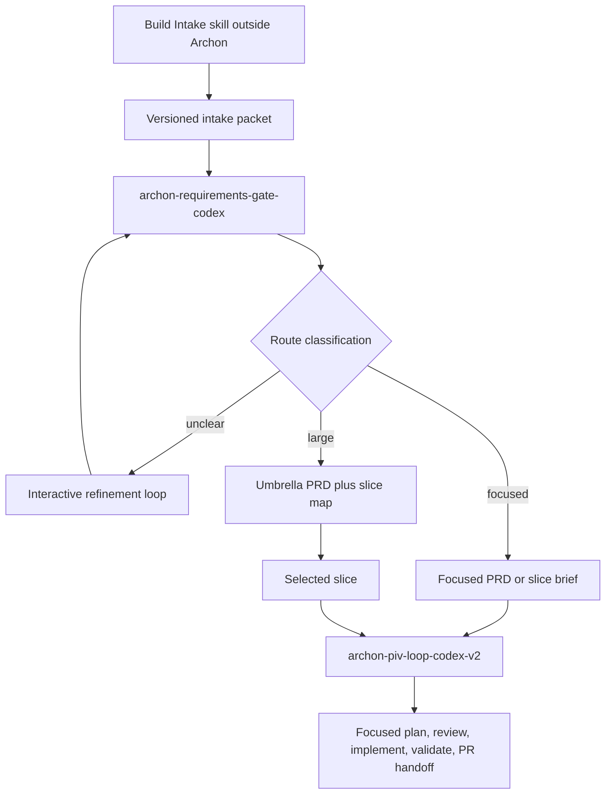

# ELI5 Summary

Archon should not try to turn a vague feature idea directly into implementation.

The clean model is three layers:

1. A Codex Build Intake skill shapes the idea outside Archon.
2. A new Archon requirements gate turns that shaped context into Archon-ready
   requirements artifacts.
3. Archon PIV V2 executes exactly one selected focused slice.

This plan captures the baseline decisions from the recovered May 4 discussion.
It is intentionally a draft contract plan, not an implementation plan for YAML
changes yet.



# Recovered Communication

The full side-chat transcript was not fully visible in local session extraction,
but the core peer-review exchange was recovered from:

`/Users/mase/.codex/sessions/2026/05/04/rollout-2026-05-04T17-01-49-019df382-82bc-7790-abc8-2d2bf40d6a29.jsonl`

Recovered peer-review verdict:

- The direction is sound.
- The separation of intake, requirements gating, and slice execution is the
  right shape.
- The concept is not implementation-ready until routing contracts, artifact
  schemas, and migration boundaries are written down.

The pasted transcript added the missing operator decisions:

- Build Intake and Archon requirements gate should be developed in parallel,
  but connected through explicit contracts.
- The Archon requirements gate is a separate workflow from PIV V2.
- The requirements gate incorporates or calls a Codex-native interactive PRD
  creation/refinement workflow.
- PIV V2 remains the execution workflow and should not become the broad PRD
  creation workflow.
- Design docs are optional support artifacts, not a default route.

# Decisions Locked So Far

- `archon-piv-loop-codex-v2` should not become the PRD creation workflow.
- A new Codex-native Archon workflow should be created, likely named
  `archon-requirements-gate-codex`.
- The existing Claude `archon-interactive-prd` workflow is reference material,
  not the final implementation.
- The Build Intake skill runs outside Archon and produces upstream context.
- The requirements gate consumes the intake packet and promotes it into
  Archon-ready artifacts.
- PIV V2 consumes only a focused PRD, a slice brief, or a selected slice from an
  umbrella PRD and slice map.
- Current PIV V2 Mode B should be revisited because it creates design docs and
  slice maps too early.
- A design doc is not a route. It is an optional support artifact when
  architectural tradeoffs, diagrams, migration strategy, or competing technical
  approaches would overload the PRD or slice map.

# Current Repo Facts

- `.archon/workflows/defaults/archon-interactive-prd.yaml` exists and is
  `provider: claude`.
- `.archon/workflows/defaults/archon-interactive-prd.yaml` already has the
  rough interaction shape we want to adapt: initiate, foundation gate, research,
  deep-dive gate, technical grounding, scope gate, PRD generation, validation.
- `.archon/workflows/defaults/archon-piv-loop-codex-v2.yaml` exists and is
  `provider: codex`.
- The PIV V2 workflow description says it is not for PRD creation and that the
  PIV loop comes after a PRD exists.
- The current PIV V2 Mode B path classifies large inputs, creates a design doc,
  creates a slice map, selects one slice, and then continues into the one-slice
  lane. That behavior now conflicts with the desired requirements-gate boundary.

# Target Workflow Boundaries

## Build Intake Skill

Purpose: conversational shaping before Archon.

Responsibilities:

- brainstorm and challenge the request
- preserve facts, assumptions, decisions, open questions, and evidence
- recommend a route
- produce a versioned, agent-readable intake packet

Non-responsibilities:

- do not claim the work is PIV-ready
- do not create the focused implementation plan
- do not enforce Archon-specific PRD readiness

Draft packet shape:

```yaml
schema_version: build-intake-packet-v1
handoff_status: shaped_not_archon_validated
user_intent: ""
facts: []
assumptions: []
decisions: []
open_questions: []
evidence:
  codebase: []
  external: []
recommended_route: requirements_gate
downstream_notes: []
```

## Archon Requirements Gate

Purpose: Archon-side readiness, PRD creation, and routing.

Proposed workflow name:

`archon-requirements-gate-codex`

Responsibilities:

- validate the intake packet
- classify readiness
- run targeted interactive refinement
- ground technical claims in the codebase
- generate or update formal Archon artifacts
- emit a machine-readable handoff to PIV V2 when ready

Core routing states:

- `needs_refinement`
- `focused_prd_candidate`
- `umbrella_prd_candidate`
- `direct_codex_candidate`
- `not_ready_or_stop`

Primary outputs:

- focused work: `docs/prd/<feature>.prd.md` or a focused slice brief
- large work: `docs/prd/<feature>.prd.md` plus
  `docs/plans/<feature>-slice-map.md`
- optional support: `docs/design/<feature>.md`, only when architecture detail
  would otherwise overload the PRD or slice map

Draft handoff shape:

```yaml
schema_version: archon-requirements-handoff-v1
route: archon_piv_v2
prd_path: docs/prd/<feature>.prd.md
slice_map_path: docs/plans/<feature>-slice-map.md
selected_slice_id: S1
focused_scope: ""
unresolved_assumptions: []
ready_for_piv_v2: true
```

## Codex Interactive PRD Creation

Purpose: Codex-native interactive PRD/refinement process inside the
requirements gate, or as a reusable command called by that gate.

Responsibilities:

- adapt the useful structure of `archon-interactive-prd`
- ask targeted questions only where the intake packet has gaps
- preserve intake evidence instead of restarting from a blank prompt
- generate PIV-compatible PRDs rather than generic PRDs
- support focused and umbrella PRD shapes
- validate technical claims against code before declaring readiness

Open design choice:

- decide whether this is implemented as nodes inside
  `archon-requirements-gate-codex` or as a reusable command that the workflow
  calls.

## Archon PIV V2

Purpose: one selected focused execution lane.

Responsibilities:

- explore the selected slice
- create the focused implementation plan
- run plan review and refinement
- implement
- validate
- produce PR or PR-review handoff

Required changes:

- add an entry guard that accepts only focused PRDs, focused slice briefs, or a
  requirements handoff with one selected slice
- stop and redirect broad or ambiguous inputs to
  `archon-requirements-gate-codex`
- remove, demote, or compatibility-wrap current Mode B design-doc and slice-map
  creation

# Design Doc Rule

Default:

- intake packet plus PRD and, when needed, slice map is enough

Exception:

- create a design doc only when architecture tradeoffs, system diagrams,
  migration strategy, or multiple viable technical approaches are too large for
  the PRD or slice map

Decision:

- "architecture needed" is not a separate default route
- design docs are optional support artifacts

# Implementation Sequence

1. Define `build-intake-packet-v1`.
2. Define `archon-requirements-handoff-v1`.
3. Write the mutually exclusive routing table.
4. Define refinement-loop stop conditions and user decision gates.
5. Draft `archon-requirements-gate-codex`.
6. Adapt interactive PRD logic into Codex-native nodes or commands.
7. Add the PIV V2 entry guard.
8. Demote or remove current PIV V2 Mode B broad-artifact creation.
9. Add workflow fixture tests for routing, artifact paths, handoff shape, and
   legacy Mode B behavior.
10. Run a real sample through intake packet -> requirements gate -> PIV V2
    handoff.

# Open Decisions For Next Iteration

- What exact criteria make work non-trivial enough to require Build Intake and
  the requirements gate?
- Is the intake packet durable, append-only, or disposable after consumption?
- What exact field names and evidence format should `build-intake-packet-v1`
  use?
- What exact field names should `archon-requirements-handoff-v1` use?
- How many refinement loops are allowed before the workflow must stop and ask
  Mase for a decision?
- Is the Codex PRD gate intended to be behaviorally equivalent to
  `archon-interactive-prd`, or only inspired by it?
- What migration boundary should disable current PIV V2 Mode B for broad input?
- Should `direct_codex_candidate` be a real requirements-gate route or only an
  intake recommendation outside Archon?

# Peer Review Baseline

Recovered strict review findings:

- High: routing is not yet mutually exclusive across Build Intake,
  requirements gate, current PIV V2 entrypoints, direct implementation, and
  legacy interactive PRD.
- High: intake packet content is described, but the stable contract is not yet
  defined.
- Medium: Mode B compatibility is incomplete.
- Medium: direct Codex implementation is currently an escape hatch rather than
  a defined route.
- Medium: Claude interactive PRD is reference material, but parity criteria are
  not defined.

Reviewer recommendation:

- approve the architecture conceptually
- block implementation until routing, schemas, stop conditions, and migration
  boundaries are specified

# Next Best Step

Do not start workflow YAML changes yet. First iterate this plan into a contract
plan by defining:

- the intake packet schema
- the requirements handoff schema
- the routing table
- the refinement stop conditions
- the Mode B migration rule

After those are stable, peer review the contract plan and then implement the
requirements gate and PIV V2 guard changes.
