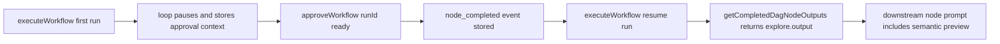

# ELI5 Summary (Read This First)

We fixed a bug where a paused interactive loop could save the wrong text when a
human answered with a completion alias like `ready`.

The unit fix is in place, but the most important missing proof is still this:

> if a loop pauses, the human replies with a completion alias, and the workflow
> resumes, do later nodes see the correct semantic paused output?

This plan is for adding that proof later.

Simple version:

- the test should run the real pause -> approve -> resume path
- it should avoid a real database and real AI
- it should still use the real workflow executor and approval logic
- it should prove that downstream `$node.output` uses the semantic paused
  preview, not the old compatibility preview

# Goal

Add one integration-style automated test that covers the full paused interactive
loop completion-alias path:

1. a loop node pauses with both compatibility and semantic paused previews
2. `approveWorkflow()` completes the loop through `completeOnUserInput`
3. resume preloads prior node outputs from persisted `node_completed` events
4. a downstream node consumes `$loopNode.output`
5. the downstream node receives the preferred semantic preview text

# Why This Exists

Current automated coverage is split across separate units:

- snapshot creation and pause metadata in `packages/workflows/src/dag-executor.test.ts`
- approval mutation behavior in
  `packages/core/src/operations/workflow-operations.test.ts`
- resume preloading behavior in `packages/workflows/src/executor.test.ts`

That is good local coverage, but it does not yet prove that these pieces
compose correctly in one end-to-end state transition.

# In Scope

- one focused integration-style test for pause -> alias approve -> resume ->
  downstream `$node.output`
- reuse real `executeWorkflow()` and real `approveWorkflow()`
- use a stateful in-memory fake store instead of real DB wiring
- use a scripted fake provider instead of real SDK or CLI calls
- assert both the stored node output and the downstream prompt content

# Out Of Scope

- migrating this test to real SQLite in the first pass
- CLI or Web surface rendering assertions
- broad workflow-engine integration harness work
- unrelated paused-output follow-up features
- adding more than one integration-style case before this first path is proven

# Recommendation

Start with a stateful in-memory integration test in `@archon/core`, not a
heavier database-backed end-to-end test.

Why:

- it exercises the real business seam that previously broke
- failures stay local and debuggable
- it avoids setup noise from SQLite, CLI process spawning, and Bun
  cross-package fixture complexity
- it is strong enough to prove the load-bearing data flow

# Proposed Test Home

Primary recommendation:

- add a new focused test file near the approval operation tests, for example:
  `packages/core/src/operations/workflow-approval-resume.integration.test.ts`

Rationale:

- the scenario crosses `approveWorkflow()` plus workflow execution
- the current bug lived at the `@archon/core` pause-resolution boundary
- the test can still import `executeWorkflow()` from `@archon/workflows`

Secondary alternative:

- extend `packages/workflows/src/executor.test.ts` with a more stateful fixture

Tradeoff:

- this keeps execution ownership local to the workflow package, but makes the
  approval mutation path feel bolted on

# Test Shape

Use a small stateful fixture shared by the fake store and fake provider.



Core fixture state:

- current workflow run object
- persisted workflow events array
- paused approval context
- provider call log
- captured downstream prompt text

Core fake store behavior:

- `createWorkflowRun()` creates the initial run
- `pauseWorkflowRun()` flips the run to `paused` and stores approval metadata
- `createWorkflowEvent()` appends durable events to an in-memory list
- `getWorkflowRun()` returns current mutable state
- `resolveWorkflowRunApproval()` or equivalent underlying DB mock behavior
  archives the approval and marks the run as failed
- `findResumableRun()` returns the failed run after approval
- `getCompletedDagNodeOutputs()` derives outputs from stored `node_completed`
  events
- `resumeWorkflowRun()` transitions the run back into running state for the
  resumed execution path

Core fake provider behavior:

- first loop-node execution emits output that leads to a pause
- the pause metadata should include both:
  - `lastOutput: Compatibility preview`
  - `finalAssistantOutput: Semantic summary`
- downstream node execution captures the resolved prompt so the test can assert
  what `$explore.output` became on resume

# Minimal Workflow Under Test

Use a two-node DAG:

1. `explore`
   - interactive loop
   - `complete_on_user_input: ['ready']`
   - pauses after producing a semantic summary

2. `consume`
   - simple prompt node
   - prompt includes `$explore.output`

Example intent:

- `explore` produces a reviewable summary and pauses
- human says `ready`
- `consume` should receive `Semantic summary`, not `Compatibility preview`

# Assertions

The test should prove all of the following:

- first execution pauses the run
- paused approval metadata contains the expected semantic preview
- alias approval writes a `node_completed` event for the loop node
- the persisted loop-node `node_output` equals the preferred paused preview
- resume does not re-run the completed loop node
- downstream node prompt contains `Semantic summary`
- downstream node prompt does not contain `Compatibility preview`
- no accidental clipped marker such as `[truncated]` leaks into the durable
  output unless the fixture explicitly models a truncated semantic preview case

# Phase Outline

| Phase | Goal | Outcome |
| --- | --- | --- |
| P0 | Freeze the harness approach | Decide exact test home and fixture ownership |
| P1 | Build the in-memory stateful fixture | Fake store/provider can drive pause and resume |
| P2 | Add the main alias-completion test | Full pause -> approve -> resume path is proven |
| P3 | Add one narrow regression variant if needed | Optional truncated-preview case only if the first test shows value |

# Implementation Notes

- prefer reusing existing `makeWorkflow()` style helpers where practical
- do not pull in a real DB adapter on the first version
- keep the fake store minimal and stateful rather than mocking every method
  independently
- capture provider prompts explicitly so the final assertion checks actual
  substitution behavior, not just event payloads
- if Bun `mock.module()` isolation becomes noisy, keep this test in its own file
  and run it as a targeted invocation

# Validation Plan

Minimum validation for the future implementation:

- targeted new integration-style test file
- existing approval operation test file
- existing executor or handler test file most adjacent to the touched harness
- `bun run type-check`

Suggested commands:

```bash
bun test packages/core/src/operations/workflow-approval-resume.integration.test.ts
bun test packages/core/src/operations/workflow-operations.test.ts
bun test packages/workflows/src/executor.test.ts
bun run type-check
```

# Risks

- over-mocking could reduce this back into another unit test
- putting the test in the wrong package could create awkward mock boundaries
- using a real DB too early would increase cost without increasing signal much
- the first version may need one small harness helper to keep state handling
  readable

# Definition Of Done

This follow-up is done when:

- one automated test proves the exact pause -> alias approve -> resume ->
  downstream substitution path
- the test fails if the system regresses back to using compatibility preview
  text as durable output
- the harness is small enough that future paused-output regressions can add
  nearby cases without major setup churn

# References

- `packages/core/src/operations/workflow-operations.ts`
- `packages/core/src/operations/workflow-operations.test.ts`
- `packages/workflows/src/executor.ts`
- `packages/workflows/src/executor.test.ts`
- `packages/workflows/src/dag-executor.ts`
- `packages/workflows/src/dag-executor.test.ts`
- `packages/core/src/db/workflow-events.ts`
- `packages/workflows/src/schemas/workflow-run.ts`
