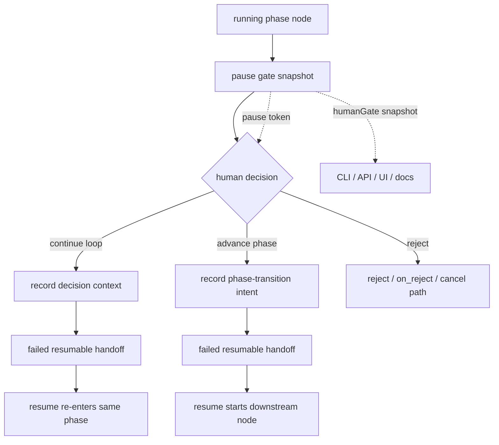

# ELI5 Summary (Read This First)

Right now Archon can pause a workflow, but it does not cleanly distinguish
between these two human moments:

1. "Give me more feedback and stay in this loop."
2. "We are done with this phase. Move to the next one."

That ambiguity leaks into the CLI, API, web UI, and PIV workflows:

- a paused loop can be treated like something you can simply "resume"
- the PIV explore phase depends on a model-emitted phrase instead of an explicit
  runtime transition decision
- some run rows can stay misleadingly `running` after the actual process is gone

The goal of this plan is to make phase transitions explicit and durable without
breaking the rest of the workflow engine.

Simple version:

- today: "paused" means several different things, and "resume" is overloaded
- target: Archon knows whether a paused run needs feedback, approval, or
  explicit phase advancement, and every host surface says the same thing

This plan is deliberately conservative:

- prefer additive contracts over new global statuses
- do not add old-run compatibility shims; old paused/malformed rows are
  abandoned and restarted cleanly
- do not autonomously kill ambiguous cross-process work just because it looks
  stale

# Problem Statement

## User-visible failure

The current PIV loop lets a human accept the PRD checkpoint, yet the resumed run
can re-enter the `explore` loop instead of advancing into the plan phase. That
is not just one bad run. It reveals a generic control-surface problem:

- runtime state does not encode "continue loop" versus "advance phase"
- paused interactive loops and paused approval gates share too much of the same
  operator surface
- `resume` remains available on paused runs even when a human decision is still
  required

## Verified current state

- interactive-loop approval writes only `approval_received` and stores
  `loop_user_input`, then moves the run to `failed` so it can be picked up by
  resume logic in `packages/core/src/operations/workflow-operations.ts`
- interactive-loop resume restores the saved session and starts the next
  iteration using `loop_user_input` in `packages/workflows/src/dag-executor.ts`
- paused and failed are both resumable in
  `packages/workflows/src/schemas/workflow-run.ts`; runtime enforcement also
  gates on that shared constant in
  `packages/core/src/operations/workflow-operations.ts`
- CLI `workflow resume` accepts paused runs and re-runs the workflow from the
  stored working path in `packages/cli/src/commands/workflow.ts`
- foreground web dispatch also checks `findResumableRunByParentConversation()`,
  which currently treats `paused` as resumable in
  `packages/core/src/db/workflows.ts` and
  `packages/core/src/orchestrator/orchestrator-agent.ts`
- API resume, approve, and reject routes expose only generic
  `{ success, message }` envelopes in `packages/server/src/routes/api.ts` and
  `packages/server/src/routes/schemas/workflow.schemas.ts`
- the web dashboard uses paused approval metadata for display and exposes
  approve/reject actions, while failed runs get the Resume action in
  `packages/web/src/components/dashboard/WorkflowRunCard.tsx`
- natural-language approval routing intercepts any non-slash message for paused
  runs and immediately records approval before redispatching in
  `packages/core/src/orchestrator/orchestrator-agent.ts`
- explicit unblock already exists for non-terminal runs through
  `workflow abandon`, API `/abandon`, and `cancelWorkflowRun()`; however the
  paused dashboard card does not currently expose Abandon even though docs imply
  it does
- CLI-owned stale `running` rows are intentionally excluded from orphan cleanup
  in `packages/core/src/db/workflows.ts`, which matches the project rule against
  autonomous lifecycle mutation across process boundaries

## Root cause

The engine currently uses prompt text and metadata conventions to infer intent
that should instead be represented explicitly in runtime state.

The main gaps are:

1. no structured distinction between feedback and phase advancement
2. no stable pause-instance identity for stale-action protection
3. overloaded `resume` semantics
4. surface drift between CLI, API, docs, and web UI
5. incomplete operator guidance for stale-looking CLI-owned rows under the
   cross-process safety rule

The first four are implementation recommendations. The fifth is recovery and
operator-guidance work absorbed into P1 and P4, not a standalone phase.

# Proof Pass Status

The earlier review left four points as "needs deeper proof." They are now in
three buckets:

## Proven in code

- hidden paused-resume bypasses exist beyond CLI/API:
  - path-based resumable lookup still includes `paused`
  - parent-conversation resumable lookup still includes `paused`
  - executor auto-resume still activates paused interactive-loop state
- natural-language paused-message routing is part of the same control surface:
  - arbitrary non-slash paused replies are still treated as approval today

## Narrowed, not fully open anymore

- already-paused rows are not completely stranded today:
  - CLI/API approve, reject, and abandon already provide explicit actions for
    normal paused rows
  - the remaining gap is consistency and discoverability, especially in web UI
- stale/unblock handling is not a greenfield feature:
  - the core cancel/abandon primitive already exists
  - the preferred first-slice answer is to sharpen the existing abandon path,
    path-lock messaging, and paused-card parity instead of adding a new
    reconcile command

## Still follow-up territory

- if later evidence proves existing abandon is not specific enough, open a
  follow-up reconcile command design
- whether stale-run messaging needs host-specific signals beyond status,
  `last_activity_at`, and run id after the first slice ships

# Solution Concept

Introduce an explicit human-decision contract for paused workflow gates, then
apply it to PIV without destabilizing the broader workflow engine.

Core idea:

- keep `paused` meaning "waiting on a human decision"
- make that decision explicit and typed
- keep `resume` as the path for resumable execution states only
- add pause-instance identity so stale actions can be rejected safely
- make PIV phase advancement a runtime-controlled decision instead of a magic
  phrase emitted by the model
- use Abandon/Restart as the recovery path for old, malformed, or stale-looking
  paused rows; do not reconstruct missing gate context



# Design Principles For This Slice

- Prefer additive metadata and response fields over introducing a new global run
  status.
- Keep `approval` node behavior working while the new contract is added.
- Do not rely on stale-time heuristics alone to mutate CLI-owned active rows.
- Do not add compatibility shims for already-paused old rows; operators can
  abandon and restart them.
- Keep the first slice focused on PIV adoption plus generic runtime support;
  migrate other workflow definitions deliberately rather than carrying
  open-ended legacy runtime branches.
- Treat the PIV workflow as the first adopter, not the only caller.
- Accept this clean-cut migration because Archon is currently a single-operator
  tool. If Archon later becomes a shared team service, revisit whether in-flight
  paused rows need an explicit compatibility or migration path.

# In Scope

- harden `resume` semantics so paused runs require a human action first
- define a structured human-decision payload for paused gates
- add pause-instance identity to protect against stale approve/reject/advance
  actions
- make PIV `explore -> plan` advancement explicit in runtime state
- align CLI, API, web UI, and docs around one contract
- sharpen the existing abandon/unblock path for stale-looking CLI-owned runs
  without violating the project lifecycle-mutation rule
- expose Abandon directly on paused dashboard rows
- route malformed paused rows to Abandon/Restart instead of approve/reject
- add transition-focused tests across CLI, API, orchestrator, and executor

# Out Of Scope

- redesigning all workflow statuses from scratch
- broad dashboard redesign beyond what the new contract requires
- generic host-side automation beyond Archon’s own CLI/API/web surfaces
- changing every existing workflow to structured phase gates in the same slice
- automatic cancellation/failure of ambiguous cross-process runs based only on
  age

# Plan Status & Controls

- Status: draft
- Planning mode: plan only, no implementation in this slice
- E2E Gate: required
- Overall feasibility: feasible
- Overall implementation complexity: high
- Peer-review note:
  - v2 review confirmed the prior hidden-bypass, precedence, `PLAN_READY`, and
    P5-scope concerns are resolved
  - remaining non-blocking review points are now folded into frontmatter, P1,
    P3, P4, and P99
  - status stays `draft` until the operator explicitly freezes or activates the
    plan
- Highest-risk points:
  - structured phase decisions for interactive loops
  - contract alignment across CLI, API, web UI, and natural-language routing
  - safe stale-run handling under the no-autonomous-lifecycle-mutation rule
- Rollback principle:
  - add new contract fields and behavior behind explicit workflow opt-in first
  - old or malformed paused rows recover through Abandon/Restart, not shims

# Transition Surfaces Affected

| Surface | Current assumption | Follow-on risk if changed carelessly | Required mitigation |
| --- | --- | --- | --- |
| Resumable-run selectors | `findResumableRun()` and executor activation can still treat paused interactive loops as resumable | CLI/API `resume` hardening can be bypassed by normal workflow re-dispatch | narrow DB selectors and executor auto-resume activation in the same slice as operator-surface changes |
| Executor loop resume | resumed interactive loop always means "next iteration with free text" | phase-advance actions could still re-enter the same loop | add explicit decision kind and branch logic |
| Approval nodes | `approve` writes `node_completed`, loops do not | structured decisions could break approval capture or `on_reject` | keep approval-node semantics separate and additive |
| CLI resume | paused and failed are both resumable | operators can bypass the intended human decision | make paused non-resumable and return action guidance |
| Web dashboard | paused runs show Approve/Reject, failed runs show Resume | response changes can leave UI stale or misleading | expose the new gate snapshot and Abandon action without changing unrelated cards |
| Orchestrator NL approval | any paused message can be treated as approval and redispatch | free-form replies can trigger the wrong transition kind | route through structured gate parsing for opted-in flows |
| Existing abandon / cancel path | explicit unblock primitive already exists for non-terminal runs | plan may over-design a new command when the real gap is targeting, messaging, and UI parity | absorb unblock work into P1/P4 by sharpening the existing abandon flow |
| Path lock | `running` and `paused` rows block; `failed` releases | new state usage can leak or prematurely release locks | keep active-status set stable in first slice |
| Orphan cleanup | CLI-owned `running` rows are excluded on purpose | naive stale cleanup would violate safety policy | use explicit Abandon/Restart guidance, not autonomous mutation |
| Docs / examples | CLI and guide semantics already drift | operator confusion persists after implementation | update docs in the same slice as runtime changes |

# Migration And Clean-Cut Strategy

## Status strategy

Do not add a new top-level workflow status in the first slice.

Reason:

- `running` / `pending` / `paused` / `failed` / `completed` / `cancelled` are
  used widely in queries, dashboard grouping, route schemas, and tests
- introducing a new status would widen the blast radius before the human-gate
  contract is stable

Planned approach:

- keep `paused` for "waiting on human"
- keep `failed` as the resumable handoff state after a valid human decision is
  recorded
- add metadata that explains *why* the handoff exists

## Existing paused-run strategy

Older paused or malformed runs do not get compatibility code.

Migration rules:

- stale, old, or malformed paused rows should be abandoned and restarted
- missing approval context is not reconstructed from logs or prompts
- the UI and CLI should make Abandon/Restart the obvious recovery path
- new structured gates require a current pause token
- stale tokens are rejected instead of falling back to free text
- only opt PIV into explicit phase advancement after runtime support lands
- do not ship strict "paused is non-resumable" behavior until:
  - resumable-run selectors stop auto-picking paused rows by default
  - executor resume activation honors the new gate metadata
  - natural-language paused-run routing uses the same decision contract
  - Abandon/Restart is clearly available for blocked paths

# Phase Summary

| Phase | Goal | Complexity | Outcome |
| --- | --- | --- | --- |
| P0 | Freeze the transition contract and blast-radius boundaries | medium | one explicit state-machine contract |
| P1 | Make paused non-resumable without hidden bypasses | high | CLI/API, DB selectors, executor, and paused-message routing stop disagreeing |
| P2 | Add structured human-decision and pause-token contracts | high | typed decisions and stale-action protection |
| P3 | Move PIV phase advancement to runtime-controlled intent | high | `explore -> plan` no longer depends on magic phrase alone |
| P4 | Align CLI/API/web/docs on one gate contract | medium-high | one operator story across surfaces |
| P99 | Prove transition safety end to end | high | regression-resistant implementation proof |

# Detailed Plan

## Phase 0 — Freeze The Transition Contract

### Goal

Decide exactly which transition states are supported in this slice, and where
migration boundaries must hold.

### Tasks

#### P0-T1 Transition-state inventory

- Map current allowed transitions for:
  - interactive loop pause/resume
  - approval gate approve/reject
  - `on_reject` rework loops
  - natural-language paused-run resume
  - CLI/API/web resume paths
- Produce a canonical transition table for code reviewers and test planning.

#### P0-T2 Freeze the additive contract shape

- Freeze the first-slice metadata additions:
  - `pause_token`
  - `gate_kind`
  - `decision_options`
  - `resume_reason`
  - `transition_intent`
- Freeze the first-slice response additions for CLI/API readback and action
  responses.
- Freeze orchestrator routing rules:
  - structured gates route natural-language replies through the typed decision
    parser, not implicit approval
  - ambiguous free text asks the user to choose a displayed decision
  - malformed paused rows route to Abandon/Restart guidance
- Freeze precedence rules:
  - current `pause_token` plus explicit structured decision wins
  - first accepted decision for the current token wins
  - repeated or stale-token actions are rejected as stale
  - free-text aliases are input conveniences only when mapped into a typed
    decision; they never bypass the token/decision contract

#### P0-T3 Freeze no-break rules

- Keep current top-level statuses unchanged.
- Do not add old-run compatibility shims.
- Keep approval-node capture/on-reject behavior working unchanged unless the new
  contract is explicitly used.

### Primary files likely to change

- `packages/workflows/src/schemas/workflow-run.ts`
- `packages/core/src/operations/workflow-operations.ts`
- `packages/server/src/routes/schemas/workflow.schemas.ts`
- `packages/docs-web/src/content/docs/reference/cli.md`

### Follow-on risks to watch

- if P0 is skipped, later phases may accidentally invent different meanings for
  `approve`, `advance`, `resume`, and `continue`
- if a new status sneaks in here, dashboard and route blast radius expands
  immediately
- if precedence is not frozen here, CLI, web, and natural-language replies can
  race into inconsistent decisions

### Complexity

Medium

---

## Phase 1 — Make Paused Non-Resumable Without Hidden Bypasses

### Goal

Close the operator hole where paused runs can be resumed directly instead of
requiring a human action first, without leaving DB- or orchestrator-level
bypasses behind.

### Tasks

#### P1-T1 Core operation hardening

- change core `resumeWorkflow()` validation so paused runs are not resumable
- return paused-specific guidance that points to the actual gate action

#### P1-T2 Selector and executor hardening

- update resumable-run selectors so paused rows are not implicitly chosen as
  resumable execution handoffs unless the new gate contract explicitly says so
- update executor resume activation so a normal workflow re-dispatch cannot
  silently continue a paused gate through `findResumableRun()`
- include both path-based and parent-conversation resumable selectors

#### P1-T3 Natural-language paused-message routing

- update the paused-conversation routing path so arbitrary follow-up text is not
  auto-treated as approval for structured gates
- route natural-language input through the typed decision contract frozen in P0

#### P1-T4 CLI/API parity

- update CLI `workflow resume` to reject paused runs clearly
- update API resume route to match
- update tests so paused runs are not treated like failed resumable runs

#### P1-T5 Abandon/Restart recovery bridge

- keep an explicit Abandon/Restart path for old, malformed, or blocked paused
  rows while the new gate contract rolls out
- do not add code that tries to infer or reconstruct missing approval context
- fix guidance for malformed paused rows so the suggested recovery action matches
  the handlers that actually work
- improve path-lock errors to name the blocking run id, status, and the
  operator-owned abandon action
- preserve the no-autonomous-lifecycle-mutation rule:
  - do not fail/cancel non-terminal rows across process boundaries based on
    stale-time guesses
  - keep same-process SIGINT/SIGTERM cleanup behavior intact
- do not add PID/TTY-based stale classification in this slice
- verify that explicit abandon succeeds even when a path-locking run is still
  recorded as non-terminal, and that follow-on dispatch no longer selects that
  lock

#### P1-T6 Internal caller review

- confirm web dashboard already only shows Resume for failed runs
- confirm no internal caller depends on paused resume succeeding after the
  structured gate path is in place

### Primary files likely to change

- `packages/core/src/operations/workflow-operations.ts`
- `packages/workflows/src/schemas/workflow-run.ts`
- `packages/core/src/db/workflows.ts`
- `packages/workflows/src/executor.ts`
- `packages/cli/src/commands/workflow.ts`
- `packages/server/src/routes/api.ts`
- `packages/core/src/orchestrator/orchestrator-agent.ts`
- `packages/cli/src/commands/workflow.test.ts`
- `packages/server/src/routes/api.workflow-runs.test.ts`

### Upstream / downstream impact

- upstream: active execution logic and resume detection must now agree with
  operator surfaces
- downstream: stricter pause semantics are safe only if Abandon/Restart is clear
  for old or malformed rows

### Complexity

High

---

## Phase 2 — Add Structured Human Decisions And Pause Tokens

### Goal

Represent paused-gate intent explicitly so the runtime can distinguish loop
feedback from phase advancement and reject stale actions safely.

### Tasks

#### P2-T1 Extend approval context into a gate snapshot

- extend paused metadata to carry:
  - gate kind (`approval`, `interactive_loop_feedback`, `interactive_phase_gate`)
  - pause token / pause instance id
  - allowed decisions
  - optional free-text note

#### P2-T2 Add structured decision requests

- define additive request bodies that can express:
  - `continue`
  - `advance`
  - `approve`
  - `reject`
- keep `comment` / `reason` fields only as user note fields attached to typed
  decisions, not as implicit decision selectors

#### P2-T3 Persist resumable intent

- when a valid decision is recorded, write enough metadata for the executor to
  know why the run is now resumable
- keep `failed` as the handoff state in this slice, but distinguish true errors
  from human-decision handoffs in metadata

#### P2-T3b Route orchestrator messages through the same contract

- make paused-conversation natural-language handling consume the same gate kind,
  allowed decisions, and pause-token semantics used by CLI/API actions
- avoid creating a second approval dialect in the orchestrator path

#### P2-T4 Stale-action protection

- require the current pause token on structured actions where available
- reject stale approve/reject/advance attempts with a dedicated error contract
- do not fall back to unstructured continuation when a structured gate has a
  stale or missing token

### Primary files likely to change

- `packages/workflows/src/schemas/workflow-run.ts`
- `packages/core/src/db/workflows.ts`
- `packages/core/src/operations/workflow-operations.ts`
- `packages/server/src/routes/api.ts`
- `packages/server/src/routes/schemas/workflow.schemas.ts`
- `packages/web/src/lib/api.ts`
- `packages/core/src/orchestrator/orchestrator-agent.ts`

### Follow-on risks to watch

- token enforcement will invalidate old clients or old paused rows; that is an
  accepted migration tradeoff, so Abandon/Restart guidance must be good
- mixing free-text and structured decisions can create ambiguity if precedence is
  not frozen in P0
- metadata bloat can create drift if multiple snapshot builders exist
- if the orchestrator path is not switched at the same time, structured CLI/API
  decisions and free-text paused replies will disagree in production behavior

### Complexity

High

---

## Phase 3 — Make PIV Phase Advancement Explicit

### Goal

Remove the load-bearing dependency on model-emitted "PLAN_READY" for PIV phase
transition and move that decision into the runtime contract.

### Tasks

#### P3-T1 Choose the first-slice adoption boundary

Preferred first-slice recommendation:

- add runtime support for structured phase-gate decisions
- opt `archon-piv-loop-codex` into it first
- leave other workflow definitions unchanged in this slice unless they are
  explicitly migrated

#### P3-T2 Update PIV explore semantics

- replace the current "human says ready -> model emits PLAN_READY" dependency as
  the only advancement mechanism
- make the paused gate expose explicit "continue exploring" versus
  "advance to create plan" semantics
- remove `PLAN_READY` as an active runtime advancement signal for adopted PIV
  workflows
- keep "ready" / "create the plan" only as human-input aliases that map to the
  typed `advance` decision
- do not keep both `PLAN_READY` and typed `advance` as independent safety nets;
  dual mechanisms can disagree
- target authoring shape for schema review:

  ```yaml
  interactive: true
  decision_gate:
    gate_kind: phase_decision
    decisions:
      - id: continue
        resume_reason: loop_feedback
      - id: advance
        transition_intent: phase_advance
  ```

  Exact field names should be frozen in P0/P2, but the implementation must
  preserve this shape: a loop declares typed decisions directly instead of
  asking the model to emit a magic sentinel.

#### P3-T3 Keep plan creation isolated

- preserve `create-plan` as a fresh-context node
- ensure the transition from explore to detect/create-plan uses the explicit
  decision metadata, not implicit prompt reuse

#### P3-T4 Review Claude parity boundary

- decide whether the Claude PIV workflow adopts the same gate contract in the
  same slice or whether Codex PIV is the pilot
- default recommendation: implement runtime support generically, adopt on Codex
  PIV first, then evaluate Claude parity once proven

### Primary files likely to change

- `.archon/workflows/defaults/archon-piv-loop-codex.yaml`
- `.archon/workflows/defaults/archon-piv-loop.yaml` (if parity is included)
- `packages/workflows/src/dag-executor.ts`
- `packages/workflows/src/loader.ts`
- `packages/workflows/src/schemas/loop.ts`
- `packages/workflows/src/dag-executor.test.ts`

### Upstream / downstream impact

- upstream: workflow authoring rules for interactive loops may expand
- downstream: PIV create-plan entry becomes deterministic and less prompt-fragile

### Complexity

High

---

## Phase 4 — Align CLI, API, Web UI, And Docs

### Goal

Make every operator surface tell the same story about paused gates, decisions,
and resume eligibility.

### Tasks

#### P4-T1 Shared gate readback contract

- expose one canonical readback shape on existing run-detail surfaces
- avoid separate ad hoc formatting logic in CLI, API, and web UI

#### P4-T2 Update mutating action responses

- add structured response fields so action callers know:
  - what decision was recorded
  - whether the run is now resumable
  - whether a token mismatch occurred
  - what the next correct action is

#### P4-T3 Align web UI affordances

- review paused banner text, action labels, and any follow-up prompts
- ensure paused/failed distinction remains clear after the new contract lands
- resolve the current parity gap where docs describe abandoning paused runs, but
  the paused dashboard card only exposes Approve/Reject
- expose Abandon directly on paused dashboard rows
- make malformed paused-row guidance point to Abandon/Restart rather than
  approve/reject
- ensure dashboard and docs let operators identify the blocking run id before
  abandoning it
- state the follow-up trigger:
  - open a separate reconcile-command plan only if P1/P4 still leave operators
    unable to safely identify and abandon the correct blocking run

#### P4-T4 Resolve doc drift in the same slice

- CLI reference
- authoring-workflows guide
- any PIV README/execution notes that describe phase handoff or approval flow
- add an Unreleased CHANGELOG note for the operator-visible clean-cut migration:
  old or malformed paused rows must be abandoned and restarted, not resumed

### Primary files likely to change

- `packages/server/src/routes/api.ts`
- `packages/server/src/routes/schemas/workflow.schemas.ts`
- `packages/web/src/lib/api.ts`
- `packages/web/src/components/dashboard/WorkflowRunCard.tsx`
- `packages/docs-web/src/content/docs/reference/cli.md`
- `packages/docs-web/src/content/docs/guides/authoring-workflows.md`
- `.archon/workflows/defaults/archon-piv-loop-codex.README.md`
- `CHANGELOG.md`

### Follow-on risks to watch

- additive API response fields are low risk; replacing existing fields is not
- generated web types must be regenerated after route-schema changes
- docs must not describe CLI behavior that only the web path provides
- docs must not describe a dashboard Abandon action until the paused card
  actually exposes it

### Complexity

Medium-high

---

## Phase 99 — Prove Transition Safety End To End

### Goal

Show that the four implementation recommendations, plus absorbed recovery work,
do not break adjacent workflow behavior.

### Proof matrix

#### P99-T1 Interactive loop structured-gate proof

- structured interactive gates pause and continue correctly
- old paused runs without structured metadata are guided to Abandon/Restart

#### P99-T2 PIV phase advancement proof

- PIV explore can continue multiple iterations
- explicit "advance to plan" decision resumes into downstream planning, not back
  into exploratory repo rereads
- `PLAN_READY` no longer acts as a competing advancement path in adopted PIV
  workflows

#### P99-T3 Approval-node parity proof

- standard approval nodes still capture response correctly
- `on_reject` retry / cancel behavior still works

#### P99-T4 CLI / API / web parity proof

- paused run shows consistent gate message and next action
- paused runs cannot be resumed directly
- failed resumable runs can be resumed
- paused dashboard rows expose Abandon directly
- malformed paused rows guide to Abandon/Restart

#### P99-T5 Orchestrator natural-language routing proof

- free-text replies on structured gates route through typed decision parsing
- ambiguous replies ask for a concrete decision instead of implicit approval
- stale-token or repeated replies are rejected consistently
- concurrent decisions against the same `pause_token` are deterministic:
  first accepted decision wins, and the second action is rejected as stale

#### P99-T6 Safety-rule proof for stale CLI runs

- stale-looking active CLI rows do not get auto-failed
- operator can explicitly abandon and restart from the blocking run id
- explicit abandon succeeds when a path-locking run is still recorded as
  non-terminal, and follow-on dispatch no longer selects that lock

### Suggested verification homes

- `packages/workflows/src/dag-executor.test.ts`
- `packages/workflows/src/executor.test.ts`
- `packages/core/src/operations/workflow-operations.test.ts`
- `packages/core/src/orchestrator/orchestrator-agent.test.ts`
- `packages/cli/src/commands/workflow.test.ts`
- `packages/server/src/routes/api.workflow-runs.test.ts`

### Complexity

High

# Feasibility And Complexity Assessment

## Feasibility

Feasible, with one important constraint:

- the slice should stay additive for schemas/API shape, but clean-cut for old
  paused rows
- the structured gate contract must land before or with strict paused-resume
  hardening
- the PIV workflow should be the first adopter of structured phase decisions
- cross-process stale-run handling must remain operator-driven, not heuristic
  auto-mutation
- executor selectors and natural-language paused-message routing must be treated
  as part of the control surface, not follow-up cleanup
- old paused or malformed rows do not need compatibility code; Abandon/Restart
  is the recovery path

## Complexity by recommendation

| Recommendation | Feasibility | Complexity | Why |
| --- | --- | --- | --- |
| 1. Make `resume` failed-only | medium-high | high | only safe if core ops, DB selectors, executor activation, and paused-message routing change together |
| 2. Add structured loop decisions | medium-high | high | touches metadata, request bodies, stale-action safety, and executor behavior |
| 3. Make `explore -> plan` explicit | medium-high | high | requires runtime decision support plus PIV workflow adoption |
| 4. Align CLI/API/UI/docs and absorbed unblock affordances | high | medium-high | broad but mostly additive once the contract is frozen; uses existing abandon primitive instead of a new reconcile command |

## Recommended delivery order

1. P0 contract freeze
2. P2 structured decisions and pause tokens
3. P1 paused non-resumable without hidden bypasses
4. P3 PIV explicit phase advancement
5. P4 surface parity
6. P99 transition proof

# References

- `.archon/workflows/defaults/archon-piv-loop-codex.yaml`
- `.archon/workflows/defaults/archon-piv-loop-codex.README.md`
- `packages/workflows/src/dag-executor.ts`
- `packages/workflows/src/executor.ts`
- `packages/workflows/src/schemas/loop.ts`
- `packages/workflows/src/schemas/workflow-run.ts`
- `packages/core/src/db/workflows.ts`
- `packages/core/src/operations/workflow-operations.ts`
- `packages/core/src/orchestrator/orchestrator-agent.ts`
- `packages/cli/src/commands/workflow.ts`
- `packages/cli/src/commands/isolation.ts`
- `packages/server/src/routes/api.ts`
- `packages/server/src/routes/schemas/workflow.schemas.ts`
- `packages/web/src/lib/api.ts`
- `packages/web/src/components/dashboard/WorkflowRunCard.tsx`
