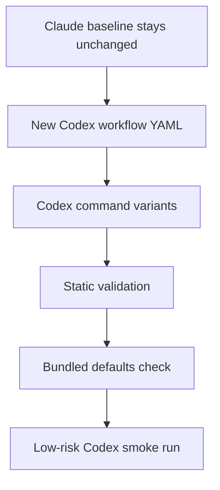

# ELI5 Summary (Read This First)

Archon already has a strong Claude workflow for "take this existing plan and turn
it into a PR." This plan is about building a Codex-native version that uses
Codex models and Codex-safe workflow controls without weakening the Claude
baseline.

Simple version:

- keep the existing Claude workflow as the baseline
- add a separate `archon-plan-to-pr-codex` workflow instead of mutating the
  baseline
- validate the new workflow statically and with a controlled smoke run
- do not claim Claude-quality parity from the adaptation alone

`archon-piv-loop-codex` is not treated as proof that Codex plan-to-PR will be
good enough. It is only the current local benchmark for what a Codex-adapted
workflow looks like: explicit provider, `xhigh` reasoning, Codex-specific
prompt discipline, and no fake parity for Claude-only node controls.

# Problem Statement

`archon-plan-to-pr` is currently usable as a Claude-oriented autonomous
implementation and PR workflow, but it is not a Codex-native workflow.

The main hard blocker is that the implementation node explicitly selects a
Claude model:

```yaml
- id: implement-tasks
  command: archon-implement-tasks
  depends_on: [confirm-plan]
  context: fresh
  model: claude-opus-4-6[1m]
```

Because Archon infers provider from model names, that node routes to Claude even
if the surrounding conversation or config defaults to Codex. A real Codex version
must remove that provider leak and make the Codex provider explicit.

The softer issue is prompt quality. Several commands still assume Claude-flavored
surfaces such as `CLAUDE.md`, `.claude/agents`, and `TodoWrite`. Some of that is
valid repo guidance, but it must be expressed as compatibility guidance rather
than a requirement that every repo adopt Codex/AGENTS naming.

# Current State

Verified surfaces:

- `archon workflow list --json` lists both the current `archon-plan-to-pr` and
  the existing `archon-piv-loop-codex`.
- `archon-plan-to-pr` has no workflow-level `provider`, so it falls back to the
  configured assistant unless a node-level model infers a provider.
- `implement-tasks` has `model: claude-opus-4-6[1m]`, which forces that node to
  Claude.
- Archon warns/ignores Claude-only node controls on Codex. Current unsupported
  Codex node controls include `hooks`, `mcp`, `skills`, `agents`,
  `allowed_tools`, and `denied_tools`.
- Archon CLI workflow execution defaults to worktree isolation unless
  `--no-worktree` is used.
- `--branch` creates or reuses a named isolated worktree; unique branch names are
  required for any controlled smoke run.

# Goals

- Add a real Codex-native plan-to-PR workflow without weakening or replacing the
  existing Claude baseline.
- Keep model reasoning effort at `xhigh` for the Codex workflow.
- Preserve compatibility with repos that only have `CLAUDE.md`.
- Avoid pretending Codex supports Claude-only workflow controls.
- Produce a small, reviewable conversion slice that can be validated before any
  production use.

# Non-Goals

- Do not rewrite the existing `archon-plan-to-pr` baseline in this slice.
- Do not require all repos to add `AGENTS.md`.
- Do not add per-node Codex hook/tool-restriction parity unless Archon runtime
  support actually exists.
- Do not declare Codex quality parity from static validation alone.
- Do not run a competitive Claude-vs-Codex implementation review as part of this
  plan.

# Proposed Workflow Shape

Create a new default workflow:

```yaml
name: archon-plan-to-pr-codex
provider: codex
modelReasoningEffort: xhigh
```

Start from the existing `archon-plan-to-pr` DAG, but make these changes:

- remove all Claude model overrides from Codex workflow nodes
- use Codex-tuned command variants for high-risk prompt nodes
- keep provider-independent script nodes such as `github-pr`
- preserve the same broad lifecycle: setup, confirm, implement, validate,
  finalize PR, review, fix review findings, summarize

Baseline node classification:

| Baseline node | Baseline surface | Codex treatment | Reason |
| --- | --- | --- | --- |
| `plan-setup` | `archon-plan-setup` | provider-neutral | grep found no Claude provider/model/tool assumptions; reads plan and writes context |
| `confirm-plan` | `archon-confirm-plan` | provider-neutral, verify during implementation | grep found no Claude provider/model/tool assumptions; still read once for drift before finalizing |
| `implement-tasks` | `archon-implement-tasks` | `archon-implement-tasks-codex` | high-risk autonomous implementation node needs Codex stop/scope discipline even though prompt text is mostly provider-neutral |
| `validate` | `archon-validate` | provider-neutral | validation prompt is command/test oriented, not provider-specific |
| `compose-finalize-pr` | `archon-compose-finalize-pr` | provider-neutral | writes deterministic PR artifacts and explicitly avoids direct `gh pr create` |
| `finalize-pr` | `github-pr` script | provider-independent script | Bun script applies PR artifacts; not an AI prompt |
| `review-scope` | `archon-pr-review-scope` | `archon-pr-review-scope-codex` | currently frames repo guidance as `CLAUDE.md`; needs `AGENTS.md`/`CLAUDE.md` compatibility wording |
| `sync` | `archon-sync-pr-with-main` | provider-neutral | git/PR sync prompt has no Claude provider/model/tool assumptions |
| `code-review` | `archon-code-review-agent` | `archon-code-review-agent-codex` | currently says `CLAUDE.md compliance`; should become repo-guidance compliance |
| `error-handling` | `archon-error-handling-agent` | `archon-error-handling-agent-codex` | currently reads `CLAUDE.md` error rules; should read available repo guidance without implying Claude provider |
| `test-coverage` | `archon-test-coverage-agent` | provider-neutral | test-quality review prompt has no Claude provider/model/tool assumptions |
| `comment-quality` | `archon-comment-quality-agent` | provider-neutral | comment-quality review prompt has no Claude provider/model/tool assumptions |
| `docs-impact` | `archon-docs-impact-agent` | `archon-docs-impact-agent-codex` | currently checks `CLAUDE.md` and `.claude/agents`; needs broader docs/instruction-surface handling |
| `synthesize` | `archon-synthesize-review` | provider-neutral | aggregates review artifacts and posts the review comment; "agent" means review role, not Claude subagent |
| `implement-fixes` | `archon-implement-review-fixes` | `archon-implement-review-fixes-codex` | contains `TodoWrite`; needs provider-neutral progress/scope wording |
| `workflow-summary` | `archon-workflow-summary` | provider-neutral | full read shows `CLAUDE.md` only in example follow-up/docs rows, not as Claude-provider compliance; keep provider-neutral unless Phase 2 finds stronger provider coupling |

The Codex workflow should not use `archon-assist-codex` internally. Assist remains
a fallback lane, not the plan-to-PR engine.

# PIV Pattern Transfer Rules

`archon-piv-loop-codex` is an interactive workflow. `archon-plan-to-pr-codex`
is autonomous. Only transfer the patterns that fit an autonomous DAG.

Transfer:

- explicit `provider: codex`
- workflow-level `modelReasoningEffort: xhigh`
- Codex-specific stop discipline
- scope-leak guardrails, including per-file staging where a node commits changes
- direct, numbered output contracts for implementation and validation handoffs
- negative guardrails that tell Codex when not to declare completion

Do not transfer:

- interactive loop nodes just because PIV uses them
- `gate_message` semantics
- `<promise>` signal contracts used to move between interactive PIV phases
- human pause/resume semantics where the plan-to-PR lane is meant to proceed
  autonomously

Autonomous replacement:

- use deterministic artifacts, command outputs, and workflow node completion as
  the phase boundary
- reserve human gates for explicit future approval-node design, not for the
  first Codex plan-to-PR conversion

# Repo Guidance Compatibility

The Codex command prompts should use this guidance rule:

1. Read `AGENTS.md` if it exists.
2. Read `CLAUDE.md` if it exists.
3. If only `CLAUDE.md` exists, treat it as valid repo-local guidance.
4. Do not fail, warn, or push the repo to add `AGENTS.md` just because this is a
   Codex run.
5. Do not assume Codex auto-loaded `CLAUDE.md`; read it explicitly when repo
   conventions, architecture, or validation rules matter.

This matches the current reality: many repos already encode project rules in
`CLAUDE.md`, and Mase has a global fallback for Codex/Claude instruction
compatibility. The workflow should benefit from that without turning it into a
repo migration requirement.

Path convention note:

- existing `.claude/` paths may be historical repo conventions rather than
  proof that a node must run on the Claude provider
- do not rename `.claude/` artifact paths in this slice unless the path itself
  blocks Codex behavior
- where user-facing wording mentions `.claude/`, explain whether it is a
  compatibility path, repo-guidance path, or provider-specific path

# Adaptation Readiness Checks

The adaptation should be judged by whether it is actually Codex-native and safe
to try, not by whether it already proves better than Claude.

Readiness evidence:

| Dimension | Required evidence |
| --- | --- |
| Provider routing | workflow-level `provider: codex`; no Claude model aliases in any Codex workflow node |
| Reasoning effort | workflow-level `modelReasoningEffort: xhigh`; no unjustified node-level downgrade |
| Prompt compatibility | Codex command variants do not force `AGENTS.md` and treat `CLAUDE.md` as valid repo guidance |
| Runtime honesty | workflow does not claim unsupported Codex `hooks`, `mcp`, `skills`, `agents`, `allowed_tools`, or `denied_tools` controls |
| Bundling | bundled defaults regenerate cleanly and bundled-default tests prove discovery |
| Smoke readiness | one low-risk Codex-only run can create an isolated worktree and reach a clear terminal state or clear failure |



# Implementation Plan

## Phase 1: Static Codex Workflow And Command Scaffold

- create `archon-plan-to-pr-codex.yaml`
- set `provider: codex`
- set `modelReasoningEffort: xhigh`
- remove Claude model overrides
- reference provider-neutral baseline commands only where the classification table
  says provider-neutral
- create the required `*-codex.md` command files before running workflow
  validation; these can start as mechanical copies with obvious Claude-provider
  wording removed, then Phase 2 hardens them
- ensure the workflow is discoverable and validates

Verification:

```bash
bun run cli validate workflows archon-plan-to-pr-codex --json
```

## Phase 2: Codex Prompt Adaptation

- add Codex-specific command variants for implementation, review scope, review
  agents, docs impact, and review fixes
- replace Claude-branded compliance language with "repo guidance compliance"
- keep `CLAUDE.md` as a first-class valid repo guidance file
- remove `TodoWrite` wording
- add Codex-specific stop/scope/validation discipline
- re-confirm every provider-neutral command before finalizing the table; do not
  trust the initial grep result as permanent evidence

Verification:

```bash
rg -n "TodoWrite|full Claude Code capabilities|model: claude|sonnet|opus|haiku" \
  .archon/workflows/defaults/archon-plan-to-pr-codex.yaml \
  .archon/commands/defaults/*-codex.md

rg -n "model:|modelReasoningEffort:" \
  .archon/workflows/defaults/archon-plan-to-pr-codex.yaml

rg -n "Claude Code capabilities|TodoWrite|CLAUDE\\.md Compliance|CLAUDE\\.md compliant|Follows CLAUDE\\.md|CLAUDE\\.md rules to check|\\.claude/agents" \
  .archon/commands/defaults/archon-plan-setup.md \
  .archon/commands/defaults/archon-confirm-plan.md \
  .archon/commands/defaults/archon-validate.md \
  .archon/commands/defaults/archon-compose-finalize-pr.md \
  .archon/commands/defaults/archon-sync-pr-with-main.md \
  .archon/commands/defaults/archon-test-coverage-agent.md \
  .archon/commands/defaults/archon-comment-quality-agent.md \
  .archon/commands/defaults/archon-synthesize-review.md \
  .archon/commands/defaults/archon-workflow-summary.md
```

Expected result:

- no Claude model aliases or `claude-*` model strings in the Codex workflow
- `modelReasoningEffort: xhigh` appears at workflow level
- no per-node `modelReasoningEffort` downgrade exists unless explicitly
  justified in the workflow comments
- provider-neutral commands have no Claude-provider compliance wording; plain
  `CLAUDE.md` repo-doc examples are acceptable only when they are not framed as
  a Claude runtime requirement

## Phase 3: Runtime Guardrails Without Fake Parity

- do not use unsupported Codex node fields as safety claims
- add deterministic preflight/reporting where safety matters
- make the workflow report selected provider/model/reasoning settings in its
  setup or summary artifact if practical
- avoid per-node tool restriction promises unless runtime support is added
- extend workflow validation, not only bundled-default tests, so
  `bun run cli validate workflows` reports an error when a workflow with
  `provider: codex` contains a node whose `model` string infers a non-Codex
  provider through `inferProviderFromModel`
- add the regression test in `packages/workflows/src/validator.test.ts`; expected
  behavior is invalid workflow output, not a soft warning, because silent
  provider escape invalidates the Codex workflow contract

Verification:

```bash
bun run cli validate workflows archon-plan-to-pr-codex --json
```

The validation output must not include Codex unsupported-capability warnings for
this workflow.

## Phase 4: Bundle And Discovery Parity

- regenerate bundled defaults if this workflow is intended to ship in binary
  builds
- add/update tests that prove the workflow and required commands are bundled and
  discoverable

Verification:

```bash
bun run generate:bundled
bun run check:bundled
bun run test packages/workflows/src/defaults/bundled-defaults.test.ts
bun run cli validate workflows archon-plan-to-pr-codex --json
```

## Phase 5: Controlled Codex Smoke Run

- choose a low-risk test repo/feature plan
- launch only the new Codex workflow with a unique `--branch`
- do not use `--resume`
- do not use `--no-worktree`
- verify `archon workflow status --json` after launch
- record run id, branch, worktree path, terminal status, changed file list,
  validation output, and PR URL if a draft PR is created

Suggested stop rule:

- if the Codex lane silently routes any implementation node through Claude, the
  smoke run is invalid
- if the Codex lane reuses an unrelated existing worktree, the smoke run is
  invalid
- if auth/network setup prevents PR creation, stop and judge only up to the last
  equivalent lifecycle stage reached by the workflow

# Risks And Mitigations

| Risk | Mitigation |
| --- | --- |
| Codex workflow appears valid but still routes a node to Claude | static grep for Claude model names plus runtime artifact/provider reporting |
| prompt conversion overcorrects toward `AGENTS.md` | explicit repo-guidance rule: `CLAUDE.md` is valid when present |
| lack of Codex hooks/tool restrictions weakens safety | use prompt discipline plus deterministic preflight/reporting; do not claim fake parity |
| smoke branch interferes with existing work | unique branch name, no `--resume`, prove worktree path before judging run output |
| PR side effects are too noisy | use a sandbox repo or low-risk feature plan first, or stop after PR-body composition |
| `archon-piv-loop-codex` is not good enough as a benchmark | treat it as a provisional pattern library, not as quality proof |

# Open Questions

- Should the Codex workflow initially be repo-local experimental only, or added
  to bundled defaults immediately after static validation?
- Should the first smoke run create a real draft PR, or stop after branch
  validation and PR-body composition?
- Should the provider/model/reasoning report live in the setup artifact,
  workflow summary, or both?

# Recommended Next Step

First implement Phases 1-4 as a small, reviewable workflow-conversion slice.
Then run one controlled Codex smoke run before calling the Codex lane ready for
normal use.
