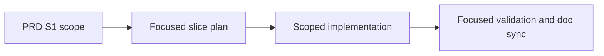

## ELI5 Summary (Read This First)

- What we're doing: turn `S1` from the PRD execution map into a focused executable slice without widening scope.
- Why we're doing it: the orchestrator needs a concrete slice draft so planning and freeze can converge on the named boundary instead of starting from a blank template.
- What "done" looks like: the repo ships `S1` exactly within `Execution Map row` plus the Execution Map note: V2 workflow skeleton from V1, keeping V1 plan-path behavior and explicit sentinel contracts while deferring typed gates, design-doc intake, review automation, live evidence conventions, and PR handoff to later slices and proves it with focused validation.
- How we'll do it: ground the current repo truth, lock the slice contract and docs, implement the smallest load-bearing surface, then validate and sync the affected docs.
- Next step / resume point: run `refine_all` on this seeded slice and only add more scope if current repo evidence proves it is required.

### Optional Mental Model

- Treat this slice as a scoped receipt for one PRD row: the plan should explain exactly how `S1` lands without borrowing work from later rows.

## 1) Problem Statement
`Archon PIV Loop Codex V2` is already split into execution slices, but `S1` needs a focused plan that keeps the implementation boundary aligned with the PRD instead of expanding into adjacent slice work. The PRD already names the intended surface for this slice; this seeded draft turns that row into an executable workflow artifact.

## 2) Solution Concept (High-Level)
- Keep `S1` anchored to `Execution Map row` plus the Execution Map note: V2 workflow skeleton from V1, keeping V1 plan-path behavior and explicit sentinel contracts while deferring typed gates, design-doc intake, review automation, live evidence conventions, and PR handoff to later slices.
- Ground the slice against the current repo code, docs, and tests before changing implementation.
- Prefer the smallest producer/consumer boundary that satisfies `S1` without opening neighboring slices early.
- Use focused repo-local validation and doc sync as the initial proof shape for this slice.

## 3) Scope / Non-Goals
- In scope: V2 workflow skeleton from V1, keeping V1 plan-path behavior and explicit sentinel contracts while deferring typed gates, design-doc intake, review automation, live evidence conventions, and PR handoff to later slices
- In scope: code, contract docs, and tests directly required by `Execution Map row`.
- Non-goal: widening `S1` into neighboring execution-map rows during the first refine/freeze pass.
- Non-goal: inventing a brand-new UX or runtime surface unless the current repo boundary cannot satisfy this slice.

## 4) Architecture Overview

## 5) Decision Options per Area

### A. Slice boundary
| Option | Pros | Cons | Effort |
|--------|------|------|--------|
| A1. Keep `S1` scoped to `Execution Map row` and the row note | Preserves deterministic sequencing and protects neighboring slices | Optional polish can wait for later slices | Low |
| A2. Widen `S1` into adjacent concerns during the first pass | May reduce a later handoff | Breaks slice isolation and makes orchestration less predictable | High |

**Choice:** [x] A1  [ ] A2

## Plan Status & Controls
- Plan Status: Draft (as of 2026-04-27)
- Current Phase: P0 — Grounding
- Last Updated: 2026-04-27
- Last Reviewed: 2026-04-27
- Next Checkpoint: refine this seeded slice against current repo reality, then freeze only if no real blockers remain
- E2E Gate: not_required
- E2E Waiver Category: internal_tooling
- E2E Waiver Rationale: This seeded slice targets contract, workflow, or internal runtime surfaces. Focused repo-local validation is the required proof shape before any broader end-to-end coverage is considered.
- Canonical task location: Section 6 (Phased Execution Plan)

**Terminology & Actors (Workflow Defaults):**
- **[LBA]** = **Load-Bearing Assumption** (must be verified before freeze/implementation).
- **[Q]** = Open Question (blocking only when placed under `### Blockers` in Unresolved Items).
- **People:** Mase.
- **Reserved token:** "LBA" is reserved for load-bearing assumptions only.

> **State file:** Task status tracked in companion `.state.json` file.
> Markdown checkboxes are supplementary for readability. JSON is source of truth.

## Unresolved Items (Canonical)

Rules:
- Unresolved items are canonical in `<plan>.state.json`.
- Edit via `state_manager.py --action set_unresolved`; markdown is rendered output.
- `[LBA]` items are always blocking until checked.
- `[Q]` items block only when placed under `### Blockers`.
- Default scope is phases `P1+` unless explicitly tagged.

### Blockers (must resolve before freeze)
- [ ] [Q] Q1 (Blocks: P0 freeze, P1 freeze, P2 freeze) — Resolve the PRD `plan:` backlink handoff before freezing this focused S1 plan.
  - Answer: Default path: keep the PRD `plan:` pointer on the umbrella plan while this slice is still a draft, then run `frontmatter_link_sync.py` during `phase_freeze` or `freeze_all confirm=true` to repoint the backlink to this slice plan once S1 becomes the active frozen plan. Only fall back to a readiness-rule change if that handoff would violate umbrella governance. Use P0-T3 to dry-run the sync and keep this blocker open until the handoff path is verified.

### FYI / Later (does not block freeze)
- (none)
## Phase Summary (Quick View)

| Phase | Phase Status | Tasks (ID: Title — Status) |
|------:|--------------|----------------------------|
| P0 | Proposed | - P0-T1: Ground the `S1` boundary against the PRD, V1 workflow, and V2 design note — proposed - P0-T2: Lock the exact implementation surfaces and proof commands — proposed - P0-T3: Stage the focused-slice lineage handoff required before freeze — proposed |
| P1 | Proposed | - P1-T1: Create `archon-piv-loop-codex-v2` from the V1 workflow while preserving Slice 1 contracts — proposed - P1-T2: Regenerate bundled defaults so binaries discover the new workflow — proposed - P1-T3: Add targeted default-workflow tests for the v2 skeleton contract — proposed |
| P2 | Proposed | - P2-T1: Run the focused Slice 1 proof commands and capture failures precisely — proposed - P2-T2: Reconcile workflow-reference docs and close the slice evidence loop — proposed |

## 6) Phased Execution Plan

### Phase 0 — Grounding And Contract Lock

- [ ] P0-T1: Ground the `S1` boundary against the PRD, V1 workflow, and V2 design note
  - Test Impact: N/A
  - Commands to Run:
    - `sed -n '340,352p' docs/prd/r001-archon-piv-loop-codex-v2.md`
    - `sed -n '490,530p' docs/design/codex-piv-v2-workflow-design.md`
    - `rg -n "\\.claude/archon/plans|<promise>|PLAN_READY|PLAN_APPROVED|COMPLETE|VALIDATED" .archon/workflows/defaults/archon-piv-loop-codex.yaml`
    - record in this plan that Slice 1 preserves the legacy `.claude/archon/plans/*.plan.md` contract and explicit loop sentinels, while deferring typed gates, design-doc or slice-map intake, review automation, live E2E evidence conventions, and PR handoff
  - Exit Criteria:
    - this plan names the exact V1 contracts that `S1` must preserve
    - this plan names the exact later-slice capabilities that remain out of scope
    - adjacent slice work stays explicitly out of scope
  - Verify Commands:
    - `rg -n "\\.claude/archon/plans|PLAN_READY|PLAN_APPROVED|COMPLETE|VALIDATED|typed gates|design-doc|slice-map|review automation|PR handoff" docs/plans/r001-archon-piv-loop-codex-v2-s1_plan.md`

- [ ] P0-T2: Lock the exact implementation surfaces and proof commands
  - Test Impact: N/A
  - Commands to Run:
    - `sed -n '1,220p' packages/workflows/src/defaults/bundled-defaults.test.ts`
    - `sed -n '1,220p' scripts/generate-bundled-defaults.ts`
    - `sed -n '1,220p' package.json`
    - inspect `scripts/generate-bundled-defaults.ts` and the `.archon/workflows/defaults/` directory to confirm the writer, generator, and proof surfaces for a new bundled workflow
    - update this plan so each code-changing task names the exact file(s) to edit and the exact proof commands `S1` must satisfy
  - Exit Criteria:
    - this plan distinguishes the exact Slice 1 writer surfaces from generated output:
      manual edits land in `.archon/workflows/defaults/archon-piv-loop-codex-v2.yaml`
      and `packages/workflows/src/defaults/bundled-defaults.test.ts`, while
      `packages/workflows/src/defaults/bundled-defaults.generated.ts` is regenerated
      via `bun run generate:bundled` and is not a hand-edited target
    - this plan names the exact Slice 1 proof commands:
      `bun run cli validate workflows archon-piv-loop-codex-v2 --json`,
      `bun run check:bundled`, and
      `bun test packages/workflows/src/defaults/bundled-defaults.test.ts`
  - Verify Commands:
    - `python3 "${CODEX_HOME:-$HOME/.codex}/skills/.shared/workflow/scripts/plan_readiness.py" --plan-path docs/plans/r001-archon-piv-loop-codex-v2-s1_plan.md --format markdown`

- [ ] P0-T3: Stage the focused-slice lineage handoff required before freeze
  - Test Impact: N/A
  - Commands to Run:
    - `python3 "${CODEX_HOME:-$HOME/.codex}/skills/.shared/workflow/scripts/frontmatter_link_sync.py" --repo-root "$(pwd)" --plan-path docs/plans/r001-archon-piv-loop-codex-v2-s1_plan.md --check`
    - `sed -n '53,57p' "${CODEX_HOME:-$HOME/.codex}/skills/.shared/workflow/references/prd-section-slicing.md"`
    - record that the current PRD `plan:` backlink still points to `docs/plans/r001-archon-piv-loop-codex-v2-orchestration-plan.md` and that the current `--check` dry-run would rewrite both this slice plan and the PRD
    - record the default pre-freeze path for Slice 1: when this focused slice becomes the active frozen plan, run `frontmatter_link_sync.py` to repoint the PRD `plan:` backlink from the umbrella plan to this slice plan; only fall back to a readiness-rule change if that handoff would violate umbrella governance
    - keep the unresolved blocker tied to this explicit pre-freeze handoff step instead of leaving it as an unscoped timing question
  - Exit Criteria:
    - this plan records `frontmatter_link_sync.py` as the default lineage-handoff step before `phase_freeze` or `freeze_all confirm=true`
    - this plan records the current mismatch precisely enough that freeze failure is explainable from repo evidence rather than from a generic warning
    - the unresolved freeze blocker now has a concrete command path and an explicit fallback policy
  - Verify Commands:
    - `python3 "${CODEX_HOME:-$HOME/.codex}/skills/.shared/workflow/scripts/frontmatter_link_sync.py" --repo-root "$(pwd)" --plan-path docs/plans/r001-archon-piv-loop-codex-v2-s1_plan.md --check`

### Phase 1 — Scoped Implementation

- [ ] P1-T1: Create `archon-piv-loop-codex-v2` from the V1 workflow while preserving Slice 1 contracts
  - Test Impact: update
  - Commands to Run:
    - copy `.archon/workflows/defaults/archon-piv-loop-codex.yaml` to `.archon/workflows/defaults/archon-piv-loop-codex-v2.yaml`
    - rename the workflow metadata and top-level description so the new workflow is explicitly a serious one-slice Codex PIV lane
    - keep the `.claude/archon/plans/*.plan.md` writer and reader contract unchanged in Slice 1
    - preserve the explicit `PLAN_READY`, `PLAN_APPROVED`, `COMPLETE`, and `VALIDATED` sentinel contracts in Slice 1 rather than attempting typed-gate migration here
    - add only the minimum new prompt or description guardrails needed to state the one-slice boundary and the explicit deferrals from the PRD
  - Exit Criteria:
    - `.archon/workflows/defaults/archon-piv-loop-codex-v2.yaml` exists and validates as a discovered workflow
    - the new workflow preserves the V1 plan-path and sentinel behavior required by `S1`
    - the new workflow does not silently absorb typed gates, design-doc intake, review automation, live E2E evidence conventions, or PR handoff
  - Verify Commands:
    - `bun run cli validate workflows archon-piv-loop-codex-v2 --json`

- [ ] P1-T2: Regenerate bundled defaults so binaries discover the new workflow
  - Test Impact: update
  - Commands to Run:
    - run `bun run generate:bundled`
    - inspect `packages/workflows/src/defaults/bundled-defaults.generated.ts` for the new `archon-piv-loop-codex-v2` entry
    - treat `packages/workflows/src/defaults/bundled-defaults.generated.ts` as generated output only; do not hand-edit it
    - keep `packages/workflows/src/defaults/bundled-defaults.ts` unchanged unless the bundled-defaults facade truly needs a supporting edit
  - Exit Criteria:
    - the generated bundled defaults include the new workflow content
    - `bun run check:bundled` passes without stale generated output
  - Verify Commands:
    - `bun run check:bundled`
    - `rg -n "archon-piv-loop-codex-v2" packages/workflows/src/defaults/bundled-defaults.generated.ts`

- [ ] P1-T3: Add targeted default-workflow tests for the v2 skeleton contract
  - Test Impact: update
  - Commands to Run:
    - extend `packages/workflows/src/defaults/bundled-defaults.test.ts`
    - rely on the existing bundle-completeness assertions to prove the new workflow is discovered once it exists on disk
    - add workflow-specific assertions that the bundled `archon-piv-loop-codex-v2` content preserves the Slice 1 load-bearing contracts: the legacy `.claude/archon/plans/*.plan.md` path and the explicit sentinel tokens
    - keep the assertions limited to Slice 1 contract presence; do not add tests for later-slice behavior
  - Exit Criteria:
    - the targeted default-workflow test file checks the preserved Slice 1 contract markers without duplicating the existing generic completeness coverage
    - the test scope stays limited to the bundled workflow surface rather than later workflow behavior
  - Verify Commands:
    - `bun test packages/workflows/src/defaults/bundled-defaults.test.ts`

### Phase 2 — Validation And Doc Sync

- [ ] P2-T1: Run the focused Slice 1 proof commands and capture failures precisely
  - Test Impact: N/A
  - Commands to Run:
    - `bun run cli validate workflows archon-piv-loop-codex-v2 --json`
    - `bun run check:bundled`
    - `bun test packages/workflows/src/defaults/bundled-defaults.test.ts`
    - capture the exact failing command and failing surface if any proof command does not pass
  - Exit Criteria:
    - Slice 1 has concrete proof for workflow validation, bundle drift, and targeted default-workflow tests
    - any failure is recorded against the exact workflow or bundled-defaults surface rather than hand-waved as general repo noise
  - Verify Commands:
    - `bun run cli validate workflows archon-piv-loop-codex-v2 --json`
    - `bun run check:bundled`
    - `bun test packages/workflows/src/defaults/bundled-defaults.test.ts`

- [ ] P2-T2: Reconcile workflow-reference docs and close the slice evidence loop
  - Test Impact: N/A
  - Commands to Run:
    - review `.archon/workflows/defaults/archon-piv-loop-codex.README.md` as the execution-notes precedent for the v2 workflow
    - add or update `.archon/workflows/defaults/archon-piv-loop-codex-v2.README.md` only if the new workflow introduces operator-facing context behavior that is no longer obvious from the YAML alone; otherwise record explicit N/A in this plan's doc sync log
    - sync this plan, its sidecar, and the documentation checklist so the final Slice 1 evidence matches the landed workflow surface
  - Exit Criteria:
    - any new operator-facing workflow-reference note required by Slice 1 exists and points to the v2 workflow
    - this plan's doc checklist and sync log reflect the actual landed Slice 1 surface with no hidden doc debt
  - Verify Commands:
    - `python3 "${CODEX_HOME:-$HOME/.codex}/skills/.shared/workflow/scripts/plan_readiness.py" --plan-path docs/plans/r001-archon-piv-loop-codex-v2-s1_plan.md --format markdown`
    - `rg -n "archon-piv-loop-codex-v2" .archon/workflows/defaults docs/plans/r001-archon-piv-loop-codex-v2-s1_plan.md`

## Documentation Checklist

- [ ] Add or update `.archon/workflows/defaults/archon-piv-loop-codex-v2.yaml` as the new default workflow surface for `S1`.
- [ ] Regenerate `packages/workflows/src/defaults/bundled-defaults.generated.ts` after the new workflow is added.
- [ ] Treat `packages/workflows/src/defaults/bundled-defaults.generated.ts` as generated output from `bun run generate:bundled`, not a hand-edited file.
- [ ] Review whether `.archon/workflows/defaults/archon-piv-loop-codex-v2.README.md` is required; create it only if Slice 1 introduces non-obvious operator-facing context behavior.
- [ ] Before freeze, dry-run and then execute the PRD lineage handoff with `frontmatter_link_sync.py` if Slice 1 becomes the active focused plan.
- [ ] Keep `docs/design/codex-piv-v2-workflow-design.md` and `docs/prd/r001-archon-piv-loop-codex-v2.md` as scope authorities unless a narrow factual correction is required.
- [ ] Sync this plan and its `.state.json` sidecar after any task list changes or status updates.

## Current Inputs (single source of truth)
- Feature: `Archon PIV Loop Codex V2`
- Feature PRD: `docs/prd/r001-archon-piv-loop-codex-v2.md`
- Planning shape: umbrella + slices
- Feature PRD section(s): `Execution Map row S1`
- Specs / contracts (if any):
  - `docs/design/codex-piv-v2-workflow-design.md` — V2 slice-shape and V1-derived implementation basis
  - `.archon/workflows/defaults/archon-piv-loop-codex.yaml` — V1 contract surface Slice 1 must preserve
  - `.archon/workflows/defaults/archon-piv-loop-codex.README.md` — V1 workflow-reference precedent
- Goals:
  - deliver `S1` as a new `archon-piv-loop-codex-v2` default workflow without widening into later slices
  - preserve the V1 `.claude/archon/plans/*.plan.md` path and explicit sentinel contracts in Slice 1
  - prove the slice with workflow validation, bundle drift checking, and targeted default-workflow tests
- Non-Goals:
  - typed phase-gate runtime support
  - design-doc or slice-map intake mode
  - planning or implementation review automation
  - live E2E evidence conventions
  - PR or PR-review handoff
- Constraints/Interfaces:
  - start from `.archon/workflows/defaults/archon-piv-loop-codex.yaml`, not from scratch
  - preserve the V1 legacy plan-path contract in Slice 1 unless every downstream reader migrates in the same slice
  - preserve explicit model-sentinel progression in Slice 1; typed gates belong to `S3`
  - treat `packages/workflows/src/defaults/bundled-defaults.generated.ts` as generated output from `scripts/generate-bundled-defaults.ts`, not as a manual edit surface
  - keep the PRD `plan:` backlink on the umbrella plan during draft orchestration, then hand it off intentionally to this slice plan before freeze if Slice 1 becomes the active focused plan
  - keep the implementation scoped to the smallest load-bearing workflow, bundle, and test surfaces
- Testing (only if code changes):
  - Test posture: `unit=happy-path`, `integration=critical-only`
  - Test suite status: existing targeted workflow-bundle coverage exists and should be extended, not replaced
  - Primary test command(s):
    - `bun run cli validate workflows archon-piv-loop-codex-v2 --json`
    - `bun run check:bundled`
    - `bun test packages/workflows/src/defaults/bundled-defaults.test.ts`
  - Test locations:
    - `packages/workflows/src/defaults/bundled-defaults.test.ts`
  - Waivers: repo-wide validation is out of scope for `S1`; proof stays limited to the touched workflow, bundled defaults, and targeted tests
- Owner/Stakeholders: Mase
- Definition of Done: `S1` lands exactly within the PRD row boundary as a new bundled default workflow and is proven with focused validation evidence.
- Metrics:
  - slice scope stays within `Execution Map row S1`
  - the new workflow is discoverable both from source checkout validation and bundled-default parity
  - targeted tests cover the legacy path and sentinel markers preserved by Slice 1
- Deadlines: maintain deterministic progress; no separate external deadline is assumed for the seeded draft
- Dependencies:
  - `docs/prd/r001-archon-piv-loop-codex-v2.md` remains the scope authority
  - neighboring slices remain separate unless current repo evidence proves unavoidable coupling
  - bundled defaults must be regenerated after new default-workflow files are added
  - Slice 1 freeze depends on a deliberate PRD lineage handoff via `frontmatter_link_sync.py` or an explicit readiness-rule change
- Risk tolerance: low; prefer the narrowest safe change

## References (authoritative)
- Source order: vendor docs > official repos/examples > repo code > community posts
- Pin URL + accessed date (+ version/tag/commit)
- Initial:
  - `docs/prd/r001-archon-piv-loop-codex-v2.md` — repo PRD authority (accessed 2026-04-27)
  - `docs/design/codex-piv-v2-workflow-design.md` — V2 slice design basis (accessed 2026-04-27)
  - `.archon/workflows/defaults/archon-piv-loop-codex.yaml` — V1 workflow contract surface (accessed 2026-04-27)
  - `.archon/workflows/defaults/archon-piv-loop-codex.README.md` — V1 workflow-reference precedent (accessed 2026-04-27)
  - `packages/workflows/src/defaults/bundled-defaults.test.ts` — existing bundle-drift and default-workflow test surface (accessed 2026-04-27)
  - `package.json` — root validation and bundled-generation scripts (accessed 2026-04-27)
  - `docs/plans/r001-archon-piv-loop-codex-v2-s1_plan.md` — focused slice execution ledger (accessed 2026-04-27)

## Doc Surface Map (Project Docs Only)
Purpose: enumerate project-facing docs that must match implementation reality at closeout.

Explicit exclusions (handled outside the PIV loop closeout): Project Brief, Feature PRDs, `CLAUDE.md`, `memory/projects/`.

| Area | File/Path | Action (must-edit / review-only / N/A) | Notes (what to check) |
| --- | --- | --- | --- |
| README | `README.md` | N/A | Slice 1 should not change top-level product setup or README-level behavior. |
| Env contract (.env.example) | `.env.example` | N/A | Slice 1 should not introduce env-contract changes. |
| Workflow companion note | `.archon/workflows/defaults/archon-piv-loop-codex-v2.README.md` | review-only | Create only if the v2 workflow needs its own execution-notes companion. |
| Design docs | `docs/design/codex-piv-v2-workflow-design.md` | review-only | Review as the design basis; edit only for narrow factual drift caused by S1 implementation. |
| API docs/schema docs | `docs/specs/` | N/A | Slice 1 should not change public API or schema contracts. |
| Reference docs (docs/reference/) | `docs/reference/` | N/A | Slice 1 should not change stable operator runbooks outside the workflow companion note. |
| Decisions/ADRs (docs/decisions/) | `docs/decisions/` | N/A | No new ADR is expected for a V1-derived workflow skeleton. |
| Plans (docs/plans/) | `docs/plans/r001-archon-piv-loop-codex-v2-s1_plan.md` | must-edit | This focused plan is the canonical execution ledger for `S1`. |
| Capabilities payload docs/schema | `docs/specs/output-format.md` | N/A | Slice 1 defers payload-shape and handoff work to later slices. |
| Other project docs | `docs/prd/r001-archon-piv-loop-codex-v2.md` | N/A | The feature PRD remains the scope anchor and is maintained separately from slice closeout. |

## Doc Sync Log
- 2026-04-27: Seeded focused slice draft from the PRD execution map so the orchestrator can refine from a concrete boundary instead of a blank template.
- 2026-04-27: Refined Slice 1 into a concrete V1-derived workflow, bundled-defaults, targeted-test, and pre-freeze lineage-handoff contract with explicit preservation of the legacy plan path and sentinel markers.
- 2026-04-27: Verified that `frontmatter_link_sync.py --check` still wants to rewrite both this slice plan and `docs/prd/r001-archon-piv-loop-codex-v2.md` while the PRD `plan:` pointer remains on the umbrella plan, so the lineage handoff stays an intentional pre-freeze gate rather than an inferred assumption.
