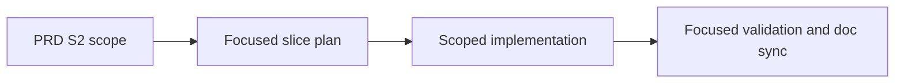

## ELI5 Summary (Read This First)

- What we're doing: turn `S2` from the PRD execution map into a focused executable slice without widening scope.
- Why we're doing it: the orchestrator needs a concrete slice draft so planning and freeze can converge on the named boundary instead of starting from a blank template.
- What "done" looks like: the repo ships `S2` exactly within `Execution Map row` plus the Execution Map note: V2 plan template and coordinated plan-path contract and proves it with focused validation.
- How we'll do it: ground the current repo truth, lock the slice contract and docs, implement the smallest load-bearing surface, then validate and sync the affected docs.
- Next step / resume point: run `refine_all` on this seeded slice and only add more scope if current repo evidence proves it is required.

### Optional Mental Model

- Treat this slice as a scoped receipt for one PRD row: the plan should explain exactly how `S2` lands without borrowing work from later rows.

## 1) Problem Statement
`Archon PIV Loop Codex V2` is already split into execution slices, but `S2` needs a focused plan that keeps the implementation boundary aligned with the PRD instead of expanding into adjacent slice work. The PRD already names the intended surface for this slice; this seeded draft turns that row into an executable workflow artifact.

## 2) Solution Concept (High-Level)
- Keep `S2` anchored to `Execution Map row` plus the Execution Map note: V2 plan template and coordinated plan-path contract.
- Ground the slice against the current repo code, docs, and tests before changing implementation.
- Prefer the smallest producer/consumer boundary that satisfies `S2` without opening neighboring slices early.
- Use focused repo-local validation and doc sync as the initial proof shape for this slice.

## 3) Scope / Non-Goals
- In scope: V2 plan template and coordinated plan-path contract
- In scope: code, contract docs, and tests directly required by `Execution Map row`.
- Non-goal: widening `S2` into neighboring execution-map rows during the first refine/freeze pass.
- Non-goal: inventing a brand-new UX or runtime surface unless the current repo boundary cannot satisfy this slice.

## 4) Architecture Overview

## 5) Decision Options per Area

### A. Slice boundary
| Option | Pros | Cons | Effort |
|--------|------|------|--------|
| A1. Keep `S2` scoped to `Execution Map row` and the row note | Preserves deterministic sequencing and protects neighboring slices | Optional polish can wait for later slices | Low |
| A2. Widen `S2` into adjacent concerns during the first pass | May reduce a later handoff | Breaks slice isolation and makes orchestration less predictable | High |

**Choice:** [x] A1  [ ] A2

## Plan Status & Controls
- Plan Status: Draft (as of 2026-04-27)
- Current Phase: Complete — Ready For Validation
- Last Updated: 2026-04-27
- Last Reviewed: 2026-04-27
- Next Checkpoint: run `$workflow-validate docs/plans/r001-archon-piv-loop-codex-v2-s2_plan.md mode=fast`
- E2E Gate: not_required
- E2E Waiver Category: internal_tooling
- E2E Waiver Rationale: This seeded slice targets contract, workflow, or internal runtime surfaces. Focused repo-local validation is the required proof shape before any broader end-to-end coverage is considered.
- Canonical task location: Section 6 (Phased Execution Plan)

**Terminology & Actors (Workflow Defaults):**
- **[LBA]** = **Load-Bearing Assumption** (must be verified before freeze/implementation).
- **[Q]** = Open Question (blocking only when placed under `### Blockers` in Unresolved Items).
- **People:** Mase.
- **Reserved token:** "LBA" is reserved for load-bearing assumptions only.

> **State file:** Task status tracked in companion `.state.json` file.
> Markdown checkboxes are supplementary for readability. JSON is source of truth.

## Unresolved Items (Canonical)

Rules:
- Unresolved items are canonical in `<plan>.state.json`.
- Edit via `state_manager.py --action set_unresolved`; markdown is rendered output.
- `[LBA]` items are always blocking until checked.
- `[Q]` items block only when placed under `### Blockers`.
- Default scope is phases `P1+` unless explicitly tagged.

### Blockers (must resolve before freeze)
- (none)

### FYI / Later (does not block freeze)
- (none)
## Phase Summary (Quick View)

| Phase | Phase Status | Tasks (ID: Title — Status) |
|------:|--------------|----------------------------|
| P0 | Done | - P0-T1: Ground the current slice boundary against repo reality — done - P0-T2: Lock the slice contract and doc surface — done |
| P1 | Done | - P1-T1: Implement the smallest load-bearing `S2` surface — done - P1-T2: Add or update focused validation for the touched surface — done |
| P2 | Done | - P2-T1: Reconcile docs and prove final slice evidence — done |

## 6) Phased Execution Plan

### Phase 0 — Grounding And Contract Lock

- [x] P0-T1: Ground the current slice boundary against repo reality
  - Test Impact: N/A
  - Commands to Run:
    - inspect `docs/prd/r001-archon-piv-loop-codex-v2.md` and the directly implicated repo surfaces for `S2`
    - record the current runtime, contract, and doc truth that this slice must preserve or change
  - Exit Criteria:
    - the plan captures the current repo truth for `S2`
    - adjacent slice work is explicitly kept out of scope
  - Verify Commands:
    - `python3 "${CODEX_HOME:-$HOME/.codex}/skills/.shared/workflow/scripts/plan_readiness.py" --plan-path docs/plans/r001-archon-piv-loop-codex-v2-s2_plan.md --format markdown`

- [x] P0-T2: Lock the slice contract and doc surface
  - Test Impact: N/A
  - Commands to Run:
    - update this focused plan after the grounding pass
    - identify the exact docs and contracts that must stay in sync with `S2`
  - Exit Criteria:
    - the plan, code boundary, and doc surface describe the same slice
    - no first-pass scope gap remains inside `Execution Map row`
  - Verify Commands:
    - `rg -n "S2|Execution Map row" docs`

### Phase 1 — Scoped Implementation

- [x] P1-T1: Implement the smallest load-bearing `S2` surface
  - Test Impact: update
  - Commands to Run:
    - update `.archon/workflows/defaults/archon-piv-loop-codex-v2.yaml` once Slice 1 lands so the `create-plan` prompt uses the V2 focused-plan template instead of the lighter V1 template block
    - in the same workflow file, migrate the plan-path contract in one pass across the plan writer and every downstream reader: `create-plan`, `refine-plan`, `implement-setup`, `code-review`, `fix-feedback`, and `compose-finalize`
    - keep the migration coordinated: do not leave V2 writing a new path while any V2 reader still searches only `.claude/archon/plans/*.plan.md`
    - keep neighboring execution-map rows untouched unless the PRD contract proves coupling
  - Exit Criteria:
    - `.archon/workflows/defaults/archon-piv-loop-codex-v2.yaml` defines the V2 focused-plan template in `create-plan`, including the design-note sections required for this slice: `ELI5 Summary`, `Problem Statement`, `Solution Concept`, `Current Inputs`, `Slice Metadata`, `Plan Status & Controls`, `Peer Review Gate`, `Documentation Surface Map`, and `Risks`
    - the same workflow file uses one coordinated V2 plan path for both the writer and every downstream reader in `refine-plan`, `implement-setup`, `code-review`, `fix-feedback`, and `compose-finalize`
    - no V2 node still hard-codes `.claude/archon/plans/*.plan.md` or searches a competing plan location after the coordinated migration
    - the implementation boundary still matches `Execution Map row`
  - Verify Commands:
    - `rg -n "## ELI5 Summary|## Problem Statement|## Solution Concept|## Current Inputs|## Slice Metadata|## Plan Status & Controls|## Peer Review Gate|## Documentation Surface Map|## Risks" .archon/workflows/defaults/archon-piv-loop-codex-v2.yaml`
    - `rg -n "Save to |mkdir -p |ls -t .*plan\\.md|PLAN_FILE=|No plan file found" .archon/workflows/defaults/archon-piv-loop-codex-v2.yaml`
    - `bash -lc 'if rg -n "\\.claude/archon/plans" .archon/workflows/defaults/archon-piv-loop-codex-v2.yaml; then echo "legacy V1 plan path still present in v2 workflow"; exit 1; fi'`

- [x] P1-T2: Add or update focused validation for the touched surface
  - Test Impact: add
  - Commands to Run:
    - extend `packages/workflows/src/defaults/bundled-defaults.test.ts` with string-based assertions against `BUNDLED_WORKFLOWS['archon-piv-loop-codex-v2']`
    - assert the bundled V2 workflow contains the strengthened template headings and the coordinated plan-path writer/reader contract for `create-plan`, `refine-plan`, `implement-setup`, `code-review`, `fix-feedback`, and `compose-finalize`
    - keep the proof surface focused on plan fixture/output inspection plus downstream reader validation; do not add unrelated workflow-behavior coverage in this slice
  - Exit Criteria:
    - `packages/workflows/src/defaults/bundled-defaults.test.ts` fails if the V2 workflow loses any required focused-plan template heading named by this slice
    - `packages/workflows/src/defaults/bundled-defaults.test.ts` fails if any V2 node regresses to the legacy `.claude/archon/plans/*.plan.md` contract or leaves the writer/reader contract inconsistent across the lane
    - validation proves the slice without depending on unrelated later-slice work
  - Verify Commands:
    - `bun test packages/workflows/src/defaults/bundled-defaults.test.ts`
    - `rg -n "archon-piv-loop-codex-v2|ELI5 Summary|Problem Statement|PLAN_FILE|legacy V1 plan path|compose-finalize" packages/workflows/src/defaults/bundled-defaults.test.ts`

### Phase 2 — Validation And Doc Sync

- [x] P2-T1: Reconcile docs and prove final slice evidence
  - Test Impact: N/A
  - Commands to Run:
    - sync the touched docs, plan state, and validation evidence after implementation
    - confirm the final slice still matches the execution-map row
  - Exit Criteria:
    - docs, code, and tests agree on the landed `S2` surface
    - the slice is ready for freeze/review without hidden follow-on scope
  - Verify Commands:
    - `python3 "${CODEX_HOME:-$HOME/.codex}/skills/.shared/workflow/scripts/plan_readiness.py" --plan-path docs/plans/r001-archon-piv-loop-codex-v2-s2_plan.md --format markdown`

## Current Inputs (single source of truth)
- Feature: `Archon PIV Loop Codex V2`
- Feature PRD: `docs/prd/r001-archon-piv-loop-codex-v2.md`
- Planning shape: umbrella + slices
- Feature PRD section(s): `Execution Map row S2`
- Specs / contracts (if any):
  - `docs/design/codex-piv-v2-workflow-design.md` — defines the V2 template section set and the coordinated plan-path migration rule for Slice 2
  - `.archon/workflows/defaults/archon-piv-loop-codex.yaml` — current V1 writer/reader contract whose plan-path behavior Slice 2 replaces in the V2 lane
  - `.archon/workflows/defaults/archon-piv-loop-codex-v2.yaml` — Slice 2 implementation surface for the V2 template and coordinated writer/reader migration
  - `packages/workflows/src/defaults/bundled-defaults.generated.ts` — derived bundled workflow surface that must match the edited V2 YAML after regeneration
  - `packages/workflows/src/defaults/bundled-defaults.test.ts` — focused proof surface that currently asserts the Slice 1 legacy plan-path contract and must flip with the coordinated V2 migration
- Grounded repo truth:
  - `docs/prd/r001-archon-piv-loop-codex-v2.md` keeps `S2` scoped to "V2 plan template and coordinated plan-path contract" and explicitly assigns any coordinated migration to this slice, not `S1` or later rows.
  - `docs/design/codex-piv-v2-workflow-design.md` requires `S2` to introduce the stronger V2 template headings and to migrate the writer plus every downstream reader together if the plan path changes.
  - `.archon/workflows/defaults/archon-piv-loop-codex-v2.yaml` still preserves the Slice 1 contract today: `create-plan` writes `.claude/archon/plans/{slug}.plan.md`, `refine-plan` consumes the exact `PLAN_FILE=...` output, the implement loop copy still describes the plan as `.claude/archon/plans/*.plan.md`, and `compose-finalize` still carries a legacy `.claude/archon/plans/*.plan.md` fallback.
  - `packages/workflows/src/defaults/bundled-defaults.test.ts` currently proves the Slice 1 contract by asserting the bundled V2 workflow still contains `.claude/archon/plans/{slug}.plan.md` and `PLAN_FILE=.claude/archon/plans/{slug}.plan.md`.
- Goals:
  - deliver `S2` without widening into later slices
  - keep the focused plan, code, and docs aligned to the same execution-map row
- Non-Goals:
  - adjacent slice implementation
  - speculative abstraction beyond the named slice boundary
- Constraints/Interfaces:
  - follow the current repo contracts before introducing new ones
  - keep changes scoped to the smallest load-bearing surface
  - keep V1 untouched in this slice; only the V2 workflow lane and its focused proof surface move
  - if the V2 plan path changes, the migration must stay coordinated across the writer, `refine-plan`, `implement-setup`, `code-review`, `fix-feedback`, and `compose-finalize`
- Testing (only if code changes):
  - Test posture: `unit=happy-path`, `integration=critical-only`
  - Test suite status: existing repo-local validation surface identified
  - Primary test command(s): `bun test packages/workflows/src/defaults/bundled-defaults.test.ts`
  - Test locations: `packages/workflows/src/defaults/bundled-defaults.test.ts`
  - Waivers: if code changes are not required after grounding, record the exact rationale in the plan update
- Owner/Stakeholders: Mase
- Definition of Done: `S2` lands exactly within the PRD row boundary and is proven with focused validation evidence.
- Metrics:
  - slice scope stays within `Execution Map row`
  - validation covers the load-bearing behavior changed by `S2`
- Deadlines: maintain deterministic progress; no separate external deadline is assumed for the seeded draft
- Dependencies:
  - the origin PRD remains the scope authority
  - neighboring slices remain separate unless current repo evidence proves coupling
- Risk tolerance: low; prefer the narrowest safe change

## Slice Contract Lock
- Must-edit implementation surface:
  - `.archon/workflows/defaults/archon-piv-loop-codex-v2.yaml`
- Must-sync derived and proof surfaces:
  - `packages/workflows/src/defaults/bundled-defaults.generated.ts`
  - `packages/workflows/src/defaults/bundled-defaults.test.ts`
- Review-only scope anchors:
  - `docs/prd/r001-archon-piv-loop-codex-v2.md`
  - `docs/design/codex-piv-v2-workflow-design.md`
- Explicitly out of scope for this slice lock:
  - `.archon/workflows/defaults/archon-piv-loop-codex.yaml`
  - typed phase gates, design-doc or slice-map intake, review automation, live E2E evidence conventions, and PR handoff

## References (authoritative)
- Source order: vendor docs > official repos/examples > repo code > community posts
- Pin URL + accessed date (+ version/tag/commit)
- Initial:
  - `docs/prd/r001-archon-piv-loop-codex-v2.md` — repo PRD authority (accessed 2026-04-27)
  - `docs/plans/r001-archon-piv-loop-codex-v2-s2_plan.md` — focused slice execution ledger (accessed 2026-04-27)

## Doc Surface Map (Project Docs Only)
Purpose: enumerate project-facing docs that must match implementation reality at closeout.

Explicit exclusions (handled outside the PIV loop closeout): Project Brief, Feature PRDs, `CLAUDE.md`, `memory/projects/`.

| Area | File/Path | Action (must-edit / review-only / N/A) | Notes (what to check) |
| --- | --- | --- | --- |
| README | `README.md` | review-only | Check whether `S2` changes operator-facing workflow or setup guidance. |
| Env contract (.env.example) | `.env.example` | N/A | Update only if this slice introduces or changes a runtime env contract. |
| Integration docs | `docs/design/codex-piv-v2-workflow-design.md` | review-only | Scope authority for the V2 section set and the coordinated plan-path migration rule. |
| API docs/schema docs | `docs/specs/` | review-only | Promote to must-edit only for the exact contract docs touched by this slice. |
| Specs/contracts (docs/specs/) | `docs/specs/` | review-only | Keep spec updates scoped to the load-bearing contract for `S2`. |
| Reference docs (docs/reference/) | `docs/reference/` | N/A | Update only if `S2` changes a stable operator runbook. |
| Decisions/ADRs (docs/decisions/) | `docs/decisions/` | N/A | Only needed if the slice introduces a durable architectural decision. |
| Plans (docs/plans/) | `docs/plans/r001-archon-piv-loop-codex-v2-s2_plan.md` | must-edit | This focused plan is the canonical execution ledger for `S2`. |
| Capabilities payload docs/schema | `docs/specs/output-format.md` | review-only | Review if `S2` touches emitted payload or packet shape. |
| Other project docs | `docs/prd/r001-archon-piv-loop-codex-v2.md` | review-only | Scope anchor for `Execution Map row S2`; update only if this slice lands a durable requirement change. |

## Doc Sync Log
- 2026-04-27: Seeded focused slice draft from the PRD execution map so the orchestrator can refine from a concrete boundary instead of a blank template.
- 2026-04-27: Refined `P1` with concrete V2 workflow/template surfaces, coordinated plan-path reader coverage, and runnable verification commands tied to the bundled-defaults test surface.
- 2026-04-27: Grounded `S2` against the current PRD, design doc, V2 workflow YAML, and bundled-defaults test; confirmed the repo still carries the Slice 1 `.claude/archon/plans/{slug}.plan.md` contract and that this slice owns the coordinated migration.
- 2026-04-27: Locked the slice contract to the V2 workflow YAML, bundled generated workflow output, bundled-defaults test, PRD row S2, and the V2 design doc; explicitly kept V1 and later-slice features out of scope.
- 2026-04-27: Landed the Slice 2 V2 workflow source update in `.archon/workflows/defaults/archon-piv-loop-codex-v2.yaml`, replacing the legacy plan-path contract with `docs/plans/{slug}_plan.md` and embedding the stronger focused-plan template headings required by this slice.
- 2026-04-27: Updated `packages/workflows/src/defaults/bundled-defaults.test.ts`, regenerated `packages/workflows/src/defaults/bundled-defaults.generated.ts`, and passed `bun test packages/workflows/src/defaults/bundled-defaults.test.ts` after installing worktree dependencies required for `@archon/paths` module resolution.
- 2026-04-27: Closed the slice with synced plan/task status, final readiness confirmation, and an implementation report bundle covering the V2 YAML migration, bundled output refresh, and focused bundled-defaults proof.
