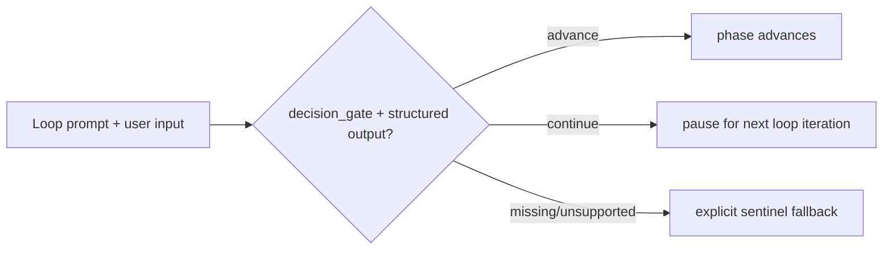

## ELI5 Summary (Read This First)

- What we're doing: turn `S3` into a truthful typed phase-gate slice by extending the workflow runtime only where the repo already has structured-output support, and by keeping an explicit sentinel fallback where it does not.
- Why we're doing it: prompt nodes already support structured output, but loop nodes still advance only through `until` / `until_bash` strings, so V2 cannot honestly claim typed phase gates yet.
- What "done" looks like: loop nodes can opt into a typed `decision_gate` contract, targeted runtime tests prove `continue` versus `advance`, and the V2 workflow on the campaign integration base pilots the contract. If the pilot target is missing in the S3 execution lane, stop as a campaign-state mismatch rather than silently falling back.
- How we'll do it: ground the exact runtime boundary, freeze one additive contract, implement the minimal loop-schema and executor support, then adopt or explicitly defer the V2 pilot with focused tests and docs.
- Next step / resume point: peer-review this corrected slice, then freeze only if the runtime contract and integration-branch pilot target are both explicit.

### Optional Mental Model

- Treat this slice as the bridge between today's string-signal loops and tomorrow's typed phase decisions: prompt-node structured output is already real, loop-node typed gating is the new work, and V1 stays untouched.

## 1) Problem Statement
`Archon PIV Loop Codex V2` wants typed phase-gate support, but the current repo only supports structured output on prompt nodes. Loop nodes still require a string `until` signal and optionally `until_bash`, and the loop-node parser strips `output_format` before execution. That means `S3` is not a YAML-only tweak: it must either land additive runtime support for loop decisions or codify a scoped sentinel fallback with proof.

## 2) Solution Concept (High-Level)
- Keep `S3` anchored to `Execution Map row` plus the row note: typed phase-gate support where runtime permits.
- Reuse the repo-local `decision_gate` authoring direction already documented in `docs/plans/piv-transition-control-surface-hardening_plan.md` instead of inventing a second typed-gate dialect.
- Treat typed loop decisions as additive: prompt-node structured output remains the proven precedent, legacy sentinel loops remain compatible, and V1 is not migrated in this slice.
- Pilot the new contract on `archon-piv-loop-codex-v2` from the campaign integration branch; do not widen into the broader paused-run or V1 parity program here.
- Keep the explicit sentinel path as the documented compatibility fallback until the loop-node structured path is proven by focused runtime tests.

## 3) Scope / Non-Goals
- In scope: loop-node schema and executor support required for typed phase decisions where runtime permits.
- In scope: V2-only workflow adoption of the new gate contract in the S3 execution worktree based on the campaign integration branch.
- In scope: tests and docs that prove either structured advancement or the explicit sentinel fallback.
- Non-goal: broad CLI/API/web paused-run contract redesign.
- Non-goal: migrating V1 to typed gates in this slice.
- Non-goal: widening `S3` into plan-path migration, design-doc intake, review automation, live E2E evidence, or PR handoff.

## 4) Architecture Overview

## 5) Decision Options per Area

### A. Typed-gate contract shape
| Option | Pros | Cons | Effort |
|--------|------|------|--------|
| A1. Reuse the repo-local `decision_gate` authoring shape and add loop runtime support | One contract across design, plan, and runtime; keeps scope additive | Requires loop-schema and executor work | Medium |
| A2. Invent a new V2-only typed-gate dialect | Might look narrower on paper | Creates avoidable contract drift and future migration debt | High |

**Choice:** [x] A1  [ ] A2

## Plan Status & Controls
- Plan Status: Draft (as of 2026-04-27)
- Current Phase: P0 — Grounding
- Last Updated: 2026-04-27
- Last Reviewed: 2026-04-27
- Next Checkpoint: peer-review this refined slice after the execution-base correction, then freeze only if the loop contract and V2 pilot target are both explicit
- Execution-base note: the root `dev` checkout may not contain S1/S2 implementation files until the integration branch is merged back, but S3 execution runs from `integration/r001-archon-piv-loop-codex-v2`, where `.archon/workflows/defaults/archon-piv-loop-codex-v2.yaml` is present.
- Deterministic grounding snapshot: prompt nodes already pass `output_format` through `buildNodeOptions()`, structured output is normalized in `dag-executor.ts`, `condition-evaluator.ts` supports `$node.output.field`, but loop nodes currently drop `output_format` in `dag-node.ts`, `buildLoopNodeOptions()` does not pass `outputFormat`, and `executeLoopNode()` only completes on `until` / `until_bash`
- E2E Gate: not_required
- E2E Waiver Category: internal_tooling
- E2E Waiver Rationale: This slice changes internal workflow-engine and default-workflow behavior. Focused runtime/schema tests are the required proof shape before any broader end-to-end coverage is considered.
- Canonical task location: Section 6 (Phased Execution Plan)

**Terminology & Actors (Workflow Defaults):**
- **[LBA]** = **Load-Bearing Assumption** (must be verified before freeze/implementation).
- **[Q]** = Open Question (blocking only when placed under `### Blockers` in Unresolved Items).
- **People:** Mase.
- **Reserved token:** "LBA" is reserved for load-bearing assumptions only.

> **State file:** Task status tracked in companion `.state.json` file.
> Markdown checkboxes are supplementary for readability. JSON is source of truth.

## Unresolved Items (Canonical)

Rules:
- Unresolved items are canonical in `<plan>.state.json`.
- Edit via `state_manager.py --action set_unresolved`; markdown is rendered output.
- `[LBA]` items are always blocking until checked.
- `[Q]` items block only when placed under `### Blockers`.
- Default scope is phases `P1+` unless explicitly tagged.

### Blockers (must resolve before freeze)
- (none)

### FYI / Later (does not block freeze)
- (none)
## Phase Summary (Quick View)

| Phase | Phase Status | Tasks (ID: Title — Status) |
|------:|--------------|----------------------------|
| P0 | Proposed | - P0-T1: Ground the loop-versus-prompt structured-output boundary against repo reality — proposed - P0-T2: Freeze the additive `decision_gate` contract and fallback rule for `S3` — proposed - P0-T3: Record the V2 pilot target on the integration execution base — proposed |
| P1 | Proposed | - P1-T1: Extend loop-node schema and executor support for additive typed phase gates — proposed - P1-T2: Pilot the typed gate contract on the V2 workflow from the integration base — proposed - P1-T3: Add focused regression tests for typed-loop decisions and sentinel fallback — proposed |
| P2 | Proposed | - P2-T1: Run the focused Slice 3 proof commands and capture the exact runtime result — proposed - P2-T2: Reconcile docs and close the slice evidence loop — proposed |

## 6) Phased Execution Plan

### Phase 0 — Grounding And Contract Lock

- [ ] P0-T1: Ground the loop-versus-prompt structured-output boundary against repo reality
  - Test Impact: N/A
  - Commands to Run:
    - `sed -n '340,347p' docs/prd/r001-archon-piv-loop-codex-v2.md`
    - `sed -n '534,540p' docs/design/codex-piv-v2-workflow-design.md`
    - `sed -n '600,670p' packages/workflows/src/dag-executor.ts`
    - `sed -n '1856,1915p' packages/workflows/src/dag-executor.ts`
    - `sed -n '2172,2265p' packages/workflows/src/dag-executor.ts`
    - `sed -n '2451,2495p' packages/workflows/src/dag-executor.ts`
    - `sed -n '1,80p' packages/workflows/src/schemas/loop.ts`
    - `sed -n '248,257p' packages/workflows/src/schemas/dag-node.ts`
    - `sed -n '560,633p' packages/workflows/src/schemas/dag-node.ts`
    - `sed -n '53,132p' packages/workflows/src/condition-evaluator.test.ts`
    - `sed -n '1297,1598p' packages/workflows/src/dag-executor.test.ts`
    - record in this plan that prompt nodes already support `output_format` and downstream field-based conditions, while loop nodes currently strip `output_format`, ignore loop-level AI-only fields, and complete only through `until` / `until_bash`
    - record the exact files that own this boundary: `packages/workflows/src/schemas/loop.ts`, `packages/workflows/src/schemas/dag-node.ts`, and `packages/workflows/src/dag-executor.ts`
  - Exit Criteria:
    - this plan names the exact repo-backed reason `S3` is a runtime slice rather than a YAML-only edit
    - this plan distinguishes proven prompt-node structured output from missing loop-node structured gating
    - adjacent slice work stays explicitly out of scope
  - Verify Commands:
    - `rg -n "output_format|decision_gate|until_bash|prompt nodes|loop nodes" docs/plans/r001-archon-piv-loop-codex-v2-s3_plan.md`

- [ ] P0-T2: Freeze the additive `decision_gate` contract and fallback rule for `S3`
  - Test Impact: N/A
  - Commands to Run:
    - `sed -n '466,590p' docs/plans/piv-transition-control-surface-hardening_plan.md`
    - adopt the repo-local authoring shape under `loop.decision_gate` rather than inventing a second typed-gate dialect
    - freeze the Slice 3 rule that typed decisions are additive and V2-only in this slice: prompt-node precedent stays intact, V1 stays sentinel-based, and loop-node structured decisions are piloted only where the runtime change is explicitly implemented
    - freeze the compatibility rule that existing sentinel completion remains the fallback proof surface until the structured loop path is proven green
  - Exit Criteria:
    - this plan records one concrete additive contract for typed loop decisions
    - this plan states the matching rule explicitly: loop structured output must include a `decision` field whose exact string value maps to one `loop.decision_gate.decisions[].id`; if parsing fails or no decision matches, executor falls back to the sentinel completion path
    - this plan records that structured decisions win when present, while the legacy sentinel path remains the explicit compatibility fallback rather than an undocumented second dialect
    - this slice stays scoped away from the broader paused-run CLI/API/web redesign
  - Verify Commands:
    - `rg -n "decision_gate|transition_intent|resume_reason|sentinel fallback|V1 stays" docs/plans/r001-archon-piv-loop-codex-v2-s3_plan.md`

- [ ] P0-T3: Record the V2 pilot target on the integration execution base
  - Test Impact: N/A
  - Commands to Run:
    - `git log --oneline --decorate -6 integration/r001-archon-piv-loop-codex-v2`
    - `git show integration/r001-archon-piv-loop-codex-v2:.archon/workflows/defaults/archon-piv-loop-codex-v2.yaml >/tmp/archon-piv-loop-codex-v2.yaml`
    - `git diff --name-only integration/r001-archon-piv-loop-codex-v2 -- .archon/workflows/defaults/archon-piv-loop-codex-v2.yaml packages/workflows/src/defaults/bundled-defaults.generated.ts packages/workflows/src/defaults/bundled-defaults.test.ts`
    - `sed -n '27,33p' docs/plans/r001-archon-piv-loop-codex-v2-orchestration-plan.md`
    - record that the root `dev` checkout can lag the campaign integration branch, so S3 must ground workflow-file availability against `integration/r001-archon-piv-loop-codex-v2`, not only the root checkout
    - record that the integration branch contains the S1/S2 V2 workflow and bundled-defaults surfaces and is the expected base for S3 execution-lane prep
  - Exit Criteria:
    - this plan records the exact V2 pilot target with integration-branch evidence instead of root-checkout assumption
    - the adoption task in Phase 1 names the concrete pilot target and treats absence in the S3 worktree as a campaign-state mismatch, not as a normal blocked-on-S1 condition
  - Verify Commands:
    - `rg -n "integration/r001-archon-piv-loop-codex-v2|archon-piv-loop-codex-v2.yaml|campaign-state mismatch|workflow adoption" docs/plans/r001-archon-piv-loop-codex-v2-s3_plan.md`

### Phase 1 — Runtime And Workflow Pilot

- [ ] P1-T1: Extend loop-node schema and executor support for additive typed phase gates
  - Test Impact: update
  - Commands to Run:
    - update `packages/workflows/src/schemas/loop.ts` to add the additive `decision_gate` contract for loop nodes
    - update `packages/workflows/src/schemas/dag-node.ts` so loop nodes preserve `output_format` when present instead of stripping it during transform
    - update `packages/workflows/src/dag-executor.ts` so `buildLoopNodeOptions()` passes loop-node `outputFormat`, `executeLoopNode()` captures loop structured output, and the loop can interpret a typed `advance` versus `continue` decision before falling back to sentinel completion detection
    - keep the change additive: existing loop nodes without `decision_gate` must keep today's `until` / `until_bash` semantics unchanged
    - keep V1 and unrelated paused-run control surfaces untouched in this slice
  - Exit Criteria:
    - loop nodes can opt into `output_format` plus `decision_gate` without breaking legacy loops
    - the executor can distinguish a typed phase-advance decision from "keep iterating" on resumed interactive loops
    - legacy sentinel loops still work unchanged when `decision_gate` is absent
  - Verify Commands:
    - `rg -n "decision_gate|output_format|buildLoopNodeOptions|structuredOutput|until_bash" packages/workflows/src/schemas/loop.ts packages/workflows/src/schemas/dag-node.ts packages/workflows/src/dag-executor.ts`
    - `bun test packages/workflows/src/dag-executor.test.ts packages/workflows/src/schemas.test.ts`

- [ ] P1-T2: Pilot the typed gate contract on the V2 workflow from the integration base
  - Test Impact: update
  - Commands to Run:
    - update `.archon/workflows/defaults/archon-piv-loop-codex-v2.yaml` in the S3 execution worktree created from `integration/r001-archon-piv-loop-codex-v2`
    - pilot the new typed gate contract only on the phase-transition loops: `explore` (`PLAN_READY` today), `refine-plan` (`PLAN_APPROVED` today), and `fix-feedback` (`VALIDATED` today)
    - keep `implement` on its existing `COMPLETE` task-completion sentinel in this slice; that is task-loop behavior, not the phase-gate pilot boundary
    - use the additive `decision_gate` authoring shape from Phase 0 and keep the explicit sentinel fallback documented rather than claiming the fallback disappeared
    - do not migrate V1 or unrelated workflows in this slice
  - Exit Criteria:
    - the V2 workflow pilots typed phase gates only on the intended cross-phase loops
    - the pilot does not silently widen into V1 parity or task-loop redesign
    - the workflow file still documents the explicit fallback behavior where the runtime path is not yet proven
  - Verify Commands:
    - `test -f .archon/workflows/defaults/archon-piv-loop-codex-v2.yaml || { echo "expected V2 workflow missing from S3 execution lane; check campaign integration base"; exit 1; }`
    - `bun run cli validate workflows archon-piv-loop-codex-v2 --json`
    - `rg -n "id: explore|id: refine-plan|id: fix-feedback|decision_gate|output_format|PLAN_READY|PLAN_APPROVED|VALIDATED|COMPLETE" .archon/workflows/defaults/archon-piv-loop-codex-v2.yaml`

- [ ] P1-T3: Add focused regression tests for typed-loop decisions and sentinel fallback
  - Test Impact: add
  - Commands to Run:
    - extend `packages/workflows/src/dag-executor.test.ts` with loop-node coverage for:
      typed structured decision advances the loop when the decision maps to phase advance
      typed structured decision keeps the loop interactive when the decision maps to continue
      sentinel fallback still works when `decision_gate` is absent or structured output is unavailable
    - extend `packages/workflows/src/schemas.test.ts` with schema coverage for the new loop `decision_gate` contract and loop-node `output_format` preservation
    - if V2 workflow adoption lands in the same slice, add a small bundled workflow assertion only if a direct string-presence proof is needed for the new `decision_gate` authoring shape
  - Exit Criteria:
    - the tests fail if loop nodes regress to stripping `output_format`
    - the tests fail if the executor cannot distinguish continue versus advance for opted-in loops
    - the proof surface stays focused on engine/runtime behavior and the adopted V2 pilot, not on unrelated workflow behavior
  - Verify Commands:
    - `bun test packages/workflows/src/dag-executor.test.ts packages/workflows/src/schemas.test.ts`
    - `rg -n "decision_gate|phase advance|sentinel fallback|output_format" packages/workflows/src/dag-executor.test.ts packages/workflows/src/schemas.test.ts`

### Phase 2 — Validation And Doc Sync

- [ ] P2-T1: Run the focused Slice 3 proof commands and capture the exact runtime result
  - Test Impact: N/A
  - Commands to Run:
    - `bun test packages/workflows/src/dag-executor.test.ts packages/workflows/src/schemas.test.ts`
    - `bun run cli validate workflows archon-piv-loop-codex-v2 --json`
    - if the V2 workflow pilot lands, `rg -n "decision_gate|output_format|PLAN_READY|PLAN_APPROVED|VALIDATED|COMPLETE" .archon/workflows/defaults/archon-piv-loop-codex-v2.yaml`
    - capture the exact failing command and the exact missing surface if the pilot target is absent in the S3 execution lane or any proof command fails
  - Exit Criteria:
    - Slice 3 has explicit proof for runtime support and, when available, V2 workflow adoption
    - any fallback or failure is recorded against the exact runtime or workflow surface instead of being hand-waved as general repo noise
  - Verify Commands:
    - `bun test packages/workflows/src/dag-executor.test.ts packages/workflows/src/schemas.test.ts`
    - `bun run cli validate workflows archon-piv-loop-codex-v2 --json`

- [ ] P2-T2: Reconcile docs and close the slice evidence loop
  - Test Impact: N/A
  - Commands to Run:
    - review `docs/design/codex-piv-v2-workflow-design.md` and update it only if the landed `decision_gate` field names or fallback rules differ from the current typed-gate prose
    - review whether `.archon/workflows/defaults/archon-piv-loop-codex-v2.README.md` is needed to explain the new typed-gate pilot; create or update it only if the YAML is no longer self-explanatory for operators
    - sync this plan, its sidecar, and the documentation checklist so the final Slice 3 evidence matches the landed runtime behavior
  - Exit Criteria:
    - any operator-facing typed-gate contract drift is documented in the narrowest required doc surface
    - this plan's checklist and sync log reflect whether the final result is structured pilot, explicit fallback proof, or a campaign-state mismatch
  - Verify Commands:
    - `python3 "${CODEX_HOME:-$HOME/.codex}/skills/.shared/workflow/scripts/plan_readiness.py" --plan-path docs/plans/r001-archon-piv-loop-codex-v2-s3_plan.md --format markdown`
    - `rg -n "decision_gate|typed phase-gate|sentinel fallback|archon-piv-loop-codex-v2" docs/design .archon/workflows/defaults docs/plans/r001-archon-piv-loop-codex-v2-s3_plan.md`

## Documentation Checklist

- [ ] Review whether `.archon/workflows/defaults/archon-piv-loop-codex-v2.README.md` must explain the new typed-gate pilot; create or update it only if the YAML is no longer sufficient by itself.
- [ ] Update `docs/design/codex-piv-v2-workflow-design.md` only if the landed `decision_gate` field names or sentinel fallback behavior differ from the current prose.
- [ ] Keep `docs/prd/r001-archon-piv-loop-codex-v2.md` as the scope authority unless Slice 3 resolves a narrow factual ambiguity that must be written back after closeout.

## Current Inputs (single source of truth)
- Feature: `Archon PIV Loop Codex V2`
- Feature PRD: `docs/prd/r001-archon-piv-loop-codex-v2.md`
- Planning shape: umbrella + slices
- Feature PRD section(s): `Execution Map row S3`
- Specs / contracts (if any):
  - `docs/design/codex-piv-v2-workflow-design.md` — states that typed phase gates are an engine/runtime slice and may require loop-runtime work before V2 can adopt them
  - `docs/plans/piv-transition-control-surface-hardening_plan.md` — repo-local contract precedent for additive `decision_gate` / `transition_intent` semantics
  - `packages/workflows/src/schemas/loop.ts` — current loop-node contract still centered on `until` / `until_bash`
  - `packages/workflows/src/schemas/dag-node.ts` — current transform strips loop `output_format`
  - `packages/workflows/src/dag-executor.ts` — current prompt-node structured-output support and loop-node completion behavior
  - `.archon/workflows/defaults/archon-piv-loop-codex.yaml` — current sentinel-based phase-gate pilot source
- Goals:
  - deliver `S3` without widening into later slices
  - let loop nodes express a typed continue-versus-advance decision where the runtime supports it
  - keep the V2 pilot explicit and truthful about any fallback still in play
- Non-Goals:
  - V1 migration
  - broader paused-run CLI/API/web contract redesign
  - speculative abstraction beyond the named slice boundary
- Constraints/Interfaces:
  - keep the change additive and backward-compatible for legacy loop nodes
  - keep the typed-gate contract aligned with the repo-local `decision_gate` precedent instead of inventing a second dialect
  - ground workflow-file availability against `integration/r001-archon-piv-loop-codex-v2`, because root `dev` intentionally trails unmerged campaign slices during umbrella execution
- Testing (only if code changes):
  - Test posture: `unit=happy-path`, `integration=critical-only`
  - Test suite status: existing repo-local validation surface identified
  - Primary test command(s):
    - `bun test packages/workflows/src/dag-executor.test.ts packages/workflows/src/schemas.test.ts`
    - `bun run cli validate workflows archon-piv-loop-codex-v2 --json`
  - Test locations:
    - `packages/workflows/src/dag-executor.test.ts`
    - `packages/workflows/src/schemas.test.ts`
  - Waivers: if the V2 workflow file is absent in the S3 execution worktree, record the exact campaign-state mismatch and stop rather than treating it as an expected Slice 1 dependency
- Owner/Stakeholders: Mase
- Definition of Done: `S3` lands exactly within the PRD row boundary and is proven by typed-loop runtime tests plus a V2 pilot or an explicit sentinel fallback proof.
- Metrics:
  - slice scope stays within `Execution Map row S3`
  - validation proves continue-versus-advance behavior or the exact fallback boundary
  - the V2 pilot does not widen into V1 or paused-run surface parity work
- Deadlines: maintain deterministic progress; no separate external deadline is assumed for this focused slice
- Dependencies:
  - `docs/prd/r001-archon-piv-loop-codex-v2.md` remains the scope authority
  - `integration/r001-archon-piv-loop-codex-v2` provides the S1/S2 V2 workflow and bundled-defaults surfaces for the S3 execution lane
  - neighboring slices remain separate unless current repo evidence proves coupling
- Risk tolerance: low; prefer the narrowest safe change

## References (authoritative)
- Source order: vendor docs > official repos/examples > repo code > community posts
- Pin URL + accessed date (+ version/tag/commit)
- Initial:
  - `docs/prd/r001-archon-piv-loop-codex-v2.md` — repo PRD authority (accessed 2026-04-27)
  - `docs/design/codex-piv-v2-workflow-design.md` — V2 design authority for typed-gate slice boundaries (accessed 2026-04-27)
  - `docs/plans/piv-transition-control-surface-hardening_plan.md` — repo-local additive gate-contract precedent (accessed 2026-04-27)
  - `packages/workflows/src/schemas/loop.ts` — current loop schema (accessed 2026-04-27)
  - `packages/workflows/src/schemas/dag-node.ts` — current loop transform behavior (accessed 2026-04-27)
  - `packages/workflows/src/dag-executor.ts` — current structured-output and loop completion behavior (accessed 2026-04-27)

## Doc Surface Map (Project Docs Only)
Purpose: enumerate project-facing docs that must match implementation reality at closeout.

Explicit exclusions (handled outside the PIV loop closeout): Project Brief, Feature PRDs, `CLAUDE.md`, `memory/projects/`.

| Area | File/Path | Action (must-edit / review-only / N/A) | Notes (what to check) |
| --- | --- | --- | --- |
| README | `README.md` | review-only | Check whether Slice 3 changes operator-facing workflow selection or setup guidance. |
| Workflow default | `.archon/workflows/defaults/archon-piv-loop-codex-v2.yaml` | must-edit | Pilot the typed phase-gate contract here in the S3 worktree based on `integration/r001-archon-piv-loop-codex-v2`. |
| Workflow companion note | `.archon/workflows/defaults/archon-piv-loop-codex-v2.README.md` | review-only | Add or update only if the typed-gate pilot is not obvious from the YAML alone. |
| Integration docs | `docs/design/codex-piv-v2-workflow-design.md` | review-only | Narrow factual sync only if the landed field names or fallback rule differ from the current prose. |
| API docs/schema docs | `docs/specs/` | N/A | This slice should not create a new public API surface. |
| Reference docs (docs/reference/) | `docs/reference/` | N/A | Update only if Slice 3 changes a stable operator runbook. |
| Decisions/ADRs (docs/decisions/) | `docs/decisions/` | N/A | Only needed if the slice introduces a durable architectural decision beyond the existing design note and precedent plan. |
| Plans (docs/plans/) | `docs/plans/r001-archon-piv-loop-codex-v2-s3_plan.md` | must-edit | This focused plan is the canonical execution ledger for `S3`. |
| Other project docs | `docs/prd/r001-archon-piv-loop-codex-v2.md` | review-only | The feature PRD remains the scope anchor and already names this slice in the Execution Map. |

## Doc Sync Log
- 2026-04-27: Seeded focused slice draft from the PRD execution map so the orchestrator can refine from a concrete boundary instead of a blank template.
- 2026-04-27: Refined `S3` around the verified runtime boundary: prompt nodes already support structured output, loop nodes do not yet, and the V2 pilot target must be read from the campaign integration branch.
- 2026-04-27: Corrected the S3 pilot-target grounding to use the campaign integration branch, where S1/S2 have already landed, instead of the root `dev` checkout that intentionally trails integration work during the umbrella campaign.
