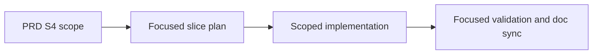

## ELI5 Summary (Read This First)

- What we're doing: turn `S4` from the PRD execution map into a focused executable slice without widening scope.
- Why we're doing it: the orchestrator needs a concrete slice draft so planning and freeze can converge on the named boundary instead of starting from a blank template.
- What "done" looks like: the repo ships `S4` exactly within `Execution Map row` plus the Execution Map note: design-doc and slice-map mode and proves it with focused validation.
- How we'll do it: ground the current repo truth, lock the slice contract and docs, implement the smallest load-bearing surface, then validate and sync the affected docs.
- Next step / resume point: Phase 0 grounding is the approved post-freeze work; after it is validated, freeze only the next concrete `S4` tasks needed to update the existing V2 workflow YAML and focused tests.

### Optional Mental Model

- Treat this slice as a scoped receipt for one PRD row: the plan should explain exactly how `S4` lands without borrowing work from later rows.

## 1) Problem Statement
`Archon PIV Loop Codex V2` is already split into execution slices, but `S4` needs a focused plan that keeps the implementation boundary aligned with the PRD instead of expanding into adjacent slice work. The PRD already names the intended surface for this slice; this seeded draft turns that row into an executable workflow artifact.

## 2) Solution Concept (High-Level)
- Keep `S4` anchored to `Execution Map row` plus the Execution Map note: design-doc and slice-map mode.
- Ground the slice against the current repo code, docs, and tests before changing implementation.
- Prefer the smallest producer/consumer boundary that satisfies `S4` without opening neighboring slices early.
- Use focused repo-local validation and doc sync as the initial proof shape for this slice.

## 3) Scope / Non-Goals
- In scope: design-doc and slice-map mode
- In scope: code, contract docs, and tests directly required by `Execution Map row`.
- Non-goal: widening `S4` into neighboring execution-map rows during the first refine/freeze pass.
- Non-goal: inventing a brand-new UX or runtime surface unless the current repo boundary cannot satisfy this slice.

## 4) Architecture Overview

## 5) Decision Options per Area

### A. Slice boundary
| Option | Pros | Cons | Effort |
|--------|------|------|--------|
| A1. Keep `S4` scoped to `Execution Map row` and the row note | Preserves deterministic sequencing and protects neighboring slices | Optional polish can wait for later slices | Low |
| A2. Widen `S4` into adjacent concerns during the first pass | May reduce a later handoff | Breaks slice isolation and makes orchestration less predictable | High |

**Choice:** [x] A1  [ ] A2

## Plan Status & Controls
- Plan Status: Accepted (as of 2026-04-28)
- Current Phase: P2 — Validated
- Last Updated: 2026-04-28
- Last Reviewed: 2026-04-27
- Next Checkpoint: commit/review handoff
- E2E Gate: not_required
- E2E Waiver Category: internal_tooling
- E2E Waiver Rationale: This seeded slice targets contract, workflow, or internal runtime surfaces. Focused repo-local validation is the required proof shape before any broader end-to-end coverage is considered.
- Canonical task location: Section 6 (Phased Execution Plan)

**Terminology & Actors (Workflow Defaults):**
- **[LBA]** = **Load-Bearing Assumption** (must be verified before freeze/implementation).
- **[Q]** = Open Question (blocking only when placed under `### Blockers` in Unresolved Items).
- **People:** Mase.
- **Reserved token:** "LBA" is reserved for load-bearing assumptions only.

> **State file:** Task status tracked in companion `.state.json` file.
> Markdown checkboxes are supplementary for readability. JSON is source of truth.

## Unresolved Items (Canonical)

Rules:
- Unresolved items are canonical in `<plan>.state.json`.
- Edit via `state_manager.py --action set_unresolved`; markdown is rendered output.
- `[LBA]` items are always blocking until checked.
- `[Q]` items block only when placed under `### Blockers`.
- Default scope is phases `P1+` unless explicitly tagged.

### Blockers (must resolve before freeze)
- [x] [LBA] LBA1 (Blocks: P1 freeze, P2 freeze) — S1 must have landed the V2 workflow skeleton so `archon-piv-loop-codex-v2.yaml` exists and can be extended before S4 implementation begins.
  - Verify: `test -f .archon/workflows/defaults/archon-piv-loop-codex-v2.yaml` passes in the S4 execution lane before P1 starts.
  - Evidence: `.archon/workflows/defaults/archon-piv-loop-codex-v2.yaml` exists in the execution lane used for S4; verified by `ls .archon/workflows/defaults | rg 'archon-piv-loop-codex-v2' || true` returning `archon-piv-loop-codex-v2.yaml` on 2026-04-27.

### FYI / Later (does not block freeze)
- (none)
## Phase Summary (Quick View)

| Phase | Phase Status | Tasks (ID: Title — Status) |
|------:|--------------|----------------------------|
| P0 | Validated | - P0-T1: Ground the current slice boundary against repo reality — validated - P0-T2: Lock the slice contract and doc surface — validated |
| P1 | Validated | - P1-T1: Implement the smallest load-bearing `S4` surface — validated - P1-T2: Add or update focused validation for the touched surface — validated |
| P2 | Validated | - P2-T1: Reconcile docs and prove final slice evidence — validated |

## 6) Phased Execution Plan

### Phase 0 — Grounding And Contract Lock

- [x] **Validated** P0-T1: Ground the current slice boundary against repo reality
  - Test Impact: N/A
  - Commands to Run:
    - inspect `docs/prd/r001-archon-piv-loop-codex-v2.md` and `docs/design/codex-piv-v2-workflow-design.md` for the `S4` Mode B contract: large-request intake, design doc creation or refresh, slice-map creation, and exactly-one-slice selection before the normal one-slice lane
    - inspect the directly implicated repo surfaces that bound the slice today: `.archon/workflows/defaults/`, `packages/workflows/src/executor.test.ts`, `packages/workflows/src/loader.test.ts`, and `packages/workflows/src/defaults/bundled-defaults.test.ts`
    - record the exact workflow YAML and test surfaces that will carry the Phase 1 implementation and proof commands
  - Exit Criteria:
    - the plan captures the current repo truth for `S4`, including the current absence or presence of `archon-piv-loop-codex-v2.yaml`
    - the plan names the concrete workflow YAML and test surfaces that Phase 1 will modify
    - adjacent slice work is explicitly kept out of scope
  - Verify Commands:
    - `sed -n '340,347p' docs/prd/r001-archon-piv-loop-codex-v2.md`
    - `rg -n "create or refresh design doc|create slice map|select exactly one slice|workflow run against fixture request" docs/prd/r001-archon-piv-loop-codex-v2.md docs/design/codex-piv-v2-workflow-design.md`
    - `ls .archon/workflows/defaults | rg 'archon-piv-loop-codex-v2' || true`
    - `rg -n "executeWorkflow|discoverWorkflows|BUNDLED_WORKFLOWS" packages/workflows/src/executor.test.ts packages/workflows/src/loader.test.ts packages/workflows/src/defaults/bundled-defaults.test.ts`
    - `python3 "${CODEX_HOME:-$HOME/.codex}/skills/.shared/workflow/scripts/plan_readiness.py" --plan-path docs/plans/r001-archon-piv-loop-codex-v2-s4_plan.md --format markdown`
  - Grounding Results:
    - `S4` contract: PRD Mode B requires large-request or PRD intake to create or refresh a design doc when load-bearing, create a slice map, select exactly one slice, create a focused slice plan, and continue through the normal one-slice lane.
    - PRD execution-map row: `S4` is `design-doc and slice-map mode`; expected main output is large-request intake that creates design/slice artifacts and selects one slice; primary proof is a workflow run against a fixture request producing expected artifacts.
    - Current workflow YAML: `.archon/workflows/defaults/archon-piv-loop-codex-v2.yaml` exists and is the Phase 1 implementation surface.
    - Current YAML gap: the V2 workflow still labels the active boundary as Slice 3 and explicitly defers design-doc or slice-map intake in the `create-plan` and implementation-loop prompts, so `S4` should update that existing workflow rather than create a new workflow.
    - Test surfaces: `packages/workflows/src/executor.test.ts` is the fixture-driven workflow proof surface for `executeWorkflow`; `packages/workflows/src/defaults/bundled-defaults.test.ts` is the bundled-default regression surface for the V2 YAML contract; `packages/workflows/src/loader.test.ts` is a supporting discovery/defaults surface only if the YAML or default loading contract changes.
    - Adjacent scope kept out: S5 live E2E evidence, S6 planning/implementation review gates, and S7 PR review handoff remain separate slices.

- [x] **Validated** P0-T2: Lock the slice contract and doc surface
  - Test Impact: N/A
  - Commands to Run:
    - update this focused plan after the grounding pass with the exact workflow YAML and validation surfaces for `S4`
    - identify the exact docs and contracts that must stay in sync with `S4`, including the PRD execution-map row and the Mode B design-doc and slice-map artifact contract
  - Exit Criteria:
    - the plan, code boundary, and doc surface describe the same slice
    - `P1-T1` and `P1-T2` each name concrete verify commands rather than prose placeholders
    - no first-pass scope gap remains inside `Execution Map row`
  - Verify Commands:
    - `rg -n "P1-T1|P1-T2|workflow run against fixture request|executeWorkflow|bundled-defaults|validate workflows archon-piv-loop-codex-v2" docs/plans/r001-archon-piv-loop-codex-v2-s4_plan.md`
  - Locked Contract:
    - Workflow YAML to modify in Phase 1: `.archon/workflows/defaults/archon-piv-loop-codex-v2.yaml`.
    - Required code proof: `bun run cli validate workflows archon-piv-loop-codex-v2 --json`.
    - Required test proof: `bun test packages/workflows/src/executor.test.ts packages/workflows/src/loader.test.ts packages/workflows/src/defaults/bundled-defaults.test.ts`.
    - Required fixture behavior: a large request or PRD intake path creates or refreshes a design doc, creates a slice map, selects exactly one slice, and then returns to the normal one-slice lane.
    - Required doc sync: keep this focused plan aligned; use the PRD row and `docs/design/codex-piv-v2-workflow-design.md` as review-only contract anchors unless Phase 1 discovers concrete drift.

### Phase 1 — Scoped Implementation

- [x] **Validated** P1-T1: Implement the smallest load-bearing `S4` surface
  - Test Impact: update
  - Commands to Run:
    - after `LBA1` is verified, update `.archon/workflows/defaults/archon-piv-loop-codex-v2.yaml` with the smallest Mode B intake path needed for large-request or PRD inputs
    - keep the implementation scoped to creating or refreshing a design doc, creating a slice map, selecting exactly one slice, and then returning to the normal one-slice lane
    - preserve neighboring execution-map rows as separate slices unless the PRD contract proves unavoidable coupling
  - Exit Criteria:
    - the V2 workflow supports Mode B intake: given a large request or PRD, it creates or refreshes a design doc, creates a slice map, and selects exactly one slice before entering the normal one-slice lane
    - the implementation boundary still matches the `S4` execution-map row instead of widening into S5+
  - Verify Commands:
    - `test -f .archon/workflows/defaults/archon-piv-loop-codex-v2.yaml`
    - `bun run cli validate workflows archon-piv-loop-codex-v2 --json`
    - `bun test packages/workflows/src/executor.test.ts packages/workflows/src/loader.test.ts packages/workflows/src/defaults/bundled-defaults.test.ts`
  - Implementation Results:
    - Added Mode B intake nodes to `.archon/workflows/defaults/archon-piv-loop-codex-v2.yaml`: `intake-classifier`, `mode-b-design-doc`, `mode-b-slice-map`, and `mode-b-intake-summary`.
    - Mode B now creates or refreshes `docs/design/<slug>.md`, writes `docs/plans/<slug>_slice_map.md`, enforces exactly one selected slice, and then routes through the existing one-slice `explore` and `create-plan` lane.
    - Regenerated `packages/workflows/src/defaults/bundled-defaults.generated.ts` so bundled defaults match the on-disk workflow YAML.

- [x] **Validated** P1-T2: Add or update focused validation for the touched surface
  - Test Impact: add
  - Commands to Run:
    - add or update a fixture-driven workflow proof in `packages/workflows/src/executor.test.ts` that exercises large-request or PRD intake and asserts design-doc and slice-map artifact creation plus exactly-one-slice selection
    - update the nearest workflow discovery or bundled-defaults regression surface in `packages/workflows/src/loader.test.ts` or `packages/workflows/src/defaults/bundled-defaults.test.ts` if the V2 default workflow contract changes
    - capture the validation evidence needed for freeze and post-freeze review using those repo-native tests
  - Exit Criteria:
    - the load-bearing behavior of `S4` has direct validation coverage
    - a fixture-driven workflow proof fails if Mode B stops producing the expected design-doc and slice-map artifacts or stops selecting exactly one slice
    - validation proves the slice without depending on unrelated later-slice work
  - Verify Commands:
    - `bun test packages/workflows/src/executor.test.ts packages/workflows/src/loader.test.ts packages/workflows/src/defaults/bundled-defaults.test.ts`
    - `bun run cli validate workflows archon-piv-loop-codex-v2 --json`
  - Implementation Results:
    - Added a bundled V2 Mode B intake contract regression in `packages/workflows/src/executor.test.ts`.
    - Extended `packages/workflows/src/defaults/bundled-defaults.test.ts` so bundled-default coverage checks for the new Mode B nodes and exactly-one-slice guard.

### Phase 2 — Validation And Doc Sync

- [x] **Validated** P2-T1: Reconcile docs and prove final slice evidence
  - Test Impact: N/A
  - Commands to Run:
    - sync the touched docs, plan state, and validation evidence after implementation
    - confirm the final slice still matches the execution-map row
  - Exit Criteria:
    - docs, code, and tests agree on the landed `S4` surface
    - the slice is ready for freeze/review without hidden follow-on scope
  - Verify Commands:
    - `python3 "${CODEX_HOME:-$HOME/.codex}/skills/.shared/workflow/scripts/plan_readiness.py" --plan-path docs/plans/r001-archon-piv-loop-codex-v2-s4_plan.md --format markdown`
  - Implementation Results:
    - Synced this focused plan and `docs/design/codex-piv-v2-workflow-design.md` with the landed S4 Mode B implementation and proof surface.
    - Verified the focused plan remains structurally ready with `plan_readiness.py`.

## Current Inputs (single source of truth)
- Feature: `Archon PIV Loop Codex V2`
- Feature PRD: `docs/prd/r001-archon-piv-loop-codex-v2.md`
- Planning shape: umbrella + slices
- Feature PRD section(s): `Execution Map row`
- Specs / contracts (if any):
  - use the active design/spec docs directly implicated by `S4` during P0 grounding
- Goals:
  - deliver `S4` without widening into later slices
  - keep the focused plan, code, and docs aligned to the same execution-map row
- Non-Goals:
  - adjacent slice implementation
  - speculative abstraction beyond the named slice boundary
- Constraints/Interfaces:
  - follow the current repo contracts before introducing new ones
  - keep changes scoped to the smallest load-bearing surface
- Testing (only if code changes):
  - Test posture: `unit=happy-path`, `integration=critical-only`
  - Test suite status: grounded to existing workflow-runtime and bundled-defaults validation surfaces
  - Primary test command(s): `bun test packages/workflows/src/executor.test.ts packages/workflows/src/loader.test.ts packages/workflows/src/defaults/bundled-defaults.test.ts`
  - Supporting validation command: `bun run cli validate workflows archon-piv-loop-codex-v2 --json`
  - Test locations: `packages/workflows/src/executor.test.ts`, `packages/workflows/src/loader.test.ts`, `packages/workflows/src/defaults/bundled-defaults.test.ts`
  - Waivers: if code changes are not required after grounding, record the exact rationale in the plan update
- Owner/Stakeholders: Mase
- Definition of Done: `S4` lands exactly within the PRD row boundary and is proven with focused validation evidence.
- Metrics:
  - slice scope stays within `Execution Map row`
  - validation covers the load-bearing behavior changed by `S4`
- Deadlines: maintain deterministic progress; no separate external deadline is assumed for the seeded draft
- Dependencies:
  - the origin PRD remains the scope authority
  - neighboring slices remain separate unless current repo evidence proves coupling
- Risk tolerance: low; prefer the narrowest safe change

## References (authoritative)
- Source order: vendor docs > official repos/examples > repo code > community posts
- Pin URL + accessed date (+ version/tag/commit)
- Initial:
  - `docs/prd/r001-archon-piv-loop-codex-v2.md` — repo PRD authority (accessed 2026-04-27)
  - `docs/plans/r001-archon-piv-loop-codex-v2-s4_plan.md` — focused slice execution ledger (accessed 2026-04-27)

## Doc Surface Map (Project Docs Only)
Purpose: enumerate project-facing docs that must match implementation reality at closeout.

Explicit exclusions (handled outside the PIV loop closeout): Project Brief, Feature PRDs, `CLAUDE.md`, `memory/projects/`.

| Area | File/Path | Action (must-edit / review-only / N/A) | Notes (what to check) |
| --- | --- | --- | --- |
| README | `README.md` | review-only | Check whether `S4` changes operator-facing workflow or setup guidance. |
| Env contract (.env.example) | `.env.example` | N/A | Update only if this slice introduces or changes a runtime env contract. |
| Integration docs | `docs/design/` | review-only | Review the active design docs directly implicated by `S4`. |
| API docs/schema docs | `docs/specs/` | review-only | Promote to must-edit only for the exact contract docs touched by this slice. |
| Specs/contracts (docs/specs/) | `docs/specs/` | review-only | Keep spec updates scoped to the load-bearing contract for `S4`. |
| Reference docs (docs/reference/) | `docs/reference/` | N/A | Update only if `S4` changes a stable operator runbook. |
| Decisions/ADRs (docs/decisions/) | `docs/decisions/` | N/A | Only needed if the slice introduces a durable architectural decision. |
| Plans (docs/plans/) | `docs/plans/r001-archon-piv-loop-codex-v2-s4_plan.md` | must-edit | This focused plan is the canonical execution ledger for `S4`. |
| Capabilities payload docs/schema | `docs/specs/output-format.md` | review-only | Review if `S4` touches emitted payload or packet shape. |
| Other project docs | `docs/prd/r001-archon-piv-loop-codex-v2.md` | N/A | The feature PRD is the scope anchor and is maintained separately from slice closeout. |

## Doc Sync Log
- 2026-04-27: Seeded focused slice draft from the PRD execution map so the orchestrator can refine from a concrete boundary instead of a blank template.
- 2026-04-27: Completed Phase 0 grounding. Verified the existing V2 workflow YAML, resolved `LBA1`, recorded the current Slice 3 deferral gap, and locked the Phase 1 S4 implementation and validation surfaces.
- 2026-04-28: Landed S4 Mode B intake in the V2 workflow YAML, regenerated bundled defaults, added focused executor/default-workflow coverage, and verified `archon-piv-loop-codex-v2` with the targeted workflow validator and workflow test batch.
