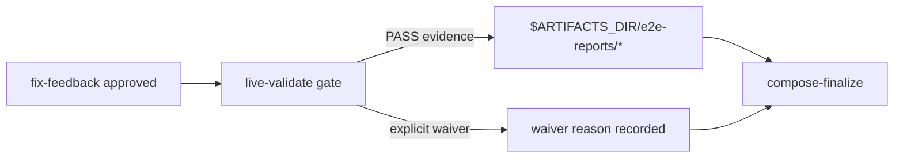

## ELI5 Summary (Read This First)

- What we're doing: turn `S5` into a truthful live-validation slice by making V2 stop treating E2E proof as plan text only and require real evidence or an explicit waiver before PR finalization.
- Why we're doing it: the current V2 workflow on the campaign integration branch still defers live E2E evidence conventions and jumps from implementation approval straight to PR artifact composition.
- What "done" looks like: `archon-piv-loop-codex-v2` has an explicit post-review live-validation gate, writes or references run-scoped evidence under `$ARTIFACTS_DIR/e2e-reports/*`, records a waiver only when live proof is genuinely not possible, and proves the contract with focused workflow validation plus real smoke evidence.
- How we'll do it: ground the current workflow gap on the integration base, freeze the smallest live-validation contract around the existing `e2e_report_manager.py` helper, update the V2 workflow and bundled assertions, then run real CLI and UI smoke with canonical evidence recording.
- Next step / resume point: peer-review this corrected slice, then freeze only if the execution base, live-validation gate, and Phase 99 proof commands are all explicit.

### Optional Mental Model

- Treat `S5` as the slice that inserts a real gate between “implementation approved” and “prepare PR artifacts”: code review stays one surface, live validation becomes a second surface, and PR finalization is not allowed to blur the two.

## 1) Problem Statement
`Archon PIV Loop Codex V2` already has stronger planning, typed phase gates, and Mode B intake work on the campaign integration branch, but it still does not implement the PRD's live-evidence rule. In the current V2 workflow, the plan template asks for a “Final Live Validation Plan”, yet the runtime lane still goes from `fix-feedback` to `compose-finalize` with no explicit live-validation node, no required evidence artifact write, and no structured waiver rule. `S5` must add that missing contract without widening into review automation or PR handoff behavior owned by later slices.

## 2) Solution Concept (High-Level)
- Keep `S5` anchored to `Execution Map row` plus the row note: live E2E evidence convention.
- Treat `integration/r001-archon-piv-loop-codex-v2` as the execution base for this slice until the earlier V2 slices are merged back, because the root `dev` checkout does not currently contain `.archon/workflows/defaults/archon-piv-loop-codex-v2.yaml`.
- Insert one explicit post-`fix-feedback`, pre-`compose-finalize` gate in the V2 workflow that either records PASS evidence through `e2e_report_manager.py` or records an explicit waiver with reason before finalization can continue.
- Keep code review findings, live-validation evidence, and PR artifacts as separate outputs: `code-review` stays the scoped code-quality gate, `live-validate` owns run-scoped proof under `$ARTIFACTS_DIR/e2e-reports/*`, and finalization only summarizes those results.
- Reuse the existing Archon/Codex smoke surfaces where they already exist instead of inventing a second E2E artifact dialect.

## 3) Scope / Non-Goals
- In scope: the V2 workflow gate and prompt contract required to enforce live validation evidence or waiver before finalization.
- In scope: run-scoped evidence-path conventions rooted in `$ARTIFACTS_DIR/e2e-reports/*` plus repo-local closeout evidence under `artifacts/workflow/e2e-reports/*`.
- In scope: focused validation that proves the bundled V2 workflow keeps the new gate, evidence path, and waiver language.
- Non-goal: planning review or implementation review automation (`S6`).
- Non-goal: PR or PR-review handoff behavior (`S7`).
- Non-goal: broad workflow-engine changes unrelated to the V2 workflow contract.

## 4) Architecture Overview



## 5) Decision Options per Area

### A. Live-validation enforcement shape
| Option | Pros | Cons | Effort |
|--------|------|------|--------|
| A1. Add an explicit `live-validate` gate before finalization and require evidence or waiver | Matches the PRD/design contract and keeps proof separate from code review | Adds one more node and summary handoff in the V2 workflow | Medium |
| A2. Keep the current flow and only strengthen plan-template wording | Cheaper on paper | Still lets runtime-changing slices finalize with no concrete evidence contract | High risk |

**Choice:** [x] A1  [ ] A2

## Plan Status & Controls
- Plan Status: Draft (as of 2026-04-28)
- Current Phase: P0 — Grounding
- Last Updated: 2026-04-28
- Last Reviewed: 2026-04-28
- Next Checkpoint: peer-review this refined slice after the execution-base correction and Phase 99 addition, then freeze only if the gate and smoke commands remain concrete.
- Execution-base note: the root `dev` checkout does not currently contain `.archon/workflows/defaults/archon-piv-loop-codex-v2.yaml`; `S5` execution should branch from `integration/r001-archon-piv-loop-codex-v2` or an equivalent lane that already contains the S1-S4 V2 workflow surfaces.
- Deterministic grounding snapshot: PRD row `S5` requires “enforced final live validation contract and evidence path” with “real CLI/API/browser smoke evidence under run artifacts”; the design doc requires proof under `$ARTIFACTS_DIR/e2e-reports/`; the integration-branch V2 workflow still says live E2E evidence is deferred and currently advances from `fix-feedback` to `compose-finalize` with no dedicated live-validation gate; `e2e_report_manager.py` already exists as the smallest deterministic writer for `*-e2e.{md,json}` artifacts.
- E2E Gate: required
- E2E Waiver Category: review_required
- E2E Waiver Rationale: This slice introduces the final live-validation behavior itself, and the PRD row explicitly requires real smoke evidence under run artifacts rather than repo-local tests alone.
- Canonical task location: Section 6 (Phased Execution Plan)

**Terminology & Actors (Workflow Defaults):**
- **[LBA]** = **Load-Bearing Assumption** (must be verified before freeze/implementation).
- **[Q]** = Open Question (blocking only when placed under `### Blockers` in Unresolved Items).
- **People:** Mase.
- **Reserved token:** "LBA" is reserved for load-bearing assumptions only.

> **State file:** Task status tracked in companion `.state.json` file.
> Markdown checkboxes are supplementary for readability. JSON is source of truth.

## Unresolved Items (Canonical)

Rules:
- Unresolved items are canonical in `<plan>.state.json`.
- Edit via `state_manager.py --action set_unresolved`; markdown is rendered output.
- `[LBA]` items are always blocking until checked.
- `[Q]` items block only when placed under `### Blockers`.
- Default scope is phases `P1+` unless explicitly tagged.

### Blockers (must resolve before freeze)
- [ ] [LBA] LBA1 (Blocks: P1 freeze, P2 freeze, P99 freeze) — S5 must execute from integration/r001-archon-piv-loop-codex-v2 or another lane that already contains .archon/workflows/defaults/archon-piv-loop-codex-v2.yaml; the root dev checkout alone is not a valid execution base for this slice.
  - Verify: `git show integration/r001-archon-piv-loop-codex-v2:.archon/workflows/defaults/archon-piv-loop-codex-v2.yaml | sed -n '1,20p'`
  - Evidence: `git branch --list "integration/r001-archon-piv-loop-codex-v2"` returned the integration branch, `git show integration/r001-archon-piv-loop-codex-v2:.archon/workflows/defaults/archon-piv-loop-codex-v2.yaml` returned the V2 workflow content, and local `sed -n '1,20p' .archon/workflows/defaults/archon-piv-loop-codex-v2.yaml` failed in the root checkout on 2026-04-28.
- [ ] [LBA] LBA2 (Blocks: P99 freeze) — The execution lane can run Codex-backed Archon smoke workflows with a writable ARCHON_HOME and the credentials required for real workflow runs before S5 claims PASS live evidence.
  - Verify: `ARCHON_HOME="$PWD/.tmp/archon-home" bun run cli workflow run e2e-codex-smoke --no-worktree "smoke test"`
  - Evidence: TBD during Phase 99; if this preflight cannot run, the slice may still implement the gate but cannot claim PASS live evidence without an explicit waiver outcome.

### FYI / Later (does not block freeze)
- (none)
## Phase Summary (Quick View)

| Phase | Phase Status | Tasks (ID: Title — Status) |
|------:|--------------|----------------------------|
| P0 | Proposed | - P0-T1: Ground the live-validation gap and execution base against repo reality — proposed<br>- P0-T2: Freeze the live-validation gate and evidence-path contract — proposed<br>- P0-T3: Record the live-smoke prerequisite lane and canonical evidence commands — proposed |
| P1 | Proposed | - P1-T1: Add the explicit live-validation gate to the V2 workflow on the integration base — proposed<br>- P1-T2: Add focused bundled-workflow assertions for the new gate, evidence path, and waiver contract — proposed |
| P2 | Proposed | - P2-T1: Run the focused workflow proof commands and capture deterministic results — proposed<br>- P2-T2: Reconcile docs and close the slice evidence loop — proposed |
| P99 | Proposed | - P99-T1: E2E backend/CLI smoke for the V2 live-validation contract — proposed<br>- P99-T2: E2E UI smoke for the V2 live-validation contract — proposed |

## 6) Phased Execution Plan

### Phase 0 — Grounding And Contract Lock

- [ ] P0-T1: Ground the live-validation gap and execution base against repo reality
  - Test Impact: N/A
  - Commands to Run:
    - `sed -n '340,348p' docs/prd/r001-archon-piv-loop-codex-v2.md`
    - `sed -n '426,452p' docs/design/codex-piv-v2-workflow-design.md`
    - `git show integration/r001-archon-piv-loop-codex-v2:.archon/workflows/defaults/archon-piv-loop-codex-v2.yaml | sed -n '1,40p'`
    - `git show integration/r001-archon-piv-loop-codex-v2:.archon/workflows/defaults/archon-piv-loop-codex-v2.yaml | sed -n '1090,1460p'`
    - `sed -n '1,220p' "${CODEX_HOME:-$HOME/.codex}/skills/.shared/workflow/scripts/e2e_report_manager.py"`
    - `sed -n '68,92p' packages/docs-web/src/content/docs/reference/troubleshooting.md`
    - record in this plan that the root checkout lacks the V2 workflow file, the integration branch contains it, the current V2 workflow still defers live E2E evidence conventions, and the existing deterministic helper for `*-e2e.{md,json}` artifacts already exists
  - Exit Criteria:
    - this plan names the exact current gap in the V2 workflow instead of describing live validation abstractly
    - this plan records the exact execution base for `S5` with branch-backed evidence
    - this plan names the exact helper and CLI smoke precedent that Phase 1 and Phase 99 will reuse
  - Verify Commands:
    - `rg -n "integration/r001-archon-piv-loop-codex-v2|fix-feedback|compose-finalize|e2e_report_manager.py|e2e-codex-smoke" docs/plans/r001-archon-piv-loop-codex-v2-s5_plan.md`
  - Grounding Results:
    - PRD execution-map row: `S5` is `live E2E evidence convention`; expected main output is an enforced final live-validation contract and evidence path; primary proof is real CLI/API/browser smoke evidence under run artifacts.
    - Design-doc rule: runtime behavior changes require a live proof under `$ARTIFACTS_DIR/e2e-reports/`, with an explicit waiver only when live validation is genuinely not possible.
    - Current V2 workflow gap: on `integration/r001-archon-piv-loop-codex-v2`, the description still says live E2E evidence conventions are deferred, and the node order still advances from `fix-feedback` to `compose-finalize` with no dedicated live-validation gate or artifact write.
    - Existing helper: `e2e_report_manager.py` already writes deterministic repo-local `artifacts/workflow/e2e-reports/<plan-slug>-<YYYY-MM-DD>-e2e.{md,json}` manifests and is the smallest concrete evidence writer to reuse.
    - Existing smoke precedent: `.archon/workflows/test-workflows/e2e-codex-smoke.yaml` plus the troubleshooting doc's `ARCHON_HOME="$PWD/.tmp/archon-home" archon workflow run ...` pattern provide the current Archon/Codex smoke baseline for a writable execution lane.

- [ ] P0-T2: Freeze the live-validation gate and evidence-path contract
  - Test Impact: N/A
  - Commands to Run:
    - update this focused plan after the grounding pass with the exact workflow node boundary and artifact contract for `S5`
    - freeze the minimal runtime contract: after `fix-feedback` approval but before `compose-finalize`, the V2 workflow must either record PASS evidence via `python3 "${CODEX_HOME:-$HOME/.codex}/skills/.shared/workflow/scripts/e2e_report_manager.py"` or record an explicit waiver with reason
    - freeze the output-separation rule: `code-review` findings remain separate from live-validation evidence, and PR-finalization artifacts must summarize the evidence path or waiver outcome rather than replace them
    - freeze the node-shape rule that `compose-finalize` should consume the `live-validate` outcome, not bypass it
  - Exit Criteria:
    - this plan names one concrete node contract (`live-validate`) and one concrete evidence writer contract (`e2e_report_manager.py`)
    - this plan states explicitly that runtime-changing slices cannot finalize without either PASS evidence or a recorded waiver reason
    - `P1-T1`, `P1-T2`, and both `P99-*` tasks use exact commands and artifact paths instead of placeholders
  - Verify Commands:
    - `rg -n "live-validate|e2e_report_manager.py|\\$ARTIFACTS_DIR/e2e-reports|waiver|compose-finalize" docs/plans/r001-archon-piv-loop-codex-v2-s5_plan.md`
  - Locked Contract:
    - New workflow gate to add in Phase 1: `id: live-validate`, placed after `fix-feedback` and before `compose-finalize`.
    - Required run-scoped artifact path: `$ARTIFACTS_DIR/e2e-reports/*`.
    - Required repo-local closeout evidence path: `artifacts/workflow/e2e-reports/*`.
    - Required summary rule: finalization artifacts must include the live-validation evidence path or explicit waiver state instead of claiming validation by implication.

- [ ] P0-T3: Record the live-smoke prerequisite lane and canonical evidence commands
  - Test Impact: N/A
  - Commands to Run:
    - `sed -n '1,120p' .archon/workflows/test-workflows/e2e-codex-smoke.yaml`
    - `rg --files .archon/workflows/test-workflows | rg 'e2e'`
    - `bun run cli workflow list --json | rg 'e2e-codex-smoke'`
    - record the exact preflight for writable Archon state in the execution lane: `ARCHON_HOME="$PWD/.tmp/archon-home" bun run cli workflow run e2e-codex-smoke --no-worktree "smoke test"`
    - record the exact closeout helper command that writes canonical repo-local evidence after the live smoke:
      `python3 "${CODEX_HOME:-$HOME/.codex}/skills/.shared/workflow/scripts/e2e_report_manager.py" --plan-path docs/plans/r001-archon-piv-loop-codex-v2-s5_plan.md --repo-root "$(pwd)" --verdict PASS --backend-mode automated --ui-mode manual`
  - Exit Criteria:
    - this plan names one concrete provider-smoke preflight for Codex-backed workflow runs
    - the Phase 99 tasks reference concrete Archon smoke surfaces rather than invented test harnesses
    - the canonical repo-local evidence recorder command is present in the plan before closeout
  - Verify Commands:
    - `rg -n "ARCHON_HOME=.*e2e-codex-smoke|workflow run archon-piv-loop-codex-v2|e2e_report_manager.py|browser_smoke" docs/plans/r001-archon-piv-loop-codex-v2-s5_plan.md`

### Phase 1 — Workflow Contract Implementation

- [ ] P1-T1: Add the explicit live-validation gate to the V2 workflow on the integration base
  - Test Impact: update
  - Commands to Run:
    - in the S5 execution worktree created from `integration/r001-archon-piv-loop-codex-v2`, update `.archon/workflows/defaults/archon-piv-loop-codex-v2.yaml`
    - insert `id: live-validate` after `fix-feedback` and before `compose-finalize`
    - require the new gate to decide whether runtime behavior changed, collect real live-proof output when required, and write or summarize evidence through `e2e_report_manager.py`; when live proof is genuinely not possible, require an explicit waiver reason instead of an implicit pass
    - update `compose-finalize` and downstream finalize-facing summary text in the same workflow file so PR artifacts include the evidence path or waiver outcome from `live-validate`
    - keep the change scoped to `S5`: do not add planning review automation, implementation review loops, or PR-review handoff behavior
  - Exit Criteria:
    - the V2 workflow cannot advance from implementation approval to PR artifact composition without a `live-validate` outcome
    - the workflow uses `$ARTIFACTS_DIR/e2e-reports/*` as the run-scoped evidence contract
    - the workflow records explicit waiver language rather than treating missing live proof as an implicit pass
    - the implementation boundary still matches the `S5` execution-map row
  - Verify Commands:
    - `test -f .archon/workflows/defaults/archon-piv-loop-codex-v2.yaml || { echo "expected V2 workflow missing from S5 execution lane; check integration base"; exit 1; }`
    - `bun run cli validate workflows archon-piv-loop-codex-v2 --json`
    - `rg -n "id: live-validate|e2e_report_manager.py|\\$ARTIFACTS_DIR/e2e-reports|waiver|compose-finalize" .archon/workflows/defaults/archon-piv-loop-codex-v2.yaml`

- [ ] P1-T2: Add focused bundled-workflow assertions for the new gate, evidence path, and waiver contract
  - Test Impact: add
  - Commands to Run:
    - extend `packages/workflows/src/defaults/bundled-defaults.test.ts` with string-based assertions against `BUNDLED_WORKFLOWS['archon-piv-loop-codex-v2']`
    - assert the bundled V2 workflow contains the new `id: live-validate` node, the `$ARTIFACTS_DIR/e2e-reports` evidence path, the `e2e_report_manager.py` writer reference, and explicit waiver wording
    - assert finalization no longer relies on a direct `fix-feedback` to `compose-finalize` path with no live-validation contract
    - keep the proof surface focused on bundled workflow content; do not widen into unrelated executor/runtime behavior in this slice
  - Exit Criteria:
    - `packages/workflows/src/defaults/bundled-defaults.test.ts` fails if the bundled V2 workflow loses the live-validation gate or evidence-path language
    - `packages/workflows/src/defaults/bundled-defaults.test.ts` fails if the workflow regresses to finalization with no explicit evidence-or-waiver contract
    - validation proves the slice without depending on later review or PR-handoff slices
  - Verify Commands:
    - `bun test packages/workflows/src/defaults/bundled-defaults.test.ts`
    - `rg -n "archon-piv-loop-codex-v2|live-validate|e2e_report_manager|e2e-reports|waiver|compose-finalize" packages/workflows/src/defaults/bundled-defaults.test.ts`

### Phase 2 — Focused Validation And Doc Sync

- [ ] P2-T1: Run the focused workflow proof commands and capture deterministic results
  - Test Impact: N/A
  - Commands to Run:
    - `bun run cli validate workflows archon-piv-loop-codex-v2 --json`
    - `bun test packages/workflows/src/defaults/bundled-defaults.test.ts`
    - `rg -n "id: live-validate|e2e_report_manager.py|\\$ARTIFACTS_DIR/e2e-reports|waiver" .archon/workflows/defaults/archon-piv-loop-codex-v2.yaml packages/workflows/src/defaults/bundled-defaults.test.ts`
  - Exit Criteria:
    - the focused repo-local proof for the S5 workflow contract passes before live smoke starts
    - the exact gate, evidence path, and waiver strings are visible in both the workflow YAML and the bundled regression surface
  - Verify Commands:
    - `bun run cli validate workflows archon-piv-loop-codex-v2 --json`
    - `bun test packages/workflows/src/defaults/bundled-defaults.test.ts`

- [ ] P2-T2: Reconcile docs and close the slice evidence loop
  - Test Impact: N/A
  - Commands to Run:
    - update this focused plan with the exact Phase 1/2 results and any changed live-proof command details
    - review whether `.archon/workflows/defaults/archon-piv-loop-codex-v2.README.md` needs a narrow operator-facing note about the new `live-validate` gate; update it only if the YAML is no longer self-explanatory
    - keep `docs/design/codex-piv-v2-workflow-design.md` and `docs/prd/r001-archon-piv-loop-codex-v2.md` as review-only unless `S5` resolves a narrow factual drift that must be written back after closeout
  - Exit Criteria:
    - docs, workflow YAML, and focused tests agree on the landed `S5` contract
    - the slice is ready for Phase 99 smoke without hidden follow-on scope
  - Verify Commands:
    - `python3 "${CODEX_HOME:-$HOME/.codex}/skills/.shared/workflow/scripts/plan_readiness.py" --plan-path docs/plans/r001-archon-piv-loop-codex-v2-s5_plan.md --format markdown`
    - `rg -n "live-validate|e2e_report_manager.py|e2e-reports|waiver|review-only" docs/plans/r001-archon-piv-loop-codex-v2-s5_plan.md`

### Phase 99 — End-to-End Gate

**Exit Criteria:** The `S5` workflow contract works in real conditions and the evidence is recorded.

- [ ] P99-T1: E2E backend/CLI smoke for the V2 live-validation contract
  - Why it matters: repo-local workflow validation and bundled string assertions do not prove that a real Archon/Codex workflow run can reach the live-validation gate, produce evidence, or force an explicit waiver before finalization.
  - Exit Criteria:
    - a real CLI workflow run reaches the `live-validate` gate on the S5 execution lane
    - the run writes or references live-validation evidence under the expected artifacts path, or records an explicit waiver with reason instead of silently finalizing
    - canonical repo-local evidence for this plan is recorded after the smoke run
  - E2E Mode: automated
  - Prerequisite Contract:
    ```json
    [
      {
        "kind": "tool_binary",
        "name": "bun",
        "smoke_command": "bun --version",
        "lane_bound": false
      },
      {
        "kind": "env_binding",
        "key": "ARCHON_HOME",
        "source": "plan_constant",
        "required_in_lane": "execution_worktree",
        "lane_bound": true
      },
      {
        "kind": "command_smoke",
        "command": "ARCHON_HOME=\"$PWD/.tmp/archon-home\" bun run cli workflow run e2e-codex-smoke --no-worktree \"smoke test\"",
        "cwd_policy": "repo_root",
        "expected_exit_code": 0,
        "lane_bound": true
      },
      {
        "kind": "fixture_path",
        "path": ".archon/workflows/defaults/archon-piv-loop-codex-v2.yaml",
        "must_exist": true,
        "producer": "integration/r001-archon-piv-loop-codex-v2 execution lane",
        "lane_bound": true
      }
    ]
    ```
  - Prerequisites:
    - The S5 execution lane is based on `integration/r001-archon-piv-loop-codex-v2`.
    - Codex-backed workflow runs can execute in that lane with writable Archon state.
  - Commands to Run:
    - `ARCHON_HOME="$PWD/.tmp/archon-home" bun run cli workflow run e2e-codex-smoke --no-worktree "smoke test"`
    - `ARCHON_HOME="$PWD/.tmp/archon-home" bun run cli workflow run archon-piv-loop-codex-v2 --branch e2e/r001-s5-cli "Use docs/plans/r001-archon-piv-loop-codex-v2-s5_plan.md and stop only after live validation evidence or an explicit waiver is recorded before PR finalization."`
    - `find "$PWD/.tmp/archon-home" -path '*e2e-reports/*-e2e.json' -o -path '*e2e-reports/*-e2e.md'`
    - `python3 "${CODEX_HOME:-$HOME/.codex}/skills/.shared/workflow/scripts/e2e_report_manager.py" --plan-path docs/plans/r001-archon-piv-loop-codex-v2-s5_plan.md --repo-root "$(pwd)" --verdict PASS --backend-mode automated --ui-mode manual`
  - Verify Commands:
    - `ARCHON_HOME="$PWD/.tmp/archon-home" bun run cli workflow run e2e-codex-smoke --no-worktree "smoke test"`
    - `find "$PWD/.tmp/archon-home" -path '*e2e-reports/*-e2e.json' -o -path '*e2e-reports/*-e2e.md'`
    - `test -s artifacts/workflow/e2e-reports/archon-piv-loop-codex-v2-s5-live-e2e-evidence-convention-plan-$(date +%F)-e2e.json || test -n "$(find artifacts/workflow/e2e-reports -name '*-e2e.json' -print -quit)"`
  - Evidence:
    - `artifacts/workflow/e2e-reports/<plan-slug>-<YYYY-MM-DD>-e2e.md`
    - `artifacts/workflow/e2e-reports/<plan-slug>-<YYYY-MM-DD>-e2e.json`
  - Test Impact: N/A

- [ ] P99-T2: E2E UI smoke for the V2 live-validation contract
  - Why it matters: the CLI smoke proves the workflow gate exists, but the user-facing Archon surface still needs proof that the same gate is visible and blocks finalization appropriately from an interactive UI/browser path.
  - Exit Criteria:
    - the local Archon UI loads in the S5 execution lane
    - the operator can reach the V2 workflow run from the UI/browser path and confirm the live-validation gate appears before finalization
    - canonical repo-local evidence is updated with the UI smoke result and screenshots or notes as needed
  - E2E Mode: manual
  - Prerequisite Contract:
    ```json
    [
      {
        "kind": "tool_binary",
        "name": "bun",
        "smoke_command": "bun --version",
        "lane_bound": false
      },
      {
        "kind": "command_smoke",
        "command": "PORT=4000 bun run dev",
        "cwd_policy": "repo_root",
        "expected_exit_code": 0,
        "lane_bound": true
      },
      {
        "kind": "browser_smoke",
        "runner": "playwright",
        "entry_artifact": "artifacts/workflow/tmp/r001-s5-ui-home.html",
        "export_artifact": "artifacts/workflow/tmp/r001-s5-ui-notes.md",
        "expected_artifact": "artifacts/workflow/e2e-reports/<plan-slug>-<YYYY-MM-DD>-e2e.json",
        "lane_bound": true
      }
    ]
    ```
  - Prerequisites:
    - Local dev server can run in the S5 execution lane.
    - A browser harness can open the local UI, or the operator can perform the manual browser steps.
  - Commands to Run:
    - `PORT=4000 bun run dev >/tmp/r001-s5-dev.log 2>&1 & echo $! >/tmp/r001-s5-dev.pid`
    - `curl -sf http://localhost:4000/ > artifacts/workflow/tmp/r001-s5-ui-home.html`
    - `curl -sf http://localhost:4000/api/conversations >/tmp/r001-s5-conversations.json || true`
    - `MANUAL: open http://localhost:4000, start a V2 run from the S5 execution lane, confirm the flow reaches the live-validation gate before finalization, and capture the observed evidence path or waiver outcome in artifacts/workflow/tmp/r001-s5-ui-notes.md`
    - `python3 "${CODEX_HOME:-$HOME/.codex}/skills/.shared/workflow/scripts/e2e_report_manager.py" --plan-path docs/plans/r001-archon-piv-loop-codex-v2-s5_plan.md --repo-root "$(pwd)" --verdict PASS --backend-mode automated --ui-mode manual --notes-file artifacts/workflow/tmp/r001-s5-ui-notes.md`
  - Verify Commands:
    - `curl -sf http://localhost:4000/ > /tmp/r001-s5-home-check.html`
    - `test -s artifacts/workflow/tmp/r001-s5-ui-notes.md`
    - `test -n "$(find artifacts/workflow/e2e-reports -name '*-e2e.json' -print -quit)"`
  - Evidence:
    - `artifacts/workflow/e2e-reports/<plan-slug>-<YYYY-MM-DD>-e2e.md`
    - `artifacts/workflow/e2e-reports/<plan-slug>-<YYYY-MM-DD>-e2e.json`
  - Test Impact: N/A

## Current Inputs (single source of truth)
- Feature: `Archon PIV Loop Codex V2`
- Feature PRD: `docs/prd/r001-archon-piv-loop-codex-v2.md`
- Planning shape: umbrella + slices
- Feature PRD section(s): `Execution Map row`
- Specs / contracts (if any):
  - `docs/design/codex-piv-v2-workflow-design.md` — defines the live-validation requirement, `$ARTIFACTS_DIR/e2e-reports/` convention, and explicit waiver rule
  - `.archon/workflows/defaults/archon-piv-loop-codex-v2.yaml` on `integration/r001-archon-piv-loop-codex-v2` — current V2 workflow surface that still defers live E2E evidence conventions
  - `${CODEX_HOME:-$HOME/.codex}/skills/.shared/workflow/scripts/e2e_report_manager.py` — deterministic helper for canonical `*-e2e.{md,json}` artifacts
- Goals:
  - deliver `S5` without widening into review automation or PR handoff work
  - keep the V2 workflow, evidence artifacts, and focused plan aligned to the same live-validation contract
- Non-Goals:
  - adjacent slice implementation
  - speculative workflow-engine changes beyond the V2 gate and evidence contract
- Constraints/Interfaces:
  - ground workflow-file availability against `integration/r001-archon-piv-loop-codex-v2`, because root `dev` intentionally lags campaign slice work
  - keep code review and final live validation as separate gates
  - reuse the existing deterministic E2E report helper instead of inventing a new artifact format
- Testing (only if code changes):
  - Test posture: `unit=happy-path`, `integration=critical-only`
  - Test suite status: existing repo-local validation surface identified for bundled workflow assertions
  - Primary test command(s): `bun test packages/workflows/src/defaults/bundled-defaults.test.ts`
  - Supporting validation command: `bun run cli validate workflows archon-piv-loop-codex-v2 --json`
  - Live-proof preflight: `ARCHON_HOME="$PWD/.tmp/archon-home" bun run cli workflow run e2e-codex-smoke --no-worktree "smoke test"`
  - Test locations: `packages/workflows/src/defaults/bundled-defaults.test.ts`, `.archon/workflows/defaults/archon-piv-loop-codex-v2.yaml`, `.archon/workflows/test-workflows/e2e-codex-smoke.yaml`
  - Waivers: if real live smoke cannot run, the workflow must record an explicit waiver reason; do not treat missing proof as an implicit pass
- Owner/Stakeholders: Mase
- Definition of Done: `S5` lands exactly within the PRD row boundary, enforces live evidence or waiver before finalization, and is proven with focused validation plus real smoke evidence.
- Metrics:
  - slice scope stays within `Execution Map row`
  - the V2 workflow cannot finalize runtime-changing slices without evidence or waiver
  - the live smoke writes or references the expected E2E artifact paths
- Deadlines: maintain deterministic progress; no separate external deadline is assumed for this slice
- Dependencies:
  - `integration/r001-archon-piv-loop-codex-v2` provides the current V2 workflow surface for the S5 execution lane
  - neighboring slices remain separate unless current repo evidence proves unavoidable coupling
- Risk tolerance: low; prefer the narrowest safe change

## References (authoritative)
- Source order: vendor docs > official repos/examples > repo code > community posts
- Pin URL + accessed date (+ version/tag/commit)
- Initial:
  - `docs/prd/r001-archon-piv-loop-codex-v2.md` — repo PRD authority (accessed 2026-04-28)
  - `docs/design/codex-piv-v2-workflow-design.md` — live-validation contract source (accessed 2026-04-28)
  - `integration/r001-archon-piv-loop-codex-v2:.archon/workflows/defaults/archon-piv-loop-codex-v2.yaml` — current V2 workflow surface on the campaign integration branch (accessed 2026-04-28)
  - `${CODEX_HOME:-$HOME/.codex}/skills/.shared/workflow/scripts/e2e_report_manager.py` — deterministic E2E evidence writer (accessed 2026-04-28)

## Doc Surface Map (Project Docs Only)
Purpose: enumerate project-facing docs that must match implementation reality at closeout.

Explicit exclusions (handled outside the PIV loop closeout): Project Brief, Feature PRDs, `CLAUDE.md`, `memory/projects/`.

| Area | File/Path | Action (must-edit / review-only / N/A) | Notes (what to check) |
| --- | --- | --- | --- |
| README | `README.md` | review-only | Check whether the new live-validation gate changes operator-facing workflow guidance. |
| Workflow default | `.archon/workflows/defaults/archon-piv-loop-codex-v2.yaml` | must-edit | Add the `live-validate` gate, evidence-path contract, and finalization handoff. |
| Workflow companion note | `.archon/workflows/defaults/archon-piv-loop-codex-v2.README.md` | review-only | Update only if the new gate needs an operator-facing note beyond the YAML itself. |
| Integration docs | `docs/design/codex-piv-v2-workflow-design.md` | review-only | Keep the design doc aligned if `S5` resolves a narrow factual gap. |
| Reference docs | `packages/docs-web/src/content/docs/reference/troubleshooting.md` | review-only | Revisit only if the writable-`ARCHON_HOME` smoke guidance changes materially. |
| Plans (docs/plans/) | `docs/plans/r001-archon-piv-loop-codex-v2-s5_plan.md` | must-edit | This focused plan is the canonical execution ledger for `S5`. |
| Other project docs | `docs/prd/r001-archon-piv-loop-codex-v2.md` | review-only | The feature PRD remains the scope anchor and already names the `S5` proof requirement. |

## Risks

| Risk | Impact | Mitigation |
|------|--------|------------|
| The workflow gate lands only as wording and still allows direct finalization | HIGH | Require a concrete `live-validate` node and bundled assertions that fail on regression. |
| The root checkout is used accidentally and the V2 workflow file is missing | HIGH | Keep `LBA1` explicit and ground execution against `integration/r001-archon-piv-loop-codex-v2`. |
| Live smoke prerequisites are unavailable, leading to fake PASS evidence | HIGH | Keep `LBA2` explicit, require real smoke preflight, and use explicit waiver recording when proof is genuinely unavailable. |
| `S5` widens into review automation or PR handoff | MED | Keep tasks and assertions scoped to the live-validation gate, evidence path, and finalization summary only. |

## Doc Sync Log
- 2026-04-27: Seeded focused slice draft from the PRD execution map so the orchestrator can refine from a concrete boundary instead of a blank template.
- 2026-04-28: Completed Phase 0 grounding for the refine pass. Verified that the root `dev` checkout lacks the V2 workflow file, grounded `S5` against the integration-branch workflow, recorded the current post-review -> finalization gap, and froze the live-validation/evidence-path contract around `e2e_report_manager.py`.
