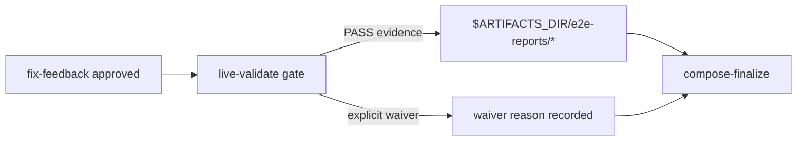

## ELI5 Summary (Read This First)

- What we're doing: turn `S5` into a truthful live-validation slice by making V2 stop treating E2E proof as plan text only and require real evidence or an explicit waiver before PR finalization.
- Why we're doing it: the current V2 workflow on the campaign integration branch still defers live E2E evidence conventions and jumps from implementation approval straight to PR artifact composition.
- What "done" looks like: `archon-piv-loop-codex-v2` has an explicit post-review live-validation gate, writes or references run-scoped evidence under `$ARTIFACTS_DIR/e2e-reports/*`, records a waiver only when live proof is genuinely not possible, and proves the contract with focused workflow validation plus real smoke evidence.
- How we'll do it: ground the current workflow gap on the integration base, freeze the smallest live-validation contract around the existing `e2e_report_manager.py` helper, update the V2 workflow and bundled assertions, then run real CLI and UI smoke with canonical evidence recording.
- Next step / resume point: resolve the remaining Phase 99 UI proof blocker, or keep the slice blocked with the recorded waiver evidence. The CLI/backend proof passed, but the UI proof cannot honestly claim PASS until the UI-created isolated worktree uses the S5 branch surface instead of stale `origin/dev`.

### Optional Mental Model

- Treat `S5` as the slice that inserts a real gate between “implementation approved” and “prepare PR artifacts”: code review stays one surface, live validation becomes a second surface, and PR finalization is not allowed to blur the two.

## 1) Problem Statement
`Archon PIV Loop Codex V2` already had stronger planning, typed phase gates, and Mode B intake work on the campaign integration branch, but at S5 start it still did not implement the PRD's live-evidence rule. The pre-S5 workflow asked for a “Final Live Validation Plan”, yet the runtime lane still went from `fix-feedback` to `compose-finalize` with no explicit live-validation node, no required evidence artifact write, and no structured waiver rule. `S5` adds that missing contract without widening into review automation or PR handoff behavior owned by later slices.

## 2) Solution Concept (High-Level)
- Keep `S5` anchored to `Execution Map row` plus the row note: live E2E evidence convention.
- Treat `integration/r001-archon-piv-loop-codex-v2` as the execution base for this slice until the earlier V2 slices are merged back, because the root `dev` checkout does not currently contain `.archon/workflows/defaults/archon-piv-loop-codex-v2.yaml`.
- Insert one explicit post-`fix-feedback`, pre-`compose-finalize` gate in the V2 workflow that either records PASS evidence through `e2e_report_manager.py` or records an explicit waiver with reason before finalization can continue.
- Keep code review findings, live-validation evidence, and PR artifacts as separate outputs: `code-review` stays the scoped code-quality gate, `live-validate` owns run-scoped proof under `$ARTIFACTS_DIR/e2e-reports/*`, and finalization only summarizes those results.
- Reuse the existing Archon/Codex smoke surfaces where they already exist instead of inventing a second E2E artifact dialect.

## 3) Scope / Non-Goals
- In scope: the V2 workflow gate and prompt contract required to enforce live validation evidence or waiver before finalization.
- In scope: run-scoped evidence-path conventions rooted in `$ARTIFACTS_DIR/e2e-reports/*` plus repo-local closeout evidence under `artifacts/workflow/e2e-reports/*`.
- In scope: focused validation that proves the bundled V2 workflow keeps the new gate, evidence path, and waiver language.
- Non-goal: planning review or implementation review automation (`S6`).
- Non-goal: PR or PR-review handoff behavior (`S7`).
- Non-goal: broad workflow-engine changes unrelated to the V2 workflow contract.

## 4) Architecture Overview



## 5) Decision Options per Area

### A. Live-validation enforcement shape
| Option | Pros | Cons | Effort |
|--------|------|------|--------|
| A1. Add an explicit `live-validate` gate before finalization and require evidence or waiver | Matches the PRD/design contract and keeps proof separate from code review | Adds one more node and summary handoff in the V2 workflow | Medium |
| A2. Keep the current flow and only strengthen plan-template wording | Cheaper on paper | Still lets runtime-changing slices finalize with no concrete evidence contract | High risk |

**Choice:** [x] A1  [ ] A2

## Plan Status & Controls
- Plan Status: Active (sidecar canonical state, as of 2026-04-28)
- Current Phase: P99 — End-to-End Gate (blocked)
- Last Updated: 2026-04-28
- Last Reviewed: 2026-04-28
- Next Checkpoint: resolve the UI-created isolation worktree mismatch for P99-T2, then rerun the UI smoke from `/workflows` with the S5 plan/workflow files present in the worker checkout.
- Execution-base note: the root `dev` checkout still lacks `.archon/workflows/defaults/archon-piv-loop-codex-v2.yaml`, but the current slice branch `slice/r001-archon-piv-loop-codex-v2/s5` already descends from `integration/r001-archon-piv-loop-codex-v2` and contains the V2 workflow surface locally. Keep implementation on this slice branch or an equivalent descendant lane that preserves those S1-S4 artifacts.
- Deterministic grounding snapshot: PRD row `S5` requires “enforced final live validation contract and evidence path” with “real CLI/API/browser smoke evidence under run artifacts”; the design doc requires proof under `$ARTIFACTS_DIR/e2e-reports/`; before this S5 implementation, the V2 workflow still said live E2E evidence was deferred and `compose-finalize` still depended directly on `fix-feedback`; `e2e_report_manager.py` already exists as the smallest deterministic writer for `*-e2e.{md,json}` artifacts; and this repo's bundled-workflow contract means any default-workflow YAML edit must also keep `packages/workflows/src/defaults/bundled-defaults.generated.ts` passing `bun run check:bundled`.
- E2E Gate: required
- E2E Waiver Category: review_required
- E2E Waiver Rationale: This slice introduces the final live-validation behavior itself, and the PRD row explicitly requires real smoke evidence under run artifacts rather than repo-local tests alone. The backend/CLI path produced live proof, but the browser/UI path is waiver-blocked until Archon can launch the UI workflow against a worker checkout containing the S5 branch artifacts.
- Canonical task location: Section 6 (Phased Execution Plan)

**Terminology & Actors (Workflow Defaults):**
- **[LBA]** = **Load-Bearing Assumption** (must be verified before freeze/implementation).
- **[Q]** = Open Question (blocking only when placed under `### Blockers` in Unresolved Items).
- **People:** Mase.
- **Reserved token:** "LBA" is reserved for load-bearing assumptions only.

> **State file:** Task status tracked in companion `.state.json` file.
> Markdown checkboxes are supplementary for readability. JSON is source of truth.

## Unresolved Items (Canonical)

Rules:
- Unresolved items are canonical in `<plan>.state.json`.
- Edit via `state_manager.py --action set_unresolved`; markdown is rendered output.
- `[LBA]` items are always blocking until checked.
- `[Q]` items block only when placed under `### Blockers`.
- Default scope is phases `P1+` unless explicitly tagged.

### Blockers (must resolve before freeze)
- [x] [LBA] LBA1 (Blocks: P1 freeze, P2 freeze, P99 freeze) — S5 must execute from integration/r001-archon-piv-loop-codex-v2 or another lane that already contains .archon/workflows/defaults/archon-piv-loop-codex-v2.yaml; the root dev checkout alone is not a valid execution base for this slice.
  - Verify: `git show integration/r001-archon-piv-loop-codex-v2:.archon/workflows/defaults/archon-piv-loop-codex-v2.yaml | sed -n '1,20p'`
  - Evidence: `git branch --show-current` returned `slice/r001-archon-piv-loop-codex-v2/s5`, `test -f .archon/workflows/defaults/archon-piv-loop-codex-v2.yaml` returned `PRESENT`, and `git merge-base --is-ancestor integration/r001-archon-piv-loop-codex-v2 HEAD` returned `YES` on 2026-04-28.
- [x] [LBA] LBA2 (Blocks: P99 freeze) — The execution lane can run Codex-backed Archon smoke workflows with a writable ARCHON_HOME and the credentials required for real workflow runs before S5 claims PASS live evidence.
  - Verify: `BUN_INSTALL_CACHE_DIR=/private/tmp/archon-bun-cache ARCHON_HOME="$PWD/.tmp/archon-home" bun run cli workflow run e2e-codex-smoke --no-worktree "smoke test"`
  - Evidence: After creating `.tmp/archon-home`, `BUN_INSTALL_CACHE_DIR=/private/tmp/archon-bun-cache ARCHON_HOME="$PWD/.tmp/archon-home" bun run cli workflow run e2e-codex-smoke --no-worktree "smoke test"` exited 0 on 2026-04-28. Output included `Workflow completed successfully` and `PASS: simple='4' structured='{category:math}'`.

### FYI / Later (does not block freeze)
- (none)
## Phase Summary (Quick View)

| Phase | Phase Status | Tasks (ID: Title — Status) |
|------:|--------------|----------------------------|
| P0 | Validated | - P0-T1: Ground the live-validation gap and execution base against repo reality — validated<br>- P0-T2: Freeze the live-validation gate and evidence-path contract — validated<br>- P0-T3: Record the live-smoke prerequisite lane and canonical evidence commands — validated |
| P1 | Validated | - P1-T1: Add the explicit live-validation gate to the V2 workflow on the integration base — validated<br>- P1-T2: Add focused bundled-workflow assertions for the new gate, evidence path, and waiver contract — validated |
| P2 | Validated | - P2-T1: Run the focused workflow proof commands and capture deterministic results — validated<br>- P2-T2: Reconcile docs and close the slice evidence loop — validated |
| P99 | Blocked | - P99-T1: E2E backend/CLI smoke for the V2 live-validation contract — blocked<br>- P99-T2: E2E UI smoke for the V2 live-validation contract — blocked |

## 6) Phased Execution Plan

### Phase 0 — Grounding And Contract Lock

- [x] **Validated** P0-T1: Ground the live-validation gap and execution base against repo reality
  - Test Impact: N/A
  - Commands to Run:
    - `sed -n '340,348p' docs/prd/r001-archon-piv-loop-codex-v2.md`
    - `sed -n '426,452p' docs/design/codex-piv-v2-workflow-design.md`
    - `git show integration/r001-archon-piv-loop-codex-v2:.archon/workflows/defaults/archon-piv-loop-codex-v2.yaml | sed -n '1,40p'`
    - `git show integration/r001-archon-piv-loop-codex-v2:.archon/workflows/defaults/archon-piv-loop-codex-v2.yaml | sed -n '1090,1460p'`
    - `sed -n '1,220p' "${CODEX_HOME:-$HOME/.codex}/skills/.shared/workflow/scripts/e2e_report_manager.py"`
    - `sed -n '68,92p' packages/docs-web/src/content/docs/reference/troubleshooting.md`
    - record in this plan that the root checkout lacks the V2 workflow file, the integration branch contains it, the pre-S5 workflow still defers live E2E evidence conventions, and the existing deterministic helper for `*-e2e.{md,json}` artifacts already exists
  - Exit Criteria:
    - this plan names the exact current gap in the V2 workflow instead of describing live validation abstractly
    - this plan records the exact execution base for `S5` with branch-backed evidence
    - this plan names the exact helper and CLI smoke precedent that Phase 1 and Phase 99 will reuse
  - Verify Commands:
    - `rg -n "integration/r001-archon-piv-loop-codex-v2|fix-feedback|compose-finalize|e2e_report_manager.py|e2e-codex-smoke" docs/plans/r001-archon-piv-loop-codex-v2-s5_plan.md`
  - Grounding Results:
    - PRD execution-map row: `S5` is `live E2E evidence convention`; expected main output is an enforced final live-validation contract and evidence path; primary proof is real CLI/API/browser smoke evidence under run artifacts.
    - Design-doc rule: runtime behavior changes require a live proof under `$ARTIFACTS_DIR/e2e-reports/`, with an explicit waiver only when live validation is genuinely not possible.
    - Pre-S5 workflow gap: on `integration/r001-archon-piv-loop-codex-v2`, the description still said live E2E evidence conventions were deferred, and the node order still advanced from `fix-feedback` to `compose-finalize` with no dedicated live-validation gate or artifact write.
    - Existing helper: `e2e_report_manager.py` already writes deterministic repo-local `artifacts/workflow/e2e-reports/<plan-slug>-<YYYY-MM-DD>-e2e.{md,json}` manifests and is the smallest concrete evidence writer to reuse.
    - Existing smoke precedent: `.archon/workflows/test-workflows/e2e-codex-smoke.yaml` plus the troubleshooting doc's `ARCHON_HOME="$PWD/.tmp/archon-home" archon workflow run ...` pattern provide the current Archon/Codex smoke baseline for a writable execution lane.

- [x] **Validated** P0-T2: Freeze the live-validation gate and evidence-path contract
  - Test Impact: N/A
  - Commands to Run:
    - update this focused plan after the grounding pass with the exact workflow node boundary and artifact contract for `S5`
    - freeze the minimal runtime contract: after `fix-feedback` approval but before `compose-finalize`, the V2 workflow must either record PASS evidence via `python3 "${CODEX_HOME:-$HOME/.codex}/skills/.shared/workflow/scripts/e2e_report_manager.py"` or record an explicit waiver with reason
    - freeze the output-separation rule: `code-review` findings remain separate from live-validation evidence, and PR-finalization artifacts must summarize the evidence path or waiver outcome rather than replace them
    - freeze the node-shape rule that `compose-finalize` should consume the `live-validate` outcome, not bypass it
  - Exit Criteria:
    - this plan names one concrete node contract (`live-validate`) and one concrete evidence writer contract (`e2e_report_manager.py`)
    - this plan states explicitly that runtime-changing slices cannot finalize without either PASS evidence or a recorded waiver reason
    - `P1-T1`, `P1-T2`, and both `P99-*` tasks use exact commands and artifact paths instead of placeholders
  - Verify Commands:
    - `rg -n "live-validate|e2e_report_manager.py|\\$ARTIFACTS_DIR/e2e-reports|waiver|compose-finalize" docs/plans/r001-archon-piv-loop-codex-v2-s5_plan.md`
  - Locked Contract:
    - New workflow gate to add in Phase 1: `id: live-validate`, placed after `fix-feedback` and before `compose-finalize`.
    - Required run-scoped artifact path: `$ARTIFACTS_DIR/e2e-reports/*`.
    - Required repo-local closeout evidence path: `artifacts/workflow/e2e-reports/*`.
    - Required summary rule: finalization artifacts must include the live-validation evidence path or explicit waiver state instead of claiming validation by implication.

- [x] **Validated** P0-T3: Record the live-smoke prerequisite lane and canonical evidence commands
  - Test Impact: N/A
  - Commands to Run:
    - `sed -n '1,120p' .archon/workflows/test-workflows/e2e-codex-smoke.yaml`
    - `rg --files .archon/workflows/test-workflows | rg 'e2e'`
    - `bun run cli workflow list --json | rg 'e2e-codex-smoke'`
    - record the exact preflight for writable Archon state in the execution lane: `BUN_INSTALL_CACHE_DIR=/private/tmp/archon-bun-cache ARCHON_HOME="$PWD/.tmp/archon-home" bun run cli workflow run e2e-codex-smoke --no-worktree "smoke test"`
    - record the exact closeout helper command that writes canonical repo-local evidence after the live smoke:
      `python3 "${CODEX_HOME:-$HOME/.codex}/skills/.shared/workflow/scripts/e2e_report_manager.py" --plan-path docs/plans/r001-archon-piv-loop-codex-v2-s5_plan.md --repo-root "$(pwd)" --verdict PASS --backend-mode automated --ui-mode manual`
  - Exit Criteria:
    - this plan names one concrete provider-smoke preflight for Codex-backed workflow runs
    - the Phase 99 tasks reference concrete Archon smoke surfaces rather than invented test harnesses
    - the canonical repo-local evidence recorder command is present in the plan before closeout
  - Verify Commands:
    - `rg -n "ARCHON_HOME=.*e2e-codex-smoke|workflow run archon-piv-loop-codex-v2|e2e_report_manager.py|browser_smoke" docs/plans/r001-archon-piv-loop-codex-v2-s5_plan.md`

### Phase 1 — Workflow Contract Implementation

- [x] **Validated** P1-T1: Add the explicit live-validation gate to the V2 workflow on the integration base
  - Test Impact: update
  - Commands to Run:
    - in the S5 execution worktree created from `integration/r001-archon-piv-loop-codex-v2`, update `.archon/workflows/defaults/archon-piv-loop-codex-v2.yaml`
    - remove the workflow-description claim that live E2E evidence conventions are still deferred to later V2 slices
    - insert `id: live-validate` after `fix-feedback` and before `compose-finalize`
    - require the new gate to decide whether runtime behavior changed, collect real live-proof output when required, and write or summarize evidence through `e2e_report_manager.py`; when live proof is genuinely not possible, require an explicit waiver reason instead of an implicit pass
    - change `compose-finalize` from `depends_on: [fix-feedback, implement-setup]` to `depends_on: [live-validate, implement-setup]`
    - update `compose-finalize` and downstream finalize-facing summary text in the same workflow file so PR artifacts include the evidence path or waiver outcome from `live-validate` instead of relying on approval alone
    - keep the change scoped to `S5`: do not add planning review automation, implementation review loops, or PR-review handoff behavior
  - Exit Criteria:
    - the V2 workflow cannot advance from implementation approval to PR artifact composition without a `live-validate` outcome
    - `compose-finalize` depends on `live-validate`, not directly on `fix-feedback`
    - the workflow uses `$ARTIFACTS_DIR/e2e-reports/*` as the run-scoped evidence contract
    - the workflow records explicit waiver language rather than treating missing live proof as an implicit pass
    - the workflow description no longer claims that live E2E evidence conventions are deferred
    - the implementation boundary still matches the `S5` execution-map row
  - Verify Commands:
    - `test -f .archon/workflows/defaults/archon-piv-loop-codex-v2.yaml || { echo "expected V2 workflow missing from S5 execution lane; check integration base"; exit 1; }`
    - `bun run cli validate workflows archon-piv-loop-codex-v2 --json`
    - `rg -n "id: live-validate|depends_on: \\[live-validate, implement-setup\\]|e2e_report_manager.py|\\$ARTIFACTS_DIR/e2e-reports|waiver|compose-finalize" .archon/workflows/defaults/archon-piv-loop-codex-v2.yaml`
    - `! rg -n "deferred to later V2 slices|depends_on: \\[fix-feedback, implement-setup\\]" .archon/workflows/defaults/archon-piv-loop-codex-v2.yaml`
  - Implementation Results:
    - Added `live-validate` after `fix-feedback` and before `compose-finalize`.
    - Changed `compose-finalize` to depend on `live-validate` and to stop if no evidence path or explicit waiver is present.
    - Replaced the stale description that said live E2E evidence conventions were deferred.
    - Verified the edited workflow with `bun run cli validate workflows archon-piv-loop-codex-v2 --json`.

- [x] **Validated** P1-T2: Add focused bundled-workflow assertions for the new gate, evidence path, and waiver contract
  - Test Impact: add
  - Commands to Run:
    - extend `packages/workflows/src/defaults/bundled-defaults.test.ts` with string-based assertions against `BUNDLED_WORKFLOWS['archon-piv-loop-codex-v2']`
    - regenerate `packages/workflows/src/defaults/bundled-defaults.generated.ts` with `bun run generate:bundled` after updating the default workflow YAML
    - assert the bundled V2 workflow contains the new `id: live-validate` node, the `$ARTIFACTS_DIR/e2e-reports` evidence path, the `e2e_report_manager.py` writer reference, and explicit waiver wording
    - assert `compose-finalize` now depends on `live-validate` and that the old `depends_on: [fix-feedback, implement-setup]` form is absent
    - assert the bundled workflow description no longer says live E2E evidence conventions are deferred to later slices
    - keep the proof surface focused on bundled workflow content; do not widen into unrelated executor/runtime behavior in this slice
  - Exit Criteria:
    - `packages/workflows/src/defaults/bundled-defaults.test.ts` fails if the bundled V2 workflow loses the live-validation gate or evidence-path language
    - `packages/workflows/src/defaults/bundled-defaults.test.ts` fails if the workflow regresses to finalization with no explicit evidence-or-waiver contract or restores the direct `fix-feedback` dependency
    - `packages/workflows/src/defaults/bundled-defaults.generated.ts` is regenerated and stays in sync with the edited workflow YAML
    - validation proves the slice without depending on later review or PR-handoff slices
  - Verify Commands:
    - `bun run check:bundled`
    - `bun test packages/workflows/src/defaults/bundled-defaults.test.ts`
    - `rg -n "archon-piv-loop-codex-v2|live-validate|e2e_report_manager|e2e-reports|waiver|compose-finalize|fix-feedback|deferred to later V2 slices" packages/workflows/src/defaults/bundled-defaults.test.ts`
  - Implementation Results:
    - Added a bundled-default regression test that requires `live-validate`, `$ARTIFACTS_DIR/e2e-reports`, `e2e_report_manager.py`, explicit waiver state, and the new `compose-finalize` dependency.
    - Regenerated `packages/workflows/src/defaults/bundled-defaults.generated.ts`.
    - Verified bundle sync and the focused bundled-default test.

### Phase 2 — Focused Validation And Doc Sync

- [x] **Validated** P2-T1: Run the focused workflow proof commands and capture deterministic results
  - Test Impact: N/A
  - Commands to Run:
    - `bun run check:bundled`
    - `bun run cli validate workflows archon-piv-loop-codex-v2 --json`
    - `bun test packages/workflows/src/defaults/bundled-defaults.test.ts`
    - `rg -n "id: live-validate|e2e_report_manager.py|\\$ARTIFACTS_DIR/e2e-reports|waiver" .archon/workflows/defaults/archon-piv-loop-codex-v2.yaml packages/workflows/src/defaults/bundled-defaults.test.ts`
  - Exit Criteria:
    - the generated bundled-default snapshot is in sync with the edited default workflow
    - the focused repo-local proof for the S5 workflow contract passes before live smoke starts
    - the exact gate, evidence path, and waiver strings are visible in both the workflow YAML and the bundled regression surface
  - Verify Commands:
    - `bun run check:bundled`
    - `bun run cli validate workflows archon-piv-loop-codex-v2 --json`
    - `bun test packages/workflows/src/defaults/bundled-defaults.test.ts`
  - Implementation Results:
    - Captured deterministic command evidence in `artifacts/workflow/implementation-reports/commands.json`.
    - All focused proof commands exited 0: `bun run check:bundled`, `bun run cli validate workflows archon-piv-loop-codex-v2 --json`, `bun test packages/workflows/src/defaults/bundled-defaults.test.ts`, positive contract `rg`, and regression `rg`.

- [x] **Validated** P2-T2: Reconcile docs and close the slice evidence loop
  - Test Impact: N/A
  - Commands to Run:
    - update this focused plan with the exact Phase 1/2 results and any changed live-proof command details
    - review whether `.archon/workflows/defaults/archon-piv-loop-codex-v2.README.md` needs a narrow operator-facing note about the new `live-validate` gate; update it only if the YAML is no longer self-explanatory
    - keep `docs/design/codex-piv-v2-workflow-design.md` and `docs/prd/r001-archon-piv-loop-codex-v2.md` as review-only unless `S5` resolves a narrow factual drift that must be written back after closeout
  - Exit Criteria:
    - docs, workflow YAML, and focused tests agree on the landed `S5` contract
    - the slice is ready for Phase 99 smoke without hidden follow-on scope
  - Verify Commands:
    - `python3 "${CODEX_HOME:-$HOME/.codex}/skills/.shared/workflow/scripts/plan_readiness.py" --plan-path docs/plans/r001-archon-piv-loop-codex-v2-s5_plan.md --format markdown`
    - `rg -n "live-validate|e2e_report_manager.py|e2e-reports|waiver|review-only" docs/plans/r001-archon-piv-loop-codex-v2-s5_plan.md`
  - Implementation Results:
    - Updated this plan with the landed Phase 1/2 implementation and proof results.
    - Reviewed `.archon/workflows/defaults/archon-piv-loop-codex-v2.README.md`; it is absent in this worktree, so no companion note was updated.
    - Kept the PRD and design doc review-only; no narrow factual drift required editing them for this slice.

### Phase 99 — End-to-End Gate

**Exit Criteria:** The `S5` workflow contract works in real conditions and the evidence is recorded.

**Live evidence status as of 2026-04-28:** backend/CLI evidence exists and the UI proof reached the real `/workflows` launch path, but Phase 99 remains blocked rather than accepted. The UI-created run `4bc2a12769072afd20dad73e08a3ddb3` started `archon-piv-loop-codex-v2` from the local Web UI on `http://127.0.0.1:5175`, advanced through `explore`, accepted `comment: "ready"` correctly, ran `detect-project`, and started `create-plan`. The run was then cancelled because the isolated worker checkout was based on `origin/dev` and did not contain `docs/plans/r001-archon-piv-loop-codex-v2-s5_plan.md` or the S5 V2 workflow files, so continuing it would have validated the wrong branch surface. This is explicit waiver/blocker evidence, not automated PASS evidence.

- [ ] P99-T1: E2E backend/CLI smoke for the V2 live-validation contract
  - Why it matters: repo-local workflow validation and bundled string assertions do not prove that a real Archon/Codex workflow run can reach the live-validation gate, produce evidence, or force an explicit waiver before finalization.
  - Exit Criteria:
    - a real CLI workflow run reaches the `live-validate` gate on the S5 execution lane
    - the specific workflow run under test has a `node_completed` event for `live-validate` before any `compose-finalize` event
    - the `live-validate` event's `node_output` for that same run records either run-scoped evidence under `e2e-reports` or an explicit `status: waived` / `waiver_reason` outcome
    - canonical repo-local evidence for this plan is recorded after the smoke run as an interim backend-first report that Phase 99 UI smoke can overwrite with the final same-day verdict
  - E2E Mode: automated
  - Prerequisite Contract:
    ```json
    [
      {
        "kind": "tool_binary",
        "name": "bun",
        "smoke_command": "bun --version",
        "lane_bound": false
      },
      {
        "kind": "env_binding",
        "key": "ARCHON_HOME",
        "source": "plan_constant",
        "required_in_lane": "execution_worktree",
        "lane_bound": true
      },
      {
        "kind": "command_smoke",
        "command": "BUN_INSTALL_CACHE_DIR=/private/tmp/archon-bun-cache ARCHON_HOME=\"$PWD/.tmp/archon-home\" bun run cli workflow run e2e-codex-smoke --no-worktree \"smoke test\"",
        "cwd_policy": "repo_root",
        "expected_exit_code": 0,
        "lane_bound": true
      },
      {
        "kind": "fixture_path",
        "path": ".archon/workflows/defaults/archon-piv-loop-codex-v2.yaml",
        "must_exist": true,
        "producer": "integration/r001-archon-piv-loop-codex-v2 execution lane",
        "lane_bound": true
      }
    ]
    ```
  - Prerequisites:
    - The S5 execution lane is based on `integration/r001-archon-piv-loop-codex-v2`.
    - Codex-backed workflow runs can execute in that lane with writable Archon state.
    - Docker is not used by this task; `docker info` is a non-blocking environment note only if the generic E2E checklist asks for it.
  - Commands to Run:
    - `mkdir -p artifacts/workflow/tmp`
    - `RUN_TOKEN="$(python3 -c 'import uuid; print("r001-s5-cli-" + uuid.uuid4().hex)')" && printf '%s\n' "$RUN_TOKEN" > artifacts/workflow/tmp/r001-s5-cli-run-token.txt`
    - `BUN_INSTALL_CACHE_DIR=/private/tmp/archon-bun-cache ARCHON_HOME="$PWD/.tmp/archon-home" bun run cli workflow run e2e-codex-smoke --no-worktree "smoke test" 2>&1 | tee artifacts/workflow/tmp/r001-s5-codex-smoke.txt`
    - `BUN_INSTALL_CACHE_DIR=/private/tmp/archon-bun-cache ARCHON_HOME="$PWD/.tmp/archon-home" bun run cli workflow run archon-piv-loop-codex-v2 --no-worktree "[run-token:$(cat artifacts/workflow/tmp/r001-s5-cli-run-token.txt)] Use docs/plans/r001-archon-piv-loop-codex-v2-s5_plan.md and stop only after live validation evidence or an explicit waiver is recorded before PR finalization." 2>&1 | tee artifacts/workflow/tmp/r001-s5-live-validate-run.txt`
    - `cat > artifacts/workflow/tmp/assert-r001-s5-cli-live-validate.py <<'PY'
import json
import re
import sqlite3
from pathlib import Path

db_path = Path(".tmp/archon-home/archon.db")
if not db_path.exists():
    raise SystemExit(f"missing Archon DB: {db_path}")
token = Path("artifacts/workflow/tmp/r001-s5-cli-run-token.txt").read_text().strip()
con = sqlite3.connect(db_path)
con.row_factory = sqlite3.Row
runs = con.execute(
    """
    SELECT id, status, workflow_name, user_message, working_path, started_at, completed_at
    FROM remote_agent_workflow_runs
    WHERE workflow_name = 'archon-piv-loop-codex-v2'
      AND working_path = ?
      AND user_message LIKE ?
    """,
    (str(Path.cwd()), f"%[run-token:{token}]%"),
).fetchall()
if len(runs) != 1:
    raise SystemExit(f"expected exactly one archon-piv-loop-codex-v2 workflow run for token {token}, found {len(runs)}")
run = runs[0]
events = con.execute(
    """
    SELECT event_type, step_name, data, created_at
    FROM remote_agent_workflow_events
    WHERE workflow_run_id = ?
    ORDER BY created_at, rowid
    """,
    (run["id"],),
).fetchall()
live_index = next((i for i, ev in enumerate(events) if ev["event_type"] == "node_completed" and ev["step_name"] == "live-validate"), None)
if live_index is None:
    raise SystemExit(f"run {run['id']} has no completed live-validate node")
finalize_index = next((i for i, ev in enumerate(events) if ev["step_name"] == "compose-finalize"), None)
if finalize_index is not None and finalize_index < live_index:
    raise SystemExit(f"run {run['id']} reached compose-finalize before live-validate")
live_data = json.loads(events[live_index]["data"] or "{}")
live_output = str(live_data.get("node_output", ""))
try:
    structured = json.loads(live_output)
except json.JSONDecodeError:
    structured = {}
if isinstance(structured, dict):
    status = str(structured.get("status", ""))
    evidence_path = str(structured.get("evidence_path", ""))
    waiver_reason = str(structured.get("waiver_reason", ""))
else:
    status = ""
    evidence_path = ""
    waiver_reason = ""
if not evidence_path:
    match = re.search(r"(/[^\\s'\"`]+e2e-reports/[^\\s'\"`]+\\.(?:json|md))", live_output)
    evidence_path = match.group(1).rstrip(".,);]") if match else ""
has_waiver = status == "waived" and bool(waiver_reason)
has_evidence = status == "pass" and bool(evidence_path) and Path(evidence_path).exists()
if not (has_evidence or has_waiver):
    raise SystemExit(f"run {run['id']} live-validate output lacks existing evidence path or explicit waiver")
Path("artifacts/workflow/tmp/r001-s5-cli-run-proof.json").write_text(json.dumps({
    "run": dict(run),
    "live_validate_event": dict(events[live_index]),
    "compose_finalize_event": dict(events[finalize_index]) if finalize_index is not None else None,
    "evidence_path": evidence_path,
    "waiver_reason": waiver_reason,
    "proof": "the token-selected CLI run completed live-validate before compose-finalize and recorded existing evidence or waiver",
}, indent=2))
PY`
    - `python3 artifacts/workflow/tmp/assert-r001-s5-cli-live-validate.py`
    - `find "$PWD/.tmp/archon-home" -path '*e2e-reports/*-e2e.json' -o -path '*e2e-reports/*-e2e.md'`
    - `printf '%s\n' '# Backend-first live-validation smoke' '- Codex smoke output: artifacts/workflow/tmp/r001-s5-codex-smoke.txt' '- V2 workflow run output: artifacts/workflow/tmp/r001-s5-live-validate-run.txt' '- Run token: artifacts/workflow/tmp/r001-s5-cli-run-token.txt' '- Run-linked proof: artifacts/workflow/tmp/r001-s5-cli-run-proof.json' '- Required observation: the token-selected Archon DB workflow run has node_completed(live-validate) before compose-finalize and live-validate node_output records an existing e2e-reports evidence path or an explicit waiver reason.' '- Upstream run-scoped evidence: inspect $PWD/.tmp/archon-home/**/e2e-reports/*' '- This interim report is expected to be overwritten by P99-T2 after the UI/browser smoke finishes.' > artifacts/workflow/tmp/r001-s5-backend-e2e-notes.md`
    - `python3 "${CODEX_HOME:-$HOME/.codex}/skills/.shared/workflow/scripts/e2e_report_manager.py" --plan-path docs/plans/r001-archon-piv-loop-codex-v2-s5_plan.md --repo-root "$(pwd)" --verdict WARN --backend-mode automated --ui-mode manual --notes-file artifacts/workflow/tmp/r001-s5-backend-e2e-notes.md`
  - Verify Commands:
    - `test -s artifacts/workflow/tmp/r001-s5-codex-smoke.txt`
    - `test -s artifacts/workflow/tmp/r001-s5-live-validate-run.txt`
    - `test -s artifacts/workflow/tmp/r001-s5-cli-run-token.txt`
    - `python3 artifacts/workflow/tmp/assert-r001-s5-cli-live-validate.py`
    - `test -s artifacts/workflow/tmp/r001-s5-cli-run-proof.json`
    - `find "$PWD/.tmp/archon-home" -path '*e2e-reports/*-e2e.json' -o -path '*e2e-reports/*-e2e.md'`
    - `test -s artifacts/workflow/e2e-reports/r001-archon-piv-loop-codex-v2-s5-plan-$(date +%F)-e2e.json || test -n "$(find artifacts/workflow/e2e-reports -name '*-e2e.json' -print -quit)"`
  - Evidence:
    - `artifacts/workflow/e2e-reports/<plan-slug>-<YYYY-MM-DD>-e2e.md`
    - `artifacts/workflow/e2e-reports/<plan-slug>-<YYYY-MM-DD>-e2e.json`
  - Test Impact: N/A

- [ ] P99-T2: E2E UI smoke for the V2 live-validation contract
  - Why it matters: the CLI smoke proves the workflow gate exists, but the user-facing Archon surface still needs proof that the same gate is visible and blocks finalization appropriately from an interactive UI/browser path.
  - Exit Criteria:
    - the local Archon UI loads in the S5 execution lane
    - browser automation starts the V2 workflow from `/workflows`, captures the parent `web-*` conversation URL, and resolves the exact workflow run created by that UI action
    - the UI-linked workflow run has a `node_completed` event for `live-validate` before any `compose-finalize` event, with evidence or waiver recorded in `live-validate` output
    - canonical repo-local evidence is updated with the final UI smoke result plus screenshots, the UI-linked run proof JSON, and operator notes
  - E2E Mode: automated
  - Prerequisite Contract:
    ```json
    [
      {
        "kind": "tool_binary",
        "name": "bun",
        "smoke_command": "bun --version",
        "lane_bound": false
      },
      {
        "kind": "tool_binary",
        "name": "agent-browser",
        "smoke_command": "agent-browser --version",
        "lane_bound": false
      },
      {
        "kind": "command_smoke",
        "command": "bash -lc 'PORT=3090 bun run dev:server >/tmp/r001-s5-server-smoke.log 2>&1 & server_pid=$!; bun --filter @archon/web dev --host 127.0.0.1 --port 5173 >/tmp/r001-s5-web-smoke.log 2>&1 & web_pid=$!; trap \"kill $server_pid $web_pid 2>/dev/null || true\" EXIT; for _ in $(seq 1 30); do curl -sf http://localhost:3090/api/health >/dev/null && curl -sf http://localhost:5173/ >/dev/null && exit 0; sleep 2; done; tail -20 /tmp/r001-s5-server-smoke.log; tail -20 /tmp/r001-s5-web-smoke.log; exit 1'",
        "cwd_policy": "repo_root",
        "expected_exit_code": 0,
        "lane_bound": true
      }
    ]
    ```
  - Prerequisites:
    - Local backend and Vite frontend can run in the S5 execution lane as separate dev processes (`PORT=3090 bun run dev:server` on `http://localhost:3090` and `bun --filter @archon/web dev --host 127.0.0.1 --port 5173` on `http://localhost:5173`).
    - `agent-browser` is available for the primary automation path. If it is unavailable or fails to connect twice, this task must record a manual/waiver result with the same run-linked DB proof shape below; it must not claim automated PASS from screenshots alone.
    - Docker is not used by this task; `docker info` is a non-blocking environment note only if the generic E2E checklist asks for it.
  - Commands to Run:
    - `mkdir -p artifacts/workflow/tmp`
    - `RUN_TOKEN="r001-s5-ui-$(date +%s)" && printf '%s\n' "$RUN_TOKEN" > artifacts/workflow/tmp/r001-s5-ui-run-token.txt`
    - `BUN_INSTALL_CACHE_DIR=/private/tmp/archon-bun-cache ARCHON_HOME="$PWD/.tmp/archon-home" PORT=3090 bun run dev:server >/tmp/r001-s5-server.log 2>&1 & echo $! >/tmp/r001-s5-server.pid`
    - `bun --filter @archon/web dev --host 127.0.0.1 --port 5173 >/tmp/r001-s5-web.log 2>&1 & echo $! >/tmp/r001-s5-web.pid`
    - `until curl -sf http://localhost:3090/api/health >/tmp/r001-s5-ui-health.json; do sleep 2; done`
    - `until curl -sf http://localhost:5173/ > artifacts/workflow/tmp/r001-s5-ui-home.html; do sleep 2; done`
    - `agent-browser --version`
    - `export WORKFLOW_ID="r001-s5-ui-smoke"`
    - `agent-browser --session "$WORKFLOW_ID" open "http://localhost:5173"`
    - `agent-browser --session "$WORKFLOW_ID" wait --load networkidle`
    - `agent-browser --session "$WORKFLOW_ID" fill "Search workflows..." "archon-piv-loop-codex-v2"`
    - `agent-browser --session "$WORKFLOW_ID" click "Run"`
    - `agent-browser --session "$WORKFLOW_ID" fill "Enter a message for this workflow..." "[run-token:$(cat artifacts/workflow/tmp/r001-s5-ui-run-token.txt)] Use docs/plans/r001-archon-piv-loop-codex-v2-s5_plan.md and stop only after live validation evidence or an explicit waiver is recorded before PR finalization."`
    - `agent-browser --session "$WORKFLOW_ID" click "Run"`
    - `agent-browser --session "$WORKFLOW_ID" wait --url "/chat/web-*"`
    - `agent-browser --session "$WORKFLOW_ID" url | tee artifacts/workflow/tmp/r001-s5-ui-chat-url.txt`
    - `agent-browser --session "$WORKFLOW_ID" snapshot -i | tee artifacts/workflow/tmp/r001-s5-ui-chat-snapshot.txt`
    - `agent-browser --session "$WORKFLOW_ID" click "View workflow run details"`
    - `agent-browser --session "$WORKFLOW_ID" wait --url "/workflows/runs/*"`
    - `agent-browser --session "$WORKFLOW_ID" url | tee artifacts/workflow/tmp/r001-s5-ui-run-url.txt`
    - `agent-browser --session "$WORKFLOW_ID" wait-text "live-validate"`
    - `agent-browser --session "$WORKFLOW_ID" snapshot -i | tee artifacts/workflow/tmp/r001-s5-ui-run-snapshot.txt`
    - `agent-browser --session "$WORKFLOW_ID" screenshot artifacts/workflow/tmp/r001-s5-ui-run.png`
    - `cat > artifacts/workflow/tmp/assert-r001-s5-ui-live-validate.py <<'PY'
import json
import re
import sqlite3
from pathlib import Path

db_path = Path(".tmp/archon-home/archon.db")
run_url = Path("artifacts/workflow/tmp/r001-s5-ui-run-url.txt").read_text().strip()
run_match = re.search(r"/workflows/runs/([^/?#\\s]+)", run_url)
if run_match is None:
    raise SystemExit(f"could not extract workflow run id from {run_url!r}")
run_id = run_match.group(1)
token = Path("artifacts/workflow/tmp/r001-s5-ui-run-token.txt").read_text().strip()
chat_url = Path("artifacts/workflow/tmp/r001-s5-ui-chat-url.txt").read_text().strip()
match = re.search(r"/chat/(web-[^/?#\\s]+)", chat_url)
if match is None:
    raise SystemExit(f"could not extract parent web conversation id from {chat_url!r}")
parent_platform_id = match.group(1)
con = sqlite3.connect(db_path)
con.row_factory = sqlite3.Row
run = con.execute(
    """
    SELECT r.id, r.status, r.workflow_name, r.working_path, r.started_at, r.completed_at,
           r.user_message,
           parent.platform_conversation_id AS parent_platform_id
    FROM remote_agent_workflow_runs r
    JOIN remote_agent_conversations parent ON parent.id = r.parent_conversation_id
    WHERE r.id = ?
      AND r.workflow_name = 'archon-piv-loop-codex-v2'
      AND parent.platform_conversation_id = ?
    """,
    (run_id, parent_platform_id),
).fetchone()
if run is None:
    raise SystemExit(f"no UI-linked archon-piv-loop-codex-v2 run found for run {run_id} and parent {parent_platform_id}")
if f"[run-token:{token}]" not in str(run["user_message"]):
    raise SystemExit(f"UI-linked run {run_id} does not contain expected run token {token}")
events = con.execute(
    """
    SELECT event_type, step_name, data, created_at
    FROM remote_agent_workflow_events
    WHERE workflow_run_id = ?
    ORDER BY created_at, rowid
    """,
    (run["id"],),
).fetchall()
live_index = next((i for i, ev in enumerate(events) if ev["event_type"] == "node_completed" and ev["step_name"] == "live-validate"), None)
if live_index is None:
    raise SystemExit(f"UI-linked run {run['id']} has no completed live-validate node")
finalize_index = next((i for i, ev in enumerate(events) if ev["step_name"] == "compose-finalize"), None)
if finalize_index is not None and finalize_index < live_index:
    raise SystemExit(f"UI-linked run {run['id']} reached compose-finalize before live-validate")
live_data = json.loads(events[live_index]["data"] or "{}")
live_output = str(live_data.get("node_output", ""))
try:
    structured = json.loads(live_output)
except json.JSONDecodeError:
    structured = {}
if isinstance(structured, dict):
    status = str(structured.get("status", ""))
    evidence_path = str(structured.get("evidence_path", ""))
    waiver_reason = str(structured.get("waiver_reason", ""))
else:
    status = ""
    evidence_path = ""
    waiver_reason = ""
if not evidence_path:
    evidence_match = re.search(r"(/[^\\s'\"`]+e2e-reports/[^\\s'\"`]+\\.(?:json|md))", live_output)
    evidence_path = evidence_match.group(1).rstrip(".,);]") if evidence_match else ""
has_waiver = status == "waived" and bool(waiver_reason)
has_evidence = status == "pass" and bool(evidence_path) and Path(evidence_path).exists()
if not (has_evidence or has_waiver):
    raise SystemExit(f"UI-linked run {run['id']} live-validate output lacks existing evidence path or explicit waiver")
Path("artifacts/workflow/tmp/r001-s5-ui-run-proof.json").write_text(json.dumps({
    "run": dict(run),
    "live_validate_event": dict(events[live_index]),
    "compose_finalize_event": dict(events[finalize_index]) if finalize_index is not None else None,
    "evidence_path": evidence_path,
    "waiver_reason": waiver_reason,
    "proof": "the URL-selected UI run completed live-validate before compose-finalize and recorded existing evidence or waiver",
}, indent=2))
PY`
    - `python3 artifacts/workflow/tmp/assert-r001-s5-ui-live-validate.py`
    - `printf '%s\n' '# UI live-validation smoke' '- Backend URL: http://localhost:3090/api/health' '- Frontend URL: http://localhost:5173' '- Run token: artifacts/workflow/tmp/r001-s5-ui-run-token.txt' '- UI chat URL: artifacts/workflow/tmp/r001-s5-ui-chat-url.txt' '- UI run URL: artifacts/workflow/tmp/r001-s5-ui-run-url.txt' '- Chat snapshot: artifacts/workflow/tmp/r001-s5-ui-chat-snapshot.txt' '- Run snapshot: artifacts/workflow/tmp/r001-s5-ui-run-snapshot.txt' '- Screenshot: artifacts/workflow/tmp/r001-s5-ui-run.png' '- Run-linked proof: artifacts/workflow/tmp/r001-s5-ui-run-proof.json' '- Required observation: browser launched the workflow from /workflows, and the URL-selected UI run completed live-validate before compose-finalize with an existing evidence path or waiver in live-validate node_output.' > artifacts/workflow/tmp/r001-s5-ui-notes.md`
    - `python3 "${CODEX_HOME:-$HOME/.codex}/skills/.shared/workflow/scripts/e2e_report_manager.py" --plan-path docs/plans/r001-archon-piv-loop-codex-v2-s5_plan.md --repo-root "$(pwd)" --verdict PASS --backend-mode automated --ui-mode automated --notes-file artifacts/workflow/tmp/r001-s5-ui-notes.md --screenshot-path artifacts/workflow/tmp/r001-s5-ui-run.png`
    - `MANUAL FALLBACK ONLY IF AUTOMATION FAILS: if agent-browser is unavailable or the daemon cannot connect after two tries, manually start the run from /workflows with the recorded run token, write the observed chat URL to artifacts/workflow/tmp/r001-s5-ui-chat-url.txt and the observed run details URL to artifacts/workflow/tmp/r001-s5-ui-run-url.txt, run python3 artifacts/workflow/tmp/assert-r001-s5-ui-live-validate.py, append the failure reason and manual browser findings to artifacts/workflow/tmp/r001-s5-ui-notes.md, rerun e2e_report_manager.py with --ui-mode manual, and treat that as a waiver-backed fallback rather than automated PASS evidence. Use packages/docs-web/src/content/docs/deployment/e2e-testing.md as the install/fallback reference rather than inventing alternate browser tooling.`
    - `kill "$(cat /tmp/r001-s5-server.pid)" 2>/dev/null || true`
    - `kill "$(cat /tmp/r001-s5-web.pid)" 2>/dev/null || true`
  - Verify Commands:
    - `test -s /tmp/r001-s5-ui-health.json`
    - `curl -sf http://localhost:5173/ > /tmp/r001-s5-home-check.html`
    - `test -s artifacts/workflow/tmp/r001-s5-ui-run-token.txt`
    - `test -s artifacts/workflow/tmp/r001-s5-ui-chat-url.txt`
    - `test -s artifacts/workflow/tmp/r001-s5-ui-run-url.txt`
    - `test -s artifacts/workflow/tmp/r001-s5-ui-chat-snapshot.txt`
    - `test -s artifacts/workflow/tmp/r001-s5-ui-run-snapshot.txt`
    - `test -s artifacts/workflow/tmp/r001-s5-ui-run.png`
    - `python3 artifacts/workflow/tmp/assert-r001-s5-ui-live-validate.py`
    - `test -s artifacts/workflow/tmp/r001-s5-ui-run-proof.json`
    - `test -s artifacts/workflow/tmp/r001-s5-ui-notes.md`
    - `test -n "$(find artifacts/workflow/e2e-reports -name '*-e2e.json' -print -quit)"`
  - Evidence:
    - `artifacts/workflow/e2e-reports/<plan-slug>-<YYYY-MM-DD>-e2e.md`
    - `artifacts/workflow/e2e-reports/<plan-slug>-<YYYY-MM-DD>-e2e.json`
  - Test Impact: N/A
  - Attempt Results:
    - `agent-browser 0.26.0` was installed and available, but the child lane could not start a controllable browser because its socket directory and Chrome sandbox setup failed in the sandboxed runtime.
    - Parent Browser Use proved the Web UI path manually: the S5 server on `PORT=3092` and Vite on `5175` loaded `/workflows`, listed `Piv Loop Codex V2`, and started run `4bc2a12769072afd20dad73e08a3ddb3` from chat `web-1777379361078-depsd0`.
    - The first two non-escalated UI attempts reached the Web UI but failed during workflow dispatch because the server could not write `.git/FETCH_HEAD` while fetching `origin dev`.
    - The escalated UI run advanced through `explore`, but the worker checkout was created from stale `origin/dev`. It did not contain the S5 plan/workflow files, so the proof was cancelled and recorded as a live-path blocker instead of a PASS.

## Current Inputs (single source of truth)
- Feature: `Archon PIV Loop Codex V2`
- Feature PRD: `docs/prd/r001-archon-piv-loop-codex-v2.md`
- Planning shape: umbrella + slices
- Feature PRD section(s): `Execution Map row S5` plus design-doc section `9.2 Final Live Validation`
- Specs / contracts (if any):
  - `docs/design/codex-piv-v2-workflow-design.md` — defines the live-validation requirement, `$ARTIFACTS_DIR/e2e-reports/` convention, and explicit waiver rule
  - `.archon/workflows/defaults/archon-piv-loop-codex-v2.yaml` on `integration/r001-archon-piv-loop-codex-v2` — current V2 workflow surface that still defers live E2E evidence conventions
  - `${CODEX_HOME:-$HOME/.codex}/skills/.shared/workflow/scripts/e2e_report_manager.py` — deterministic helper for canonical `*-e2e.{md,json}` artifacts
- Goals:
  - deliver `S5` without widening into review automation or PR handoff work
  - keep the V2 workflow, evidence artifacts, and focused plan aligned to the same live-validation contract
- Non-Goals:
  - adjacent slice implementation
  - speculative workflow-engine changes beyond the V2 gate and evidence contract
- Constraints/Interfaces:
  - ground workflow-file availability against `integration/r001-archon-piv-loop-codex-v2`, because root `dev` intentionally lags campaign slice work
  - keep code review and final live validation as separate gates
  - reuse the existing deterministic E2E report helper instead of inventing a new artifact format
- Testing (only if code changes):
  - Test posture: `unit=happy-path`, `integration=critical-only`
  - Test suite status: existing repo-local validation surface identified for bundled workflow assertions
  - Bundle sync command: `bun run generate:bundled`
  - Primary test command(s): `bun test packages/workflows/src/defaults/bundled-defaults.test.ts`
  - Supporting validation command(s): `bun run check:bundled`, `bun run cli validate workflows archon-piv-loop-codex-v2 --json`
  - Live-proof preflight: `BUN_INSTALL_CACHE_DIR=/private/tmp/archon-bun-cache ARCHON_HOME="$PWD/.tmp/archon-home" bun run cli workflow run e2e-codex-smoke --no-worktree "smoke test"`
  - UI automation preflight: `agent-browser --version`
  - Test locations: `packages/workflows/src/defaults/bundled-defaults.test.ts`, `packages/workflows/src/defaults/bundled-defaults.generated.ts`, `.archon/workflows/defaults/archon-piv-loop-codex-v2.yaml`, `.archon/workflows/test-workflows/e2e-codex-smoke.yaml`
  - Waivers: if real live smoke cannot run, the workflow must record an explicit waiver reason; do not treat missing proof as an implicit pass
- Owner/Stakeholders: Mase
- Definition of Done: `S5` lands exactly within the PRD row boundary, enforces live evidence or waiver before finalization, and is proven with focused validation plus real smoke evidence.
- Metrics:
  - slice scope stays within `Execution Map row`
  - the V2 workflow cannot finalize runtime-changing slices without evidence or waiver
  - the live smoke writes or references the expected E2E artifact paths
- Deadlines: maintain deterministic progress; no separate external deadline is assumed for this slice
- Dependencies:
  - `integration/r001-archon-piv-loop-codex-v2` provides the current V2 workflow surface for the S5 execution lane
  - neighboring slices remain separate unless current repo evidence proves unavoidable coupling
- Risk tolerance: low; prefer the narrowest safe change

## References (authoritative)
- Source order: vendor docs > official repos/examples > repo code > community posts
- Pin URL + accessed date (+ version/tag/commit)
- Initial:
  - `docs/prd/r001-archon-piv-loop-codex-v2.md` — repo PRD authority (accessed 2026-04-28)
  - `docs/design/codex-piv-v2-workflow-design.md` — live-validation contract source (accessed 2026-04-28)
  - `integration/r001-archon-piv-loop-codex-v2:.archon/workflows/defaults/archon-piv-loop-codex-v2.yaml` — current V2 workflow surface on the campaign integration branch (accessed 2026-04-28)
  - `${CODEX_HOME:-$HOME/.codex}/skills/.shared/workflow/scripts/e2e_report_manager.py` — deterministic E2E evidence writer (accessed 2026-04-28)

## Doc Surface Map (Project Docs Only)
Purpose: enumerate project-facing docs that must match implementation reality at closeout.

Explicit exclusions (handled outside the PIV loop closeout): Project Brief, Feature PRDs, `CLAUDE.md`, `memory/projects/`.

| Area | File/Path | Action (must-edit / review-only / N/A) | Notes (what to check) |
| --- | --- | --- | --- |
| README | `README.md` | review-only | Check whether the new live-validation gate changes operator-facing workflow guidance. |
| Workflow default | `.archon/workflows/defaults/archon-piv-loop-codex-v2.yaml` | must-edit | Add the `live-validate` gate, evidence-path contract, and finalization handoff. |
| Workflow companion note | `.archon/workflows/defaults/archon-piv-loop-codex-v2.README.md` | review-only | Update only if the new gate needs an operator-facing note beyond the YAML itself. |
| Integration docs | `docs/design/codex-piv-v2-workflow-design.md` | review-only | Keep the design doc aligned if `S5` resolves a narrow factual gap. |
| Reference docs | `packages/docs-web/src/content/docs/reference/troubleshooting.md` | review-only | Revisit only if the writable-`ARCHON_HOME` smoke guidance changes materially. |
| Plans (docs/plans/) | `docs/plans/r001-archon-piv-loop-codex-v2-s5_plan.md` | must-edit | This focused plan is the canonical execution ledger for `S5`. |
| Other project docs | `docs/prd/r001-archon-piv-loop-codex-v2.md` | review-only | The feature PRD remains the scope anchor and already names the `S5` proof requirement. |

## Risks

| Risk | Impact | Mitigation |
|------|--------|------------|
| The workflow gate lands only as wording and still allows direct finalization | HIGH | Require a concrete `live-validate` node and bundled assertions that fail on regression. |
| The root checkout is used accidentally and the V2 workflow file is missing | HIGH | Keep `LBA1` explicit and ground execution against `integration/r001-archon-piv-loop-codex-v2`. |
| The workflow YAML changes but bundled defaults are not regenerated, causing binary drift or failing validation | HIGH | Treat `bun run generate:bundled` and `bun run check:bundled` as part of the slice contract, not optional cleanup. |
| Live smoke prerequisites are unavailable, leading to fake PASS evidence | HIGH | Keep `LBA2` explicit, require real smoke preflight, and use explicit waiver recording when proof is genuinely unavailable. |
| `S5` widens into review automation or PR handoff | MED | Keep tasks and assertions scoped to the live-validation gate, evidence path, and finalization summary only. |

## Doc Sync Log
- 2026-04-27: Seeded focused slice draft from the PRD execution map so the orchestrator can refine from a concrete boundary instead of a blank template.
- 2026-04-28: Completed Phase 0 grounding for the refine pass. Verified that the root `dev` checkout lacks the V2 workflow file, grounded `S5` against the integration-branch workflow, recorded the current post-review -> finalization gap, and froze the live-validation/evidence-path contract around `e2e_report_manager.py`.
- 2026-04-28: Executed approved Phase 0 post-freeze tasks. Recorded deterministic command evidence for the integration-base grounding, locked `live-validate` evidence contract, and E2E smoke prerequisite lane.
- 2026-04-28: Executed approved Phase 1/2 post-freeze tasks. Added the `live-validate` gate before finalization, refreshed bundled defaults and regression assertions, captured focused proof evidence, and left Phase 99 live smoke as the remaining proposed E2E gate.
- 2026-04-28: Ran the Phase 99 live UI proof from the parent Browser Use surface. The UI-started workflow reached `create-plan`, proving the Web UI can launch the V2 workflow, but the run was cancelled because the isolated worker checkout used stale `origin/dev` and lacked the S5 plan/workflow files. Phase 99 remains blocked with explicit waiver evidence rather than PASS.
