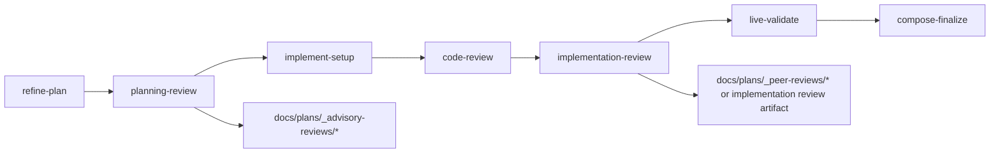

## ELI5 Summary (Read This First)

- What we're doing: turn `S6` into a truthful review-gate slice by adding the PRD-required planning and implementation review checkpoints to V2 without widening into S7.
- Why we're doing it: the integration-branch V2 workflow now has stronger plan metadata and a separate `live-validate` gate, but it still has no actual planning-review or implementation-review checkpoint.
- What "done" looks like: `archon-piv-loop-codex-v2` requires planning review before implementation, implementation review after code validation, caps material review/fix loops at `3`, and proves it with review sidecar fixtures and gate behavior tests.
- How we did it: grounded the integration-branch gap, locked the review-node and sidecar contract, updated the workflow plus targeted tests, then validated and closed the slice evidence loop.
- Next step / resume point: review/ship the accepted S6 slice into `integration/r001-archon-piv-loop-codex-v2`; the Claude ship-review lane is currently quota-blocked, so the Codex fallback ship-review artifact is separate evidence from the earlier Claude plan-gate sidecar.

### Optional Mental Model

- Treat this slice as the point where V2 stops treating review as informal conversation and starts enforcing named review checkpoints with durable artifacts.

## 1) Problem Statement
`Archon PIV Loop Codex V2` is already split into execution slices, and the current integration-branch V2 workflow now carries stronger plan metadata plus the `S5` `live-validate` gate. But it still advances from `refine-plan` straight into `implement-setup`, and from `code-review` into feedback/live validation, without the two review checkpoints required by PRD `§6.5`. `S6` must add those planning and implementation review gates, bind them to the canonical sidecar paths named in PRD `§6.3`, and cap material review/fix loops at three iterations without widening into PR handoff work owned by `S7`.

## 2) Solution Concept (High-Level)
- Keep `S6` anchored to PRD `§6.3`, PRD `§6.5`, and `Execution Map row S6`.
- Treat `integration/r001-archon-piv-loop-codex-v2` as the execution base for this slice until the V2 workflow merges back to `dev`, because the root checkout still lacks `.archon/workflows/defaults/archon-piv-loop-codex-v2.yaml`.
- Add a `planning-review` checkpoint between `refine-plan` and `implement-setup`, and an `implementation-review` checkpoint after `code-review` but before final closeout/live-validation progression.
- Record review state durably through the focused plan's peer-review metadata plus sidecars under `docs/plans/_advisory-reviews/` and `docs/plans/_peer-reviews/`, while keeping implementation-review output separate from final live-validation evidence.
- Reuse the existing workflow validation and parsing test surfaces instead of inventing a second proof harness.

## 3) Scope / Non-Goals
- In scope: the named `planning-review` and `implementation-review` checkpoints required by PRD `§6.5`.
- In scope: review-sidecar artifact conventions rooted in `docs/plans/_advisory-reviews/` and `docs/plans/_peer-reviews/`, plus the plan metadata fields that point at them.
- In scope: focused workflow validation and test coverage that proves the sidecar fixtures, checkpoint ordering, and three-iteration review cap.
- Non-goal: widening `S6` into neighboring execution-map rows during the first refine/freeze pass.
- Non-goal: live validation evidence conventions (`S5`).
- Non-goal: PR or PR-review handoff behavior (`S7`).
- Non-goal: broad workflow-engine changes unrelated to the V2 review-gate contract.

## 4) Architecture Overview

## 5) Decision Options per Area

### A. Slice boundary
| Option | Pros | Cons | Effort |
|--------|------|------|--------|
| A1. Add only the review checkpoints, sidecar contract, and bounded review-loop proof required by `S6` | Matches PRD `§6.3` / `§6.5` and keeps `S5`/`S7` separate | Leaves PR handoff and broader review automation for later slices | Medium |
| A2. Fold PR handoff or additional live-validation behavior into `S6` | Might reduce later coordination on paper | Breaks slice isolation and blurs review gates with other workflow contracts | High |

**Choice:** [x] A1  [ ] A2

## Plan Status & Controls
- Plan Status: Accepted / closed (as of 2026-04-28)
- Current Phase: P2 — Validation And Doc Sync
- Last Updated: 2026-04-28
- Last Reviewed: 2026-04-28
- Next Checkpoint: review/ship the S6 branch into the campaign integration branch, using the explicit Codex fallback ship-review artifact while Claude remains quota-blocked; do not confuse this with the earlier Claude plan-gate peer-review sidecar.
- Execution-base note: the root `dev` checkout still lacks `.archon/workflows/defaults/archon-piv-loop-codex-v2.yaml`; `S6` execution should branch from `integration/r001-archon-piv-loop-codex-v2` or an equivalent lane that already contains the S1-S5 V2 workflow surfaces.
- Deterministic grounding snapshot: PRD `§6.5` requires planning review before implementation, implementation review after code validation, a three-iteration cap on material review/fix loops, and separation between code validation and final live validation. PRD `§6.3` names `docs/plans/_advisory-reviews/` and `docs/plans/_peer-reviews/` as the durable review sidecar locations. The integration-branch V2 workflow already carries peer-review frontmatter fields and a separate `live-validate` node from `S5`, but it still has no `planning-review` or `implementation-review` node, `implement-setup` still depends directly on `refine-plan`, and `fix-feedback` still allows `max_iterations: 10`.
- E2E Gate: not_required
- E2E Waiver Category: internal_tooling
- E2E Waiver Rationale: This slice changes internal workflow review contracts rather than adding a new operator-facing runtime. The primary proof named by the PRD is review sidecar fixtures and gate behavior tests, not a new live-smoke lane.
- Canonical task location: Section 6 (Phased Execution Plan)

**Terminology & Actors (Workflow Defaults):**
- **[LBA]** = **Load-Bearing Assumption** (must be verified before freeze/implementation).
- **[Q]** = Open Question (blocking only when placed under `### Blockers` in Unresolved Items).
- **People:** Mase.
- **Reserved token:** "LBA" is reserved for load-bearing assumptions only.

> **State file:** Task status tracked in companion `.state.json` file.
> Markdown checkboxes are supplementary for readability. JSON is source of truth.

## Unresolved Items (Canonical)

Rules:
- Unresolved items are canonical in `<plan>.state.json`.
- Edit via `state_manager.py --action set_unresolved`; markdown is rendered output.
- `[LBA]` items are always blocking until checked.
- `[Q]` items block only when placed under `### Blockers`.
- Default scope is phases `P1+` unless explicitly tagged.

### Blockers (must resolve before freeze)
- [x] [LBA] LBA1 (Blocks: P1 freeze, P2 freeze) — The S6 execution lane must be based on integration/r001-archon-piv-loop-codex-v2 or an equivalent branch containing the S1-S5 V2 workflow surfaces before P1 changes start.
  - Verify: P0-T1 commands recorded in artifacts/workflow/implementation-reports/commands.json: branch existence plus git show reads of .archon/workflows/defaults/archon-piv-loop-codex-v2.yaml review-gate regions.
  - Evidence: Checked on 2026-04-28: integration/r001-archon-piv-loop-codex-v2 exists; git show of the V2 workflow review-gate regions succeeded; plan records the S6 gap as missing planning-review / implementation-review nodes and fix-feedback max_iterations: 10 on the integration base.

### FYI / Later (does not block freeze)
- (none)
## Phase Summary (Quick View)

| Phase | Phase Status | Tasks (ID: Title — Status) |
|------:|--------------|----------------------------|
| P0 | Done | - P0-T1: Ground the review-gate gap and execution base against repo reality — done - P0-T2: Freeze the review-node, sidecar, and proof contract — done |
| P1 | Done | - P1-T1: Add planning-review and implementation-review checkpoints to the V2 workflow — done - P1-T2: Add review sidecar fixture and gate behavior tests — done |
| P2 | Done | - P2-T1: Run focused proof commands and close the slice evidence loop — done |

## 6) Phased Execution Plan

### Phase 0 — Grounding And Contract Lock

- [x] P0-T1: Ground the review-gate gap and execution base against repo reality
  - Resolves: LBA1
  - Test Impact: N/A
  - Commands to Run:
    - `sed -n '167,223p' docs/prd/r001-archon-piv-loop-codex-v2.md`
    - `sed -n '364,408p' docs/design/codex-piv-v2-workflow-design.md`
    - `git branch --list 'integration/r001-archon-piv-loop-codex-v2'`
    - `git show integration/r001-archon-piv-loop-codex-v2:.archon/workflows/defaults/archon-piv-loop-codex-v2.yaml | sed -n '500,840p'`
    - `git show integration/r001-archon-piv-loop-codex-v2:.archon/workflows/defaults/archon-piv-loop-codex-v2.yaml | sed -n '1090,1495p'`
    - `sed -n '1,220p' packages/workflows/src/defaults/bundled-defaults.test.ts`
    - `rg -n "max_iterations: 3|gate_message|complete_on_user_input|interactive loop" packages/workflows/src/loader.test.ts`
    - record in this plan that the integration-branch V2 workflow already has peer-review metadata fields and the `S5` `live-validate` gate, but still lacks named `planning-review` / `implementation-review` checkpoints and still leaves `fix-feedback` at `max_iterations: 10`
  - Exit Criteria:
    - this plan names the exact `S6` gap in the current V2 workflow instead of describing review gates abstractly
    - this plan records the exact execution base for `S6` with branch-backed evidence
    - this plan identifies the exact proof surfaces that can satisfy the PRD's named primary proof: review sidecar fixtures and gate behavior tests
  - Verify Commands:
    - `rg -n "integration/r001-archon-piv-loop-codex-v2|planning-review|implementation-review|_advisory-reviews|_peer-reviews|max_iterations: 3|review sidecar fixtures and gate behavior tests" docs/plans/r001-archon-piv-loop-codex-v2-s6_plan.md`
  - Grounding Results:
    - PRD contract: `§6.5` requires planning review before implementation, implementation review after code validation, a three-iteration cap on material review/fix loops, and separation between code validation and final live validation.
    - Artifact contract: PRD `§6.3` and the design doc both name `docs/plans/_advisory-reviews/` and `docs/plans/_peer-reviews/` as the durable planning-review sidecar locations, while implementation review remains a separate post-code-validation artifact surface.
    - Current V2 gap: on `integration/r001-archon-piv-loop-codex-v2`, the workflow template has peer-review metadata and the separate `live-validate` gate, but it still lacks `id: planning-review` and `id: implementation-review`; `implement-setup` still depends directly on `refine-plan`, and `fix-feedback` still allows `max_iterations: 10`.
    - Existing proof surfaces: `packages/workflows/src/defaults/bundled-defaults.test.ts` is the bundled-workflow regression surface, and `packages/workflows/src/loader.test.ts` already covers loop parsing, `depends_on`, and interactive-gate fields that can anchor the S6 gate behavior tests.

- [x] P0-T2: Freeze the review-node, sidecar, and proof contract
  - Test Impact: N/A
  - Commands to Run:
    - update this focused plan after the grounding pass with the exact workflow node boundary and artifact contract for `S6`
    - lock the planning-review checkpoint contract: `planning-review` must sit between `refine-plan` and `implement-setup`, must use the plan's peer-review metadata, and must write advisory/frozen-plan review state through `docs/plans/_advisory-reviews/` and `docs/plans/_peer-reviews/`
    - lock the implementation-review checkpoint contract: `implementation-review` must run after `code-review`, before final closeout/live-validation progression, and must keep its findings separate from final live-validation evidence
    - lock the review-loop rule: material review/fix loops are capped at `3` iterations for the planning and implementation review gates
    - backfill exact P1 verify commands now that P0 grounding has identified the workflow-validation and test surfaces
  - Exit Criteria:
    - this plan names the specific `planning-review` and `implementation-review` checkpoints, sidecar paths, metadata fields, and `3`-iteration cap required by PRD `§6.3` / `§6.5`
    - `P1-T1` and `P1-T2` use executable verify commands rather than prose placeholders
    - `Current Inputs` and the surface map point to the exact workflow and test files that will carry the `S6` proof
  - Verify Commands:
    - `rg -n "planning-review|implementation-review|docs/plans/_advisory-reviews|docs/plans/_peer-reviews|implementation_review_artifact|bun run cli validate workflows archon-piv-loop-codex-v2 --json|bun test packages/workflows/src/defaults/bundled-defaults.test.ts|bun test packages/workflows/src/loader.test.ts" docs/plans/r001-archon-piv-loop-codex-v2-s6_plan.md`
  - Locked Contract:
    - New checkpoint before implementation: `id: planning-review`
    - New checkpoint after code validation: `id: implementation-review`
    - Required advisory sidecar path family: `docs/plans/_advisory-reviews/*`
    - Required frozen-plan sidecar path family: `docs/plans/_peer-reviews/*`
    - Required plan metadata fields to keep current: `peer_review.advisory_sidecar`, `peer_review.frozen_plan_sidecar`, `peer_review.implementation_review_artifact`, `peer_review.max_iterations`
    - Required review-loop cap: `max_iterations: 3`

### Phase 1 — Scoped Implementation

- [x] P1-T1: Add planning-review and implementation-review checkpoints to the V2 workflow
  - Test Impact: update
  - Commands to Run:
    - in the `S6` execution worktree created from `integration/r001-archon-piv-loop-codex-v2`, update `.archon/workflows/defaults/archon-piv-loop-codex-v2.yaml`
    - insert `id: planning-review` between `refine-plan` and `implement-setup`
    - require the planning-review checkpoint to drive plan status through `review_needed` / `review_revisions`, preserve the canonical frozen-plan sidecar under `docs/plans/_peer-reviews/`, and stop implementation from starting until review findings are accepted, fixed, or explicitly deferred
    - insert `id: implementation-review` after `code-review`, keep it separate from `live-validate`, and record its review artifact through `peer_review.implementation_review_artifact` or an equivalent post-code-validation review packet
    - cap the material review/fix loop behavior for the new review checkpoints at `3` iterations without widening into `S7` PR-review handoff behavior
  - Exit Criteria:
    - the V2 workflow contains named `planning-review` and `implementation-review` checkpoints at the PRD-defined boundaries
    - implementation can no longer start without the planning-review checkpoint resolving its sidecar-backed findings
    - implementation review happens after code validation and before final closeout/live-validation progression, with the material review/fix path capped at `3` iterations
    - the workflow names the advisory sidecar, frozen-plan sidecar, and implementation-review artifact fields instead of leaving review artifacts implicit
  - Verify Commands:
    - `bun run cli validate workflows archon-piv-loop-codex-v2 --json`
    - `rg -n "id: planning-review|id: implementation-review|docs/plans/_advisory-reviews|docs/plans/_peer-reviews|implementation_review_artifact|review_needed|review_revisions|max_iterations: 3" .archon/workflows/defaults/archon-piv-loop-codex-v2.yaml`

- [x] P1-T2: Add review sidecar fixture and gate behavior tests
  - Test Impact: add
  - Commands to Run:
    - extend `packages/workflows/src/defaults/bundled-defaults.test.ts` with bundled-workflow assertions against `BUNDLED_WORKFLOWS['archon-piv-loop-codex-v2']`
    - assert the bundled V2 workflow contains `planning-review`, `implementation-review`, the advisory/frozen-plan sidecar path families, `implementation_review_artifact`, and the `max_iterations: 3` review cap
    - extend `packages/workflows/src/loader.test.ts` with a focused parse/structure test that proves the new review nodes parse correctly, preserve their gate ordering, and keep the bounded review-loop behavior explicit
    - keep the primary proof surface named by the PRD explicit: review sidecar fixtures and gate behavior tests
  - Exit Criteria:
    - bundled regression fails if the V2 workflow loses the named review checkpoints, sidecar path strings, or the three-iteration review cap
    - gate behavior tests fail if the workflow can regress to no planning-review checkpoint, no implementation-review checkpoint, or an unbounded review loop
    - the focused proof surface explicitly covers review sidecar fixtures and gate behavior tests
  - Verify Commands:
    - `bun test packages/workflows/src/defaults/bundled-defaults.test.ts`
    - `bun test packages/workflows/src/loader.test.ts`

### Phase 2 — Validation And Doc Sync

- [x] P2-T1: Run focused proof commands and close the slice evidence loop
  - Test Impact: N/A
  - Commands to Run:
    - `bun run cli validate workflows archon-piv-loop-codex-v2 --json`
    - `bun test packages/workflows/src/defaults/bundled-defaults.test.ts`
    - `bun test packages/workflows/src/loader.test.ts`
    - `rg -n "planning-review|implementation-review|_advisory-reviews|_peer-reviews|implementation_review_artifact|max_iterations: 3" .archon/workflows/defaults/archon-piv-loop-codex-v2.yaml packages/workflows/src/defaults/bundled-defaults.test.ts packages/workflows/src/loader.test.ts`
    - update this focused plan with the exact proof results and keep `docs/design/codex-piv-v2-workflow-design.md` plus `docs/prd/r001-archon-piv-loop-codex-v2.md` as review-only unless `S6` resolves narrow factual drift that must be written back after closeout
  - Exit Criteria:
    - the focused workflow proof commands pass for the named `S6` contract
    - the exact review-gate, sidecar, and loop-cap contract is visible in both the workflow YAML and the targeted regression surfaces
    - the slice is ready for peer-review/freeze without hidden `S5` or `S7` scope
  - Verify Commands:
    - `bun run cli validate workflows archon-piv-loop-codex-v2 --json`
    - `python3 "${CODEX_HOME:-$HOME/.codex}/skills/.shared/workflow/scripts/plan_readiness.py" --plan-path docs/plans/r001-archon-piv-loop-codex-v2-s6_plan.md --format markdown`

## Current Inputs (single source of truth)
- Feature: `Archon PIV Loop Codex V2`
- Feature PRD: `docs/prd/r001-archon-piv-loop-codex-v2.md`
- Planning shape: umbrella + slices
- Feature PRD section(s): `§6.3 Artifact Contract`, `§6.5 Review And Validation Contract`, `Execution Map row S6`
- Specs / contracts (if any):
  - `docs/design/codex-piv-v2-workflow-design.md`
  - `integration/r001-archon-piv-loop-codex-v2:.archon/workflows/defaults/archon-piv-loop-codex-v2.yaml`
  - `packages/workflows/src/defaults/bundled-defaults.test.ts`
  - `packages/workflows/src/loader.test.ts`
- Goals:
  - deliver the two PRD-required review checkpoints without widening into later slices
  - keep planning review, implementation review, live validation, and PR handoff as separate workflow contracts
- Non-Goals:
  - redoing `S5` live-validation behavior
  - `S7` PR or PR-review handoff behavior
- Constraints/Interfaces:
  - use `integration/r001-archon-piv-loop-codex-v2` as the execution base until the V2 workflow merges back to `dev`
  - preserve the existing `live-validate` gate as a separate downstream surface
  - keep review artifacts durable through the focused plan metadata plus `docs/plans/_advisory-reviews/` / `docs/plans/_peer-reviews/`
- Testing (only if code changes):
  - Test posture: `unit=happy-path`, `integration=critical-only`
  - Test suite status: existing workflow validation and parsing tests are sufficient for the `S6` proof surface
  - Primary test command(s): `bun run cli validate workflows archon-piv-loop-codex-v2 --json`; `bun test packages/workflows/src/defaults/bundled-defaults.test.ts`; `bun test packages/workflows/src/loader.test.ts`
  - Test locations: `.archon/workflows/defaults/archon-piv-loop-codex-v2.yaml`; `packages/workflows/src/defaults/bundled-defaults.test.ts`; `packages/workflows/src/loader.test.ts`
  - Waivers: none at refine time; the P1 verify commands are now concrete
- Owner/Stakeholders: Mase
- Definition of Done: `S6` lands exactly within the PRD row boundary and is proven with review sidecar fixtures plus gate behavior tests.
- Metrics:
  - the workflow cannot bypass planning review before implementation
  - the workflow cannot bypass implementation review before final closeout/live validation progression
  - the material review/fix path is capped at `3` iterations
- Deadlines: maintain deterministic progress; no separate external deadline is assumed for the seeded draft
- Dependencies:
  - the origin PRD remains the scope authority
  - `integration/r001-archon-piv-loop-codex-v2` remains available as the execution base for V2 slice work
  - the existing `S5` `live-validate` gate remains the downstream separation point for final live proof
- Risk tolerance: low; prefer the narrowest safe change

## References (authoritative)
- Source order: vendor docs > official repos/examples > repo code > community posts
- Pin URL + accessed date (+ version/tag/commit)
- Initial:
  - `docs/prd/r001-archon-piv-loop-codex-v2.md` — repo PRD authority (accessed 2026-04-27)
  - `docs/design/codex-piv-v2-workflow-design.md` — review-gate design authority (accessed 2026-04-28)
  - `integration/r001-archon-piv-loop-codex-v2:.archon/workflows/defaults/archon-piv-loop-codex-v2.yaml` — current V2 execution-base workflow via `git show` (accessed 2026-04-28)
  - `packages/workflows/src/defaults/bundled-defaults.test.ts` — bundled workflow regression surface (accessed 2026-04-28)
  - `packages/workflows/src/loader.test.ts` — workflow parsing / gate-structure regression surface (accessed 2026-04-28)
  - `docs/plans/r001-archon-piv-loop-codex-v2-s6_plan.md` — focused slice execution ledger (accessed 2026-04-28)

## Doc Surface Map
Purpose: enumerate the workflow, proof, and documentation surfaces that must match implementation reality at closeout.

Explicit exclusions (handled outside the PIV loop closeout): Project Brief, Feature PRDs, `CLAUDE.md`, `memory/projects/`.

| Area | File/Path | Action (must-edit / review-only / N/A) | Notes (what to check) |
| --- | --- | --- | --- |
| Workflow YAML | `.archon/workflows/defaults/archon-piv-loop-codex-v2.yaml` | must-edit | Add the named review checkpoints, sidecar references, and bounded review-loop behavior on the V2 integration base. |
| Bundled workflow regression | `packages/workflows/src/defaults/bundled-defaults.test.ts` | must-edit | Assert the review sidecar fixtures and gate-contract strings stay bundled. |
| Workflow parsing / gate structure tests | `packages/workflows/src/loader.test.ts` | must-edit | Assert the new review nodes, ordering, and `max_iterations: 3` loop cap parse as intended. |
| Plans (docs/plans/) | `docs/plans/r001-archon-piv-loop-codex-v2-s6_plan.md` | must-edit | This focused plan is the canonical execution ledger for `S6`. |
| Advisory review sidecars | `docs/plans/_advisory-reviews/` | review-only | Ensure the planning-review checkpoint writes the expected sidecar family without inventing a new location. |
| Frozen-plan review sidecars | `docs/plans/_peer-reviews/` | review-only | Ensure the canonical implementation-gating plan review stays under the PRD-named sidecar family. |
| Design doc | `docs/design/codex-piv-v2-workflow-design.md` | review-only | Keep the two-review-gates contract and artifact language aligned. |
| Other project docs | `docs/prd/r001-archon-piv-loop-codex-v2.md` | N/A | The feature PRD is the scope anchor and is maintained separately from slice closeout. |

## Doc Sync Log
- 2026-04-27: Seeded focused slice draft from the PRD execution map so the orchestrator can refine from a concrete boundary instead of a blank template.
- 2026-04-28: Refined the slice against PRD `§6.3` / `§6.5`, the review-gate design doc, and the current integration-branch V2 workflow; backfilled concrete P1 verify commands and named the primary proof surface as review sidecar fixtures plus gate behavior tests.
