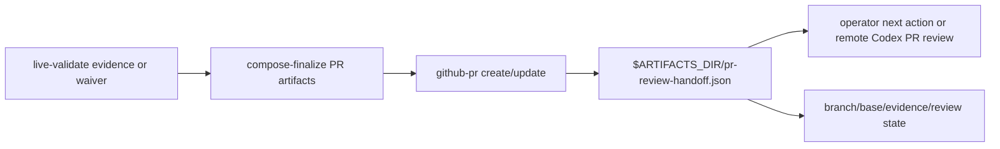

## ELI5 Summary (Read This First)

- What we're doing: add the PRD `Execution Map` row `S7` handoff contract to V2 without widening into a full remote PR-review workflow.
- Why we're doing it: after S5/S6, V2 can validate and review a slice, but it still needs a structured final handoff that carries branch, base, validation evidence, review state, and the clear next action.
- What "done" looks like: `archon-piv-loop-codex-v2` emits `$ARTIFACTS_DIR/pr-review-handoff.json` after finalization, proves the packet includes branch/base/evidence/review fields, and does not claim autonomous merge.
- How we'll do it: ground the existing finalize/`github-pr` artifacts, lock the packet fields and node boundary, update the V2 workflow plus focused tests, then validate and close the slice evidence loop.
- Next step / resume point: rerun the Codex fallback plan-gate review after this refinement, then freeze only if the S7 packet boundary and proof commands remain concrete.

### Optional Mental Model

- Treat this slice as a scoped receipt for one PRD row: the plan should explain exactly how `S7` lands without borrowing work from later rows.

## 1) Problem Statement
`Archon PIV Loop Codex V2` is already split into execution slices. The landed integration branch now contains the V2 workflow through S6: focused planning, typed gate support where available, Mode B intake, live-validation evidence/waiver handling, and planning/implementation review gates. `S7` is the remaining PRD handoff slice. PRD `Execution Map` row `S7` (`docs/prd/r001-archon-piv-loop-codex-v2.md:350`) requires a "structured PR-ready or PR-review handoff after slice completion" with primary proof as a generated PR payload or handoff packet containing branch/base/evidence fields. PRD acceptance criteria also require that the handoff include branch, base, validation evidence, review state, and clear next action without claiming autonomous merge (`docs/prd/r001-archon-piv-loop-codex-v2.md:270-275`). This slice must add one durable handoff artifact, `$ARTIFACTS_DIR/pr-review-handoff.json`, without embedding the full remote Codex PR-review loop.

## 2) Solution Concept (High-Level)
- Keep `S7` anchored to PRD `Execution Map` row `S7`, PRD `§6.4`, PRD `§8` handoff acceptance criteria, and design doc `§10`.
- Treat `integration/r001-archon-piv-loop-codex-v2` as the execution base because it contains the S1-S6 V2 workflow surfaces.
- Preserve the existing `compose-finalize` and `github-pr` split: `compose-finalize` prepares deterministic PR artifacts, `github-pr` applies the PR, and S7 adds or hardens a structured handoff packet after that boundary.
- Pin the S7 deliverable to one observable generated artifact: `$ARTIFACTS_DIR/pr-review-handoff.json`.
- Keep remote Codex PR-review execution out of scope for this slice. The handoff may recommend or describe the next review action, but it must not call `my-codex-pr-review` or poll GitHub review state.
- Prove the handoff through workflow validation, bundled-default regression coverage, and parser/fixture assertions for the packet fields.

## 3) Scope / Non-Goals
- In scope: a structured PR-ready / PR-review handoff packet written to `$ARTIFACTS_DIR/pr-review-handoff.json` after slice completion.
- In scope: branch, base, validation evidence, review state, PR URL/number/state when available, and clear next action fields.
- In scope: workflow YAML, bundled default tests, and the nearest parser/script-discovery tests needed to prove the handoff contract.
- Non-goal: widening `S7` into neighboring execution-map rows during the first refine/freeze pass.
- Non-goal: integrating or running the full remote Codex PR-review loop.
- Non-goal: changing the GitHub PR mutation helper beyond the minimum needed to expose/consume handoff fields.
- Non-goal: changing S5 live-validation or S6 review-gate behavior except to consume their outputs in the final handoff.

## 4) Architecture Overview

## 5) Decision Options per Area

### A. Slice boundary
| Option | Pros | Cons | Effort |
|--------|------|------|--------|
| A1. Add a structured handoff packet around the existing PR artifact/finalize boundary | Matches PRD row S7 and design doc `§10`; avoids embedding remote review automation too early | Remote PR-review workflow remains a separate later integration | Medium |
| A2. Directly integrate `my-codex-pr-review` or a new remote PR-review workflow into V2 | More automated end-to-end review handoff | Requires GitHub polling, auth, PR state, and cross-workflow lifecycle behavior outside S7's safe first pass | High |

**Choice:** [x] A1  [ ] A2

## Plan Status & Controls
- Plan Status: Draft (as of 2026-04-28)
- Current Phase: P0 — Grounding
- Last Updated: 2026-04-28
- Last Reviewed: 2026-04-28
- Next Checkpoint: rerun Codex fallback plan-gate review, then freeze only if the review accepts the concrete S7 handoff contract and proof commands
- PRD locator: `docs/prd/r001-archon-piv-loop-codex-v2.md:350` (`S7 | PR or PR-review handoff | ... | structured PR-ready or PR-review handoff after slice completion | generated PR payload or handoff packet with branch/base/evidence fields`)
- Acceptance criteria locator: `docs/prd/r001-archon-piv-loop-codex-v2.md:270-275`
- Design locator: `docs/design/codex-piv-v2-workflow-design.md:466-484` and `:564-568`
- Execution-base note: run S7 from `integration/r001-archon-piv-loop-codex-v2` or an equivalent branch containing S1-S6. Root `dev` is only the campaign planning lane until the integration branch is merged back.
- Deterministic grounding snapshot: the integration-branch V2 workflow already has `compose-finalize` writing `commit-message.txt`, `pr-title.txt`, `pr-body.md`, `pr-request.json`, and `pr-summary.md`, followed by the bundled `github-pr` script. The `github-pr` script writes `pr-result.json`, `.pr-number`, `.pr-url`, and `pr-ready.md`. S7 should harden or add the structured handoff packet that links those outputs to validation evidence and review state.
- Concrete S7 output artifact: `$ARTIFACTS_DIR/pr-review-handoff.json`
- Required S7 output fields: `schema_version`, `handoff_type`, `branch`, `base`, `validation.status`, `validation.evidence_path`, `validation.waiver_reason`, `review.planning_status`, `review.implementation_status`, `review.implementation_review_artifact`, `pr.url`, `pr.number`, `pr.state`, `next_action`, `remote_codex_pr_review_recommended`, `autonomous_merge_claim`.
- Required S7 field semantics: `validation.status` is `pass` or `waived`; `validation.evidence_path` is required when status is `pass`; `validation.waiver_reason` is required when status is `waived`; `pr.url`, `pr.number`, and `pr.state` are required after the `github-pr` finalizer succeeds; `remote_codex_pr_review_recommended` is boolean; `autonomous_merge_claim` must be `false`.
- E2E Gate: not_required
- E2E Waiver Category: internal_tooling
- E2E Waiver Rationale: This slice changes workflow artifact contracts and bundled workflow tests. It does not add a new operator-facing Web UI path. The PRD's primary proof for S7 is a generated PR payload or handoff packet with branch/base/evidence fields, so focused workflow validation and fixture/test coverage are the required proof.
- Canonical task location: Section 6 (Phased Execution Plan)

**Terminology & Actors (Workflow Defaults):**
- **[LBA]** = **Load-Bearing Assumption** (must be verified before freeze/implementation).
- **[Q]** = Open Question (blocking only when placed under `### Blockers` in Unresolved Items).
- **People:** Mase.
- **Reserved token:** "LBA" is reserved for load-bearing assumptions only.

> **State file:** Task status tracked in companion `.state.json` file.
> Markdown checkboxes are supplementary for readability. JSON is source of truth.

## Unresolved Items (Canonical)

Rules:
- Unresolved items are canonical in `<plan>.state.json`.
- Edit via `state_manager.py --action set_unresolved`; markdown is rendered output.
- `[LBA]` items are always blocking until checked.
- `[Q]` items block only when placed under `### Blockers`.
- Default scope is phases `P1+` unless explicitly tagged.

### Blockers (must resolve before freeze)
- [ ] [LBA] LBA1 (Blocks: P1 freeze, P2 freeze) — The S7 execution lane must be based on integration/r001-archon-piv-loop-codex-v2 or an equivalent branch containing the accepted S1-S6 V2 workflow surfaces.
  - Verify: git branch --list integration/r001-archon-piv-loop-codex-v2 plus git show integration/r001-archon-piv-loop-codex-v2:.archon/workflows/defaults/archon-piv-loop-codex-v2.yaml | rg -n "id: compose-finalize|id: finalize|id: planning-review|id: implementation-review|id: live-validate"
  - Evidence: Pending P0-T1 execution.
- [ ] [LBA] LBA2 (Blocks: P1 freeze) — S7 first pass should emit a structured handoff packet and not embed the full remote Codex PR-review loop.
  - Verify: nl -ba docs/design/codex-piv-v2-workflow-design.md | sed -n 466,484p and nl -ba docs/design/codex-piv-v2-workflow-design.md | sed -n 564,568p
  - Evidence: Pending P0-T2 contract lock.

### FYI / Later (does not block freeze)
- (none)
## Phase Summary (Quick View)

| Phase | Phase Status | Tasks (ID: Title — Status) |
|------:|--------------|----------------------------|
| P0 | Proposed | - P0-T1: Ground the current slice boundary against repo reality — proposed - P0-T2: Lock the slice contract and doc surface — proposed |
| P1 | Proposed | - P1-T1: Implement the smallest load-bearing `S7` surface — proposed - P1-T2: Add or update focused validation for the touched surface — proposed |
| P2 | Proposed | - P2-T1: Reconcile docs and prove final slice evidence — proposed |

## 6) Phased Execution Plan

### Phase 0 — Grounding And Contract Lock

- [ ] P0-T1: Ground the current S7 handoff boundary against repo reality
  - Resolves: LBA1
  - Test Impact: N/A
  - Commands to Run:
    - `nl -ba docs/prd/r001-archon-piv-loop-codex-v2.md | sed -n '185,224p'`
    - `nl -ba docs/prd/r001-archon-piv-loop-codex-v2.md | sed -n '243,278p'`
    - `nl -ba docs/prd/r001-archon-piv-loop-codex-v2.md | sed -n '340,351p'`
    - `git show integration/r001-archon-piv-loop-codex-v2:.archon/workflows/defaults/archon-piv-loop-codex-v2.yaml | sed -n '1584,1710p'`
    - `sed -n '260,620p' .archon/scripts/github-pr.ts`
  - Exit Criteria:
    - the plan captures the exact PRD row and acceptance criteria for `S7`
    - the current `compose-finalize` / `github-pr` artifact boundary is recorded
    - adjacent remote PR-review automation remains explicitly out of scope
  - Verify Commands:
    - `git show integration/r001-archon-piv-loop-codex-v2:.archon/workflows/defaults/archon-piv-loop-codex-v2.yaml | rg -n "id: compose-finalize|id: finalize|pr-request.json|pr-summary.md|pr-result.json|pr-ready.md"`
    - `python3 "${CODEX_HOME:-$HOME/.codex}/skills/.shared/workflow/scripts/plan_readiness.py" --plan-path docs/plans/r001-archon-piv-loop-codex-v2-s7_plan.md --format markdown`

- [ ] P0-T2: Lock the slice contract and doc surface
  - Resolves: LBA2
  - Test Impact: N/A
  - Commands to Run:
    - update this focused plan after the grounding pass with the exact handoff packet fields and node boundary
    - lock the S7 packet contract at `$ARTIFACTS_DIR/pr-review-handoff.json`: branch, base, validation evidence or waiver, planning/implementation review state, PR URL/number/state when available, clear next action, and no autonomous merge claim
    - identify the exact workflow and test surfaces that must stay in sync with `S7`
  - Exit Criteria:
    - the plan, workflow node boundary, and doc surface describe the same S7 handoff slice
    - no first-pass scope gap remains inside PRD row S7
    - the plan pins S7 to `$ARTIFACTS_DIR/pr-review-handoff.json` as the concrete output artifact
  - Verify Commands:
    - `rg -n "S7|Execution Map row S7|branch/base/evidence|pr-ready|pr-review handoff|remote Codex PR review|pr-review-handoff.json|autonomous_merge_claim" docs/plans/r001-archon-piv-loop-codex-v2-s7_plan.md`
    - `rg -n "PR or PR-review handoff|structured PR-ready|branch, base, validation evidence|remote Codex PR review" docs/prd/r001-archon-piv-loop-codex-v2.md docs/design/codex-piv-v2-workflow-design.md`

### Phase 1 — Scoped Implementation

- [ ] P1-T1: Add the structured S7 PR-ready / PR-review handoff surface
  - Test Impact: update
  - Commands to Run:
    - in the `S7` execution worktree created from `integration/r001-archon-piv-loop-codex-v2`, update `.archon/workflows/defaults/archon-piv-loop-codex-v2.yaml`
    - add or harden a post-finalize handoff node/artifact contract that consumes `compose-finalize`, `live-validate`, `implementation-review`, and `github-pr` outputs
    - write the concrete output artifact to `$ARTIFACTS_DIR/pr-review-handoff.json`
    - ensure the handoff records branch, base, validation evidence or waiver, review state, PR URL/number/state when available, clear next action, and no autonomous merge claim
    - keep remote Codex PR-review execution as a downstream recommendation or packet field only
  - Exit Criteria:
    - the V2 workflow emits `$ARTIFACTS_DIR/pr-review-handoff.json` after slice completion
    - the packet is sufficient for either PR-ready operator action or a later remote Codex PR-review workflow
    - the implementation boundary still matches PRD row S7 and does not run the remote review loop
  - Verify Commands:
    - `bun run cli validate workflows archon-piv-loop-codex-v2 --json`
    - `rg -n "pr-review-handoff.json|pr-ready|pr-review handoff|branch.*base|validation evidence|review state|next action|autonomous_merge_claim|remote Codex PR review|pr-result.json|pr-ready.md" .archon/workflows/defaults/archon-piv-loop-codex-v2.yaml .archon/scripts/github-pr.ts`

- [ ] P1-T2: Add handoff packet regression coverage
  - Test Impact: add
  - Commands to Run:
    - extend `packages/workflows/src/defaults/bundled-defaults.test.ts` with assertions that the bundled V2 workflow contains `$ARTIFACTS_DIR/pr-review-handoff.json` and the required field names
    - extend `packages/workflows/src/loader.test.ts` if a new workflow node or output shape needs parser-level coverage
    - extend `packages/workflows/src/script-discovery.test.ts` only if `github-pr` script behavior or bundled script metadata changes
    - add a deterministic fixture or helper-level test that generates a sample `pr-review-handoff.json` and asserts the full required field contract without creating a live GitHub PR
  - Exit Criteria:
    - the load-bearing handoff fields have direct regression coverage
    - validation proves the concrete generated handoff artifact without depending on a live GitHub PR or the remote PR-review workflow
  - Verify Commands:
    - `bun test packages/workflows/src/defaults/bundled-defaults.test.ts`
    - `bun test packages/workflows/src/loader.test.ts`
    - `bun test packages/workflows/src/script-discovery.test.ts`

### Phase 2 — Validation And Doc Sync

- [ ] P2-T1: Reconcile docs and prove final slice evidence
  - Test Impact: N/A
  - Commands to Run:
    - sync the touched docs, plan state, and validation evidence after implementation
    - confirm the final slice still matches PRD `Execution Map` row `S7`
  - Exit Criteria:
    - docs, workflow YAML, script behavior, and tests agree on the landed S7 handoff surface
    - the final evidence names and inspects `$ARTIFACTS_DIR/pr-review-handoff.json`
    - any remaining remote Codex PR-review integration work is explicitly marked follow-on, not hidden S7 scope
  - Verify Commands:
    - `bun run cli validate workflows archon-piv-loop-codex-v2 --json`
    - `bun test packages/workflows/src/defaults/bundled-defaults.test.ts`
    - `bun test packages/workflows/src/loader.test.ts`
    - `bun test packages/workflows/src/script-discovery.test.ts`
    - `python3 -c 'import json,os,pathlib; p=pathlib.Path(os.environ["ARTIFACTS_DIR"])/"pr-review-handoff.json"; d=json.loads(p.read_text()); assert d["schema_version"]=="archon.pr-review-handoff.v1"; assert d["handoff_type"] in {"pr_ready","pr_review"}; assert d["branch"]; assert d["base"]; v=d["validation"]; assert v["status"] in {"pass","waived"}; assert (v["status"]=="pass" and v["evidence_path"]) or (v["status"]=="waived" and v["waiver_reason"]); r=d["review"]; assert r["planning_status"]; assert r["implementation_status"]; assert r["implementation_review_artifact"]; pr=d["pr"]; assert pr["url"]; assert pr["number"]; assert pr["state"]; assert d["next_action"]; assert isinstance(d["remote_codex_pr_review_recommended"], bool); assert d["autonomous_merge_claim"] is False'`
    - `python3 "${CODEX_HOME:-$HOME/.codex}/skills/.shared/workflow/scripts/plan_readiness.py" --plan-path docs/plans/r001-archon-piv-loop-codex-v2-s7_plan.md --format markdown`

## Current Inputs (single source of truth)
- Feature: `Archon PIV Loop Codex V2`
- Feature PRD: `docs/prd/r001-archon-piv-loop-codex-v2.md`
- Planning shape: umbrella + slices
- Feature PRD section(s): `§6.4 Integration Branch Contract`, `§8 Acceptance Criteria`, `Execution Map row S7`
- Specs / contracts (if any):
  - `docs/prd/r001-archon-piv-loop-codex-v2.md:185-194`, `:270-275`, `:340-350`
  - `docs/design/codex-piv-v2-workflow-design.md:466-484`, `:564-568`
- Goals:
  - deliver `$ARTIFACTS_DIR/pr-review-handoff.json` without embedding the later remote PR-review workflow
  - keep the focused plan, workflow YAML, scripts, tests, and docs aligned to PRD row S7
- Non-Goals:
  - adjacent slice implementation
  - remote Codex PR-review execution or polling
  - speculative abstraction beyond the named handoff packet boundary
- Constraints/Interfaces:
  - follow the existing `compose-finalize` / `github-pr` artifact split before introducing new mechanics
  - keep changes scoped to the smallest load-bearing handoff surface
- Testing (only if code changes):
  - Test posture: `unit=happy-path`, `integration=critical-only`
  - Test suite status: use workflow validation plus default-workflow and script-discovery regression tests
  - Primary test command(s): `bun run cli validate workflows archon-piv-loop-codex-v2 --json`; `bun test packages/workflows/src/defaults/bundled-defaults.test.ts`; `bun test packages/workflows/src/loader.test.ts`; `bun test packages/workflows/src/script-discovery.test.ts`
  - Test locations: `packages/workflows/src/defaults/bundled-defaults.test.ts`, `packages/workflows/src/loader.test.ts`, `packages/workflows/src/script-discovery.test.ts`
  - Waivers: no browser E2E for this internal workflow-artifact contract
- Owner/Stakeholders: Mase
- Definition of Done: `S7` lands exactly within the PRD row boundary and is proven by `$ARTIFACTS_DIR/pr-review-handoff.json` containing branch, base, validation evidence, review state, and clear next action.
- Metrics:
  - slice scope stays within PRD `Execution Map` row `S7`
  - validation covers the load-bearing handoff fields changed by `S7`
- Deadlines: maintain deterministic progress; no separate external deadline is assumed for the seeded draft
- Dependencies:
  - the origin PRD remains the scope authority
  - S1-S6 integration branch surfaces are present before implementation starts
  - neighboring remote PR-review workflow integration remains separate unless current repo evidence proves coupling
- Risk tolerance: low; prefer the narrowest safe change

## References (authoritative)
- Source order: vendor docs > official repos/examples > repo code > community posts
- Pin URL + accessed date (+ version/tag/commit)
- Initial:
  - `docs/prd/r001-archon-piv-loop-codex-v2.md` — repo PRD authority (accessed 2026-04-27)
  - `docs/design/codex-piv-v2-workflow-design.md` — S7 staging recommendation and non-goal for full remote PR-review embedding (accessed 2026-04-28)
  - `.archon/workflows/defaults/archon-piv-loop-codex-v2.yaml` on `integration/r001-archon-piv-loop-codex-v2` — current S1-S6 workflow surface (accessed 2026-04-28)
  - `.archon/scripts/github-pr.ts` — existing PR create/update and PR-result artifact helper (accessed 2026-04-28)
  - `docs/plans/r001-archon-piv-loop-codex-v2-s7_plan.md` — focused slice execution ledger (accessed 2026-04-27)

## Doc Surface Map (Project Docs Only)
Purpose: enumerate project-facing docs that must match implementation reality at closeout.

Explicit exclusions (handled outside the PIV loop closeout): Project Brief, Feature PRDs, `CLAUDE.md`, `memory/projects/`.

| Area | File/Path | Action (must-edit / review-only / N/A) | Notes (what to check) |
| --- | --- | --- | --- |
| README | `README.md` | review-only | Check whether `S7` changes operator-facing workflow or setup guidance. |
| Env contract (.env.example) | `.env.example` | N/A | Update only if this slice introduces or changes a runtime env contract. |
| Integration docs | `docs/design/codex-piv-v2-workflow-design.md` | review-only | Review `§10` and Slice 7 guidance; update only if implementation changes the recommendation. |
| API docs/schema docs | `docs/specs/` | review-only | Promote to must-edit only for the exact contract docs touched by this slice. |
| Specs/contracts (docs/specs/) | `docs/specs/` | review-only | Keep spec updates scoped to the load-bearing contract for `S7`. |
| Reference docs (docs/reference/) | `docs/reference/` | N/A | Update only if `S7` changes a stable operator runbook. |
| Decisions/ADRs (docs/decisions/) | `docs/decisions/` | N/A | Only needed if the slice introduces a durable architectural decision. |
| Plans (docs/plans/) | `docs/plans/r001-archon-piv-loop-codex-v2-s7_plan.md` | must-edit | This focused plan is the canonical execution ledger for `S7`. |
| Workflow default | `.archon/workflows/defaults/archon-piv-loop-codex-v2.yaml` | must-edit | Add or harden `$ARTIFACTS_DIR/pr-review-handoff.json` as the structured S7 PR-ready / PR-review handoff packet. |
| PR helper script | `.archon/scripts/github-pr.ts` | review-only | Promote to must-edit only if the handoff requires script output changes beyond existing `pr-result.json` / `pr-ready.md`. |
| Workflow default tests | `packages/workflows/src/defaults/bundled-defaults.test.ts` | must-edit | Assert bundled V2 carries the S7 handoff contract and field names. |
| Workflow parser tests | `packages/workflows/src/loader.test.ts` | review-only | Promote to must-edit if a new node or output shape needs parser-level proof. |
| Script discovery tests | `packages/workflows/src/script-discovery.test.ts` | review-only | Promote to must-edit only if bundled script metadata or `github-pr` helper behavior changes. |
| Capabilities payload docs/schema | `docs/specs/output-format.md` | N/A | S7 packet is workflow-artifact scoped unless implementation proves a public output-format contract changed. |
| Other project docs | `docs/prd/r001-archon-piv-loop-codex-v2.md` | N/A | The feature PRD is the scope anchor and is maintained separately from slice closeout. |

## Doc Sync Log
- 2026-04-27: Seeded focused slice draft from the PRD execution map so the orchestrator can refine from a concrete boundary instead of a blank template.
- 2026-04-28: Refined S7 after Codex fallback plan-gate review; replaced generic row references and placeholder validation with concrete PRD/design locators, the `$ARTIFACTS_DIR/pr-review-handoff.json` output contract, LBAs, and proof commands.
