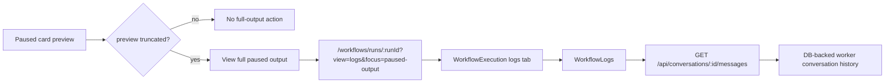

# PRD: Full Output Fallback

## Implementation Status

Historical note as of 2026-04-21:

- Slice 4 is implemented on `codex/paused-output-slices-1-2-review`
- it is included in draft PR #5 on `matzls/Archon`
- the remaining sections are preserved as the original slice artifact

## 1. Problem Statement

Slices 1 through 3 already improved the paused-output experience:

- Web paused cards now show a bounded preview.
- The preview prefers `finalAssistantOutput` when available.
- The runtime no longer keeps stale live-looking approval metadata after a
  pause is resolved.

The remaining gap is narrower: when the bounded paused preview is clipped, the
operator still does not have a targeted way to open the authoritative full
paused output from the same pause context. The current cards show a clipped
notice, but the follow-up actions are still generic navigation actions rather
than an explicit full-output fallback.

Slice 4 fixes only that fallback path. It does not widen normal paused status
payloads, change paused snapshot extraction semantics, revisit runtime metadata
cleanup, or expand to non-Web adapters.

## 2. Source Context

Umbrella plan:

- `docs/plans/archon-paused-output-ux-parity_plan.md`

Active slice only:

- Slice 4: Full Output Fallback

This PRD is the only intended implementation input for Slice 4. The umbrella
plan remains context, not execution scope.

## 3. Current Verified Behavior

- `packages/web/src/components/chat/WorkflowProgressCard.tsx` and
  `packages/web/src/components/dashboard/WorkflowRunCard.tsx` both derive the
  paused preview from `finalAssistantOutput` first, then fall back to
  `lastOutput`, and show a clipped-output notice when the chosen preview is
  truncated.
- Those same cards currently expose only generic navigation affordances:
  `View Full Screen` in chat and `View Logs` on the dashboard. Neither action
  is specific to the clipped paused-output case.
- `packages/server/src/routes/api.ts` `GET /api/workflows/runs/:runId` returns
  run details plus workflow events and includes the worker conversation's
  platform ID for Web workflows.
- `packages/web/src/components/workflows/WorkflowExecution.tsx` already uses
  that worker conversation ID to render `WorkflowLogs`.
- `packages/web/src/components/workflows/WorkflowLogs.tsx` loads full worker
  conversation history through `getMessages(conversationId)`, which calls
  `GET /api/conversations/:id/messages`.
- `packages/server/src/adapters/web/persistence.ts` persists assistant text and
  tool-call structure into conversation messages, preserving the same
  text-plus-tools shape the Web logs view renders.
- `packages/server/src/adapters/web/workflow-bridge.ts` flushes worker
  conversation buffers on step transitions, and
  `packages/core/src/orchestrator/orchestrator.ts` always releases the worker
  lock through `emitLockEvent(..., false)` at the end of the background run,
  which triggers a final flush. That means paused workflows already have an
  existing DB-backed full-log path for Web.
- `packages/core/src/db/workflow-events.ts` explicitly keeps verbose
  assistant/tool content out of `workflow_events`; those rows are intentionally
  lean UI state, not the authoritative full transcript.
- `packages/workflows/src/logger.ts` also writes JSONL workflow logs, but those
  files are a filesystem-side capture and are not the current typed Web data
  path.

## 4. User And Job To Be Done

Primary user: Mase as the Web operator of paused Archon workflows.

Job to be done:

> When a paused preview is clipped, I want one explicit action that opens the
> authoritative full paused output immediately, so I can review the real
> assistant conclusion without expanding normal status payloads or digging
> through unrelated run data.

## 5. Design Decision

### Recommendation

Use the existing worker-conversation message history as the authoritative full
paused-output source for Web, and expose it through a clipped-preview-specific
action that deep-links into the existing run-details logs view.

Concretely:

- keep normal paused status payloads bounded
- do not add a new full-output blob to `metadata.approval`, workflow events,
  or dashboard/list payloads
- do not make Web read JSONL workflow log files directly in Slice 4
- when the paused preview is clipped, show `View full paused output`
- that action should navigate to the existing workflow run details page with
  the logs view preselected and focused on the latest paused-output area

### Why This Recommendation

- It reuses the Web's existing authoritative transcript path instead of
  introducing a second truth source.
- It preserves the real text-plus-tool structure of the paused exchange.
  Reading a single extracted string would be less faithful than the existing
  message history view.
- It keeps the slice smaller and lower-risk than adding filesystem log access
  or new transcript persistence.
- It stays aligned with Slice 5 being out of scope. Worker-conversation log
  reuse is a Web-specific solution, not a cross-adapter redesign.

## 6. Proposed Product Behavior

### Paused Cards

In `WorkflowProgressCard` and `WorkflowRunCard`:

- keep the existing bounded `Latest output` block
- keep the clipped-output notice
- when the chosen paused preview is truncated, show a secondary action:
  `View full paused output`
- do not show that action when the preview is absent or not truncated

### Navigation Target

The new action should open the existing workflow run details route and land in
the logs surface directly, not the graph surface.

Preferred behavior:

- open `/workflows/runs/:runId` with a query flag such as `?view=logs&focus=paused-output`
- default the run-details page to the logs tab when that flag is present
- scroll the logs view to the latest worker-conversation content for the active
  paused run, which is the relevant paused-output area

### Failure Behavior

If the run cannot resolve a worker conversation ID or the message-history fetch
fails:

- keep the generic navigation actions intact
- surface a clear UI message that full paused output is unavailable for this
  run
- do not silently fall back to filesystem log reading in the browser path

## 7. Architecture Outline



## 8. Scope

Update only the Web fallback path for clipped paused output.

Likely files:

- `packages/web/src/components/chat/WorkflowProgressCard.tsx`
- `packages/web/src/components/dashboard/WorkflowRunCard.tsx`
- `packages/web/src/components/workflows/WorkflowExecution.tsx`
- small route/query-param glue in the Web routing layer if needed

## 9. Non-Goals

Do not include:

- new full-output fields on paused status payloads
- JSONL file-reading API endpoints
- workflow-event schema expansion for verbose transcript content
- executor changes to re-extract paused snapshots
- database schema changes for a second full-transcript store
- CLI paused-output fallback redesign
- Slack, Telegram, GitHub, Discord, or other non-Web adapter work
- Slice 5 adapter review

## 10. Acceptance Criteria

- A paused Web card with a non-truncated preview behaves as it does today.
- A paused Web card with a truncated preview shows `View full paused output`.
- That action opens the workflow run details page in the logs-oriented view.
- The logs-oriented view uses existing worker conversation history as the full
  output source.
- The operator can inspect the full paused exchange without any new large
  paused-output payload being added to routine status responses.
- If the full-log path is unavailable for a run, the UI reports that clearly.
- No filesystem log-reading endpoint is introduced in Slice 4.

## 11. Validation

Run the narrow checks first:

```bash
bun --filter @archon/web type-check
bun x eslint packages/web/src/components/chat/WorkflowProgressCard.tsx \
  packages/web/src/components/dashboard/WorkflowRunCard.tsx \
  packages/web/src/components/workflows/WorkflowExecution.tsx --max-warnings 0
```

Add the smallest useful Web regression coverage for:

- clipped paused preview shows the new action
- unclipped preview does not
- run-details view honors the logs/focus query flag

Before merge or PR:

```bash
bun run validate
```

## 12. Historical Handoff Note

This PRD already drove the Slice 4 implementation now carried in PR #5. Do not
reuse it as the active implementation prompt for new work. For the next session,
use the umbrella plan plus Slice 5 only.
