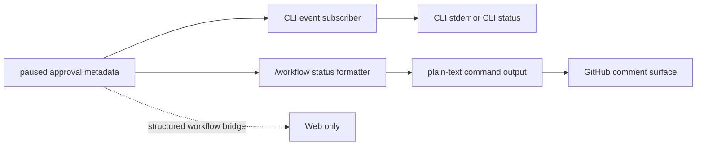

# PRD: Non-Web Paused Output Adapter Review

## 1. Problem Statement

Slices 1 through 4 improved the paused-output experience for the Web surface:

- Web now shows the bounded paused preview.
- Web prefers the more semantic `finalAssistantOutput` when present.
- Web no longer keeps stale live-looking approval metadata after a pause is
  resolved.
- Web has a clipped-preview fallback that deep-links to the authoritative full log view.

The remaining question is narrower: what is the smallest justified paused-output
improvement for non-Web text surfaces without widening this work into a
platform-by-platform notification redesign?

The existing draft established that "non-Web" is not one thing:

- CLI already has a dedicated live paused-output path plus an explicit status command.
- shared `/workflow status` text is the reusable pull surface inherited by
  non-Web adapters
- Only Web has a structured workflow-event bridge.

Given the review answers, Slice 5 is now explicitly limited to:

- CLI live paused rendering
- shared `/workflow status` parity for non-Web text surfaces
- GitHub only among forge adapters

This slice does not design proactive paused notifications for chat or forge
platforms. It defines the narrow review-backed rule for the existing pull
surfaces and leaves broader non-Web delivery questions for later work if a real
usability gap remains.

## 2. Source Context

Umbrella plan:

- `docs/plans/archon-paused-output-ux-parity_plan.md`

Authoritative prior slice artifacts:

- `docs/prd/paused-output-web-parity.prd.md`
- `docs/prd/paused-snapshot-contract-design.prd.md`
- `docs/prd/runtime-metadata-hygiene.prd.md`
- `docs/prd/full-output-fallback.prd.md`

Active slice only:

- Slice 5: Non-Web Adapter Review

This PRD is the only intended implementation input for Slice 5. The umbrella plan
remains context, not execution scope.

## 3. Current Verified Behavior

### Platform capability split

- `packages/core/src/types/index.ts:155` models `sendStructuredEvent` as optional and
  documents that only rich surfaces such as Web use it, while Telegram and Slack keep
  using plain `sendMessage()`.
- `packages/server/src/adapters/web.ts:98` is the only current adapter implementation
  that actually defines `sendStructuredEvent(...)`.
- `packages/workflows/src/dag-executor.ts:883` emits structured tool and workflow
  chunks only when `platform.sendStructuredEvent` exists.

Plain language:

- Web gets rich workflow events.
- Everyone else gets plain text unless they build their own special path.

### CLI already has a dedicated paused-output surface

- `packages/cli/src/commands/workflow.ts:676` subscribes directly to the in-memory
  `WorkflowEventEmitter` while a workflow is running.
- `packages/cli/src/commands/workflow.ts:162` renders `approval_pending` to stderr and
  prints `Latest output` when `event.lastOutput` exists.
- `packages/cli/src/commands/workflow.ts:918` makes `workflow status` print
  `Latest output` for paused runs, again reading `approval.lastOutput`.

This means CLI is already closer to Web than the other adapters, but it still
uses the compatibility snapshot field and does not yet prefer
`finalAssistantOutput`.

### Shared plain-text status output is the reusable non-Web pull surface

- `packages/core/src/handlers/command-handler.ts:662` builds `/workflow status` output
  as plain text and includes `Latest output` only from `approval.lastOutput`.
- `packages/core/src/orchestrator/orchestrator-agent.ts:714` routes deterministic
  slash commands through `handleCommand(...)` and sends the returned string to the
  current adapter via `platform.sendMessage(...)`.

Today that means non-Web adapters can surface paused output on demand through
the existing command path, but only as plain text and only via the
compatibility snapshot.

### Non-Web adapters do not share a Web-style fallback substrate

- `packages/core/src/orchestrator/orchestrator-agent.ts:580` currently persists
  non-Web conversation turns only for Telegram, and the comments explicitly say
  broader support for Slack, Discord, and GitHub still needs auditing.
- Slice 4's Web fallback depends on Web-only conversation/log plumbing; there is no
  verified shared equivalent across Slack, Discord, GitHub, Gitea, or GitLab today.

This is the main reason Slice 4 should not be copied blindly onto non-Web
adapters.

### Automatic transcript dumping remains risky and out of scope here

- The prior draft already recorded that chat surfaces have tighter delivery
  limits and split long messages, making automatic paused transcript fan-out
  noisy.
- GitHub can hold larger comments, but durable paused-output fan-out would
  still be noisy and is not needed to improve the current pull workflow.
- Gitea, GitLab, and future adapters are left out of this slice entirely.

Implication:

- auto-posting large paused output would fragment review context
- the right default for Slice 5 remains "pull when needed," not "push
  everything"

## 4. Architecture Snapshot



## 5. Decision Options

### Option A: Full Web-style parity for non-Web adapters

Do not recommend.

Why:

- the current adapter contract is not built around structured workflow events outside Web
- non-Web surfaces have very different message constraints
- there is no shared full-output inspection path comparable to the Web logs deep-link
- this would widen Slice 5 into platform-specific UX design and infrastructure work

### Option B: CLI plus shared `/workflow status` parity only

Recommend.

What it means:

- keep Web behavior as-is and out of scope
- keep CLI as the only live paused-output surface outside Web
- improve CLI and shared `/workflow status` text to prefer
  `finalAssistantOutput` first, then fall back to `lastOutput`
- show explicit clipped-state wording when the chosen preview is truncated
- do not auto-push paused snapshots when a run pauses
- keep GitHub as the only forge surface considered in this slice because it
  already inherits the shared command/status path
- do not add a full-output fallback path for non-Web in this slice
- if `/workflow status` later proves insufficient, prefer a dedicated inspect
  command before platform-specific deep links

This is the smallest change that improves non-Web operator quality without
creating a noisy adapter redesign.

### Option C: Close Slice 5 as no-op

Do not recommend.

Why:

- CLI and shared `/workflow status` still lag behind the newer semantic paused snapshot
- the repo now has enough evidence to define a deliberate non-Web rule instead of
  leaving behavior accidental

## 6. Recommendation

Adopt Option B.

Plain-language recommendation:

- Non-Web should not chase strict Web parity.
- CLI should remain the only live paused-output surface outside Web.
- The shared command-driven pull path should remain the default for other
  non-Web text surfaces.
- The plain-text preview should show one preferred paused preview only:
  `finalAssistantOutput` when present, otherwise `lastOutput`.
- The plain-text preview should report truncation explicitly.
- GitHub is the only forge surface in scope for this slice.
- If this later proves insufficient, add a dedicated inspect command before
  considering deep-link designs.

### Recommended product rule by surface

#### CLI

- Keep the current live `approval_pending` rendering.
- Keep `workflow status`.
- Upgrade both surfaces to choose the best paused preview using:
  1. `finalAssistantOutput`
  2. `lastOutput`
- If the chosen preview is truncated, print a clear clipped note.

#### Shared `/workflow status`

- Keep the operator pull model.
- Reuse the same best-preview selection rule as CLI.
- Show one preferred preview only, not both snapshots by default.
- Preserve plain-text delivery so GitHub inherits the same behavior through the
  existing command/status path.

#### GitHub

- Do not auto-post extra paused-output comments when a run pauses.
- Rely on the shared command/status path for this slice.
- Do not design GitHub-specific deep links or richer fallback behavior here.

#### Other adapters

- Slack, Telegram, Discord, Gitea, GitLab, and future adapters are not active
  Slice 5 scope.
- This PRD intentionally does not set new product rules for them beyond
  excluding proactive paused-output fan-out from this slice.

## 7. Scope

If Slice 5 implementation is approved later, keep it narrow.

### In Scope

- review and document the current non-Web paused-output behavior
- define the intended non-Web rule
- update shared non-Web preview selection logic to prefer `finalAssistantOutput`
- update CLI live paused rendering to use the same preview rule
- surface explicit truncation wording in those plain-text outputs
- keep GitHub on the shared `/workflow status` path only

### Out of Scope

- Web UI changes
- runtime metadata changes
- paused snapshot extraction changes
- full-output deeplinks or log-reader fallbacks for non-Web
- automatic paused-output push notifications for any non-Web adapter
- adapter-specific custom UI treatments per platform
- Slack, Telegram, Discord, Gitea, GitLab, and future adapter parity work
- platform-specific deep links
- new commands in this slice, although a future dedicated inspect command is the
  preferred follow-up if `/workflow status` later proves insufficient

## 8. Likely Files For A Future Implementation

Keep the likely write set small:

- `packages/cli/src/commands/workflow.ts`
- `packages/core/src/handlers/command-handler.ts`
- one small shared helper in `packages/core` or `packages/workflows` for
  "best paused preview" selection so CLI and command-handler do not drift

Avoid touching adapter implementations unless later review shows the shared
text path is insufficient.

## 9. Acceptance Criteria

- Slice 5 explicitly records that non-Web behavior is adapter-tiered, not strict
  Web parity.
- CLI paused rendering prefers `finalAssistantOutput` over `lastOutput` when both
  exist.
- Shared `/workflow status` output prefers `finalAssistantOutput` over `lastOutput`
  when both exist, so GitHub inherits the better preview automatically.
- CLI and shared `/workflow status` show one preferred preview only rather than
  rendering both snapshots by default.
- Plain-text outputs clearly indicate when the chosen preview is clipped.
- No automatic paused transcript dump is added for any non-Web adapter in this
  slice.
- No non-Web full-output fallback path is introduced in this slice.

## 10. Risks

- Duplicated preview-selection logic between CLI and command-handler would drift
  if it is not centralized.
- `/workflow status` may prove too shallow for some paused runs, but a dedicated
  inspect command is a safer follow-up than introducing platform-specific
  fallback paths too early.
- GitHub can technically hold larger comments, but adding automatic paused
  transcript fan-out there would still create review noise and inflate thread
  history.
- Leaving other adapters out of scope means future parity questions remain open,
  but that is safer than widening this slice without a concrete operator need.

## 11. Validation

When implementation is approved, start with targeted checks:

```bash
bun run type-check
bun run lint
bun test packages/cli/src/commands/workflow.test.ts
bun test packages/core/src/handlers/command-handler.test.ts
```

If a shared helper is added, cover these cases:

- `finalAssistantOutput` present and chosen
- fallback to `lastOutput`
- truncated semantic preview
- truncated compatibility preview
- no preview available

Before merge or PR:

```bash
bun run validate
```

## 12. Review Decisions Captured

The current Slice 5 PRD reflects these review decisions:

1. Keep Slice 5 limited to CLI plus shared `/workflow status` parity.
2. Do not add proactive paused notifications for non-Web adapters.
3. Show one preferred preview only: prefer `finalAssistantOutput`, then fall
   back to `lastOutput`.
4. Keep GitHub as the only forge surface in scope for now.
5. If `/workflow status` later proves insufficient, prefer a dedicated inspect
   command before platform-specific deep links.

## 13. Active Handoff Note

This document is the active Slice 5 artifact for PR #5 on
`codex/paused-output-slices-1-2-review`.

Use this PRD as the direct implementation input for the next fresh Slice 5
implementation run. Do not implement Slice 5 directly from the umbrella plan or
from older slice artifacts.

Human review accepted the Slice 5 direction. A first implementation attempt in
run `6a202657c75a5095ad648a79cc9e463e` failed cleanly without landing code:
Archon split the CLI wording change and the adjacent CLI test expectation
updates into separate task iterations, so Task 3 kept reverting when task-scoped
validation still expected the pre-Slice-5 `Latest output:` text.

The worktree was left clean and no Slice 5 implementation commit was created.
For the next fresh Slice 5 run, restart from this PRD and allow adjacent
in-scope code and directly corresponding in-scope test updates to land together
when task-scoped validation depends on both.
