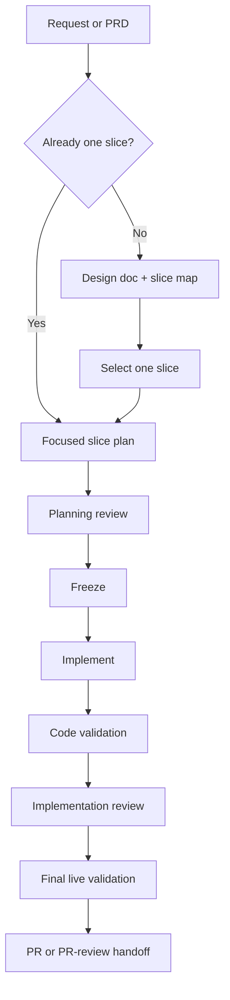

# PRD: Archon PIV Loop Codex V2

## 1. Overview

Archon currently has two very different Codex workflow tiers:

- `archon-piv-loop-codex` is useful, but still too light for serious feature
  work that needs durable planning, review gates, and live validation.
- the local heavy Codex workflow system is strong for multi-slice campaigns,
  but it is too heavy and too local to serve as the normal Archon-native
  product workflow.

This feature creates a middle tier: `archon-piv-loop-codex-v2`.

The new workflow should stay native to Archon's workflow engine and web UI,
remain Codex-safe in this fork, and support one serious implementation slice
per run. It may intake a larger request, create a design doc and slice map when
needed, and then execute exactly one selected slice with stronger planning and
validation discipline than V1.

This feature is campaign-sized. It should not be implemented as one frozen
plan. The correct delivery shape is an umbrella PRD plus multiple focused slice
plans.

Document hierarchy decision:

- this PRD is the single requirements anchor for the coherent V2 feature
- the orchestrator should route it to `umbrella + slices`
- each slice should get its own focused implementation plan
- a slice should become its own follow-on PRD only if it grows into a separate
  requirement domain with its own acceptance logic and routing

## 2. Source Context

Primary upstream design inputs:

- `docs/design/codex-piv-v2-workflow-design.md`
- `docs/design/codex-first-workflow-surface-strategy.md`

Primary runtime basis:

- `.archon/workflows/defaults/archon-piv-loop-codex.yaml`
- `.archon/workflows/defaults/archon-piv-loop-codex.README.md`
- `.agents/skills/my-dash-workflow-builder-codex/`

This PRD is the requirements anchor for the V2 feature. The design docs remain
the architecture and policy source, not the execution contract.

Artifact hierarchy:

- design docs own architecture, invariants, tradeoffs, and tiering rationale
- this PRD owns product requirements and acceptance criteria for V2
- the umbrella plan should own campaign sequencing and slice status
- focused slice plans should own executable task contracts

## 3. Problem Statement

Archon is missing a Codex-native workflow tier for serious but normal feature
delivery.

Verified current gap:

- V1 is good for bounded guided work, but it does not provide a durable enough
  plan contract, planning review discipline, or explicit separation between
  code validation and live final validation.
- the local heavy PIV system already has those stronger operating rules, but it
  depends on local workflow infrastructure and campaign machinery that should
  not simply be copied into Archon as-is.
- as a result, serious feature work is currently forced into an awkward choice:
  either use a too-light Archon workflow or leave the Archon-native surface for
  the local heavy system.

The product gap is not "add another workflow." The real gap is to create a
truthful middle tier with stronger planning, artifact, review, and validation
contracts while staying inside Archon's native workflow surface.

## 4. Users And Context

Primary user: Mase as the operator building and shipping Archon features
through Codex.

Secondary user: future Archon operators in this fork who need a serious,
reviewable, Archon-native Codex workflow without adopting the full local heavy
orchestrator as product surface.

Job to be done:

> When a feature is too large for the current Codex PIV loop but too normal for
> the full local heavy system, I want an Archon-native workflow that can turn a
> request or PRD into a serious one-slice implementation run with strong
> planning, review, validation, and PR handoff discipline.

## 5. Scope

### In Scope

- create `archon-piv-loop-codex-v2` as a new default workflow derived from V1
- keep the workflow Codex-native and Codex-safe for this fork
- support two intake modes:
  - focused request already small enough for one slice
  - large request or PRD that first needs design-doc and slice-map intake
- enforce one serious implementation slice per workflow run
- add a stronger focused slice plan template than V1
- require planning review before implementation
- separate code validation from final live validation
- support explicit integration-branch and PR-base handling
- support structured PR or PR-review handoff after implementation

### Out Of Scope

- hidden multi-slice auto-orchestration inside V2 itself
- replacing the local heavy system as the strict multi-slice campaign runner
- rebuilding the generic Workflow Builder UI as part of this feature
- broad Claude-to-Codex parity work outside the V2 lane
- automatic merge-to-main or autonomous ship

### Non-Goals

- copy the local heavy PIV implementation wholesale into Archon
- claim feature completeness from unit tests alone
- treat V2 as a campaign orchestrator that runs all slices automatically
- land typed phase decisions before the runtime actually supports them

## 6. Functional Specification

### 6.1 Tier Position

`archon-piv-loop-codex-v2` is the middle tier:

- `archon-piv-loop-codex`: simple guided Codex PIV
- `archon-piv-loop-codex-v2`: one serious slice per run
- local heavy Codex workflow system: strict multi-slice campaign execution

### 6.2 Operating Modes

Mode A: focused request

- explore request
- create focused slice plan
- run planning review
- freeze
- implement
- run code validation
- run final live validation when runtime behavior changes
- produce PR or PR-ready handoff

Mode B: large request or PRD

- explore and size request
- create or refresh design doc when architecture or slicing is load-bearing
- create slice map
- select exactly one slice
- create focused slice plan
- continue through the normal one-slice lane

### 6.3 Artifact Contract

Durable artifacts may include:

- `docs/prd/<feature>.prd.md`
- `docs/design/<feature>.md`
- `docs/plans/<feature>_slice_map.md`
- `docs/plans/<feature>-s<n>_plan.md`
- planning-review sidecars under `docs/plans/_advisory-reviews/` and
  `docs/plans/_peer-reviews/`

Run-scoped validation evidence must stay under:

- `$ARTIFACTS_DIR/e2e-reports/*`

Durable repo docs may summarize evidence, but they must not become the raw
evidence store.

### 6.4 Integration Branch Contract

For multi-slice delivery:

- one slice branch per V2 run
- the selected integration branch is both the slice start point and the
  default PR base
- the branch and PR-base intent must be carried durably through planning,
  implementation, and finalization
- V2 must not silently start from one branch and open a PR against another

### 6.5 Review And Validation Contract

- planning review is required before implementation starts
- implementation review is required after code validation and before final
  closeout
- material review/fix loops are capped at three iterations
- code validation and final live validation are separate gates
- runtime behavior changes require real live validation or an explicit waiver

### 6.6 Slice Defaults

The first implementation slice should stay close to V1 and should not attempt
the whole V2 contract.

Default assumptions:

- S1 keeps the current V1 plan-path behavior unless the downstream writer and
  every reader are migrated in the same slice.
- S1 and S2 use explicit sentinel contracts for loop progression unless the
  runtime already exposes structured loop decisions.
- S3 owns typed phase-gate discovery and any runtime/schema work required for
  structured decisions.
- S4 owns design-doc and slice-map intake mode.
- S5 owns live evidence conventions and should verify the concrete artifact
  path before making it a broad rule.
- S6 owns review-gate behavior and should not make early slices pretend review
  automation is complete.
- S7 owns PR or PR-review handoff once the prior workflow contract is stable.

## 7. Diagrams & Flows



## 8. Acceptance Criteria

- Given the default workflows are discovered, when
  `archon-piv-loop-codex-v2` is validated, then Archon's workflow validator
  reports it valid with no errors.
- Given bundled defaults are regenerated, when the bundled-defaults drift check
  runs, then the V2 workflow is included consistently in source and generated
  bundled content.
- Given an operator reads the workflow catalog or docs, when comparing V1, V2,
  and the local heavy system, then V2 is clearly positioned as one serious
  slice per run rather than a hidden campaign orchestrator.
- Given a focused request, when V2 runs, then it can create a focused slice plan
  and proceed through planning review, freeze, implementation, code validation,
  final live validation policy, and PR handoff.
- Given a large request or PRD, when V2 runs, then it can produce or update a
  design doc and slice map, select exactly one slice, and execute only that
  selected slice.
- Given a V2 focused slice plan is created, when inspected before
  implementation, then it includes plan status, current inputs, unresolved
  items, review-gate state, code validation commands, final live validation
  plan, documentation surface map, and risks.
- Given planning review finds material issues, when V2 handles the result, then
  implementation does not start until the findings are fixed, deferred with a
  reason, or explicitly waived.
- Given implementation changes runtime behavior, when V2 reaches final
  validation, then it records real live validation evidence under the agreed
  run-scoped path or records an explicit waiver.
- Given a multi-slice feature uses an integration branch, when a slice PR or
  PR-ready payload is produced, then the persisted integration branch is used
  as the explicit PR base.
- Given V2 completes a slice, when it emits a PR or PR-review handoff, then the
  handoff includes branch, base, validation evidence, review state, and clear
  next action without claiming autonomous merge.
- Given a completed V2 slice resolves an assumption, changes scope, or lands a
  requirement, when that slice closes out, then durable feedback is recorded in
  both this PRD and the campaign slice map.

## 9. Constraints & Dependencies

- The workflow must remain compatible with Archon's workflow engine and current
  Codex runtime surface in this fork.
- Codex red lines from `.agents/skills/my-dash-workflow-builder-codex/SKILL.md`
  apply. V2 must not depend on Claude-only node controls for core behavior.
- Typed phase-gate behavior may require runtime work beyond YAML authoring; do
  not assume loop-node structured decisions exist until verified in runtime.
- If V2 changes plan-path conventions, every writer and reader in the lane must
  migrate together.
- Bundled defaults, workflow docs, and relevant tests must stay in sync with
  shipped workflow changes.

## 10. Upstream Design References

- `docs/design/codex-piv-v2-workflow-design.md`
- `docs/design/codex-first-workflow-surface-strategy.md`

## 11. Workflow Handoff

This feature is ready for orchestrator intake.

### Planning Shape Recommendation

`umbrella + slices`

Rationale: the feature is explicitly composed of multiple independently shippable
increments, different proof shapes, and runtime-versus-YAML concerns that should
not be frozen into one implementation plan.

### Latest PRD Peer Review

`docs/plans/_doc-reviews/r001-archon-piv-loop-codex-v2-peer-review.json`

### Operator Handoff Prompt

```text
Use $my-codex-workflow-orchestrator for this feature.

Accepted handoff input:
- PRD: docs/prd/r001-archon-piv-loop-codex-v2.md
- Peer review sidecar: docs/plans/_doc-reviews/r001-archon-piv-loop-codex-v2-peer-review.json
- Planning shape: umbrella + slices
- Umbrella plan: create if missing

Execution lane requirements:
- start from dev
- create fresh dedicated worktrees/branches for slice execution
- do not implement directly in the root checkout

Start here:
- initial slice: S1
- create the umbrella plan and focused S1 plan
- freeze, implement, validate, and stop at the slice review/ship gate

Stop rule:
- stop at real human gates, blockers, or final campaign review/ship gate
- report exact evidence and next command
```

## Execution Map

| Slice | Scope | Plan | Expected Main Output | Primary Proof |
| --- | --- | --- | --- | --- |
| S1 | V2 workflow skeleton from V1, keeping V1 plan-path behavior and explicit sentinel contracts while deferring typed gates, design-doc intake, review automation, live evidence conventions, and PR handoff to later slices | `docs/plans/r001-archon-piv-loop-codex-v2-s1_plan.md` | new `archon-piv-loop-codex-v2` default workflow with minimal contract lift | workflow validation, bundle drift check, targeted default-workflow tests |
| S2 | V2 plan template and coordinated plan-path contract | `docs/plans/r001-archon-piv-loop-codex-v2-s2_plan.md` | stronger focused plan template and path contract across the lane | plan fixture/output inspection plus downstream reader validation |
| S3 | typed phase-gate support where runtime permits | `docs/plans/r001-archon-piv-loop-codex-v2-s3_plan.md` | verified structured or sentinel-based phase advancement rules | runtime/schema tests or explicit sentinel fallback proof |
| S4 | design-doc and slice-map mode | `docs/plans/r001-archon-piv-loop-codex-v2-s4_plan.md` | large-request intake that creates design/slice artifacts and selects one slice | workflow run against fixture request producing expected artifacts |
| S5 | live E2E evidence convention | `docs/plans/r001-archon-piv-loop-codex-v2-s5_plan.md` | enforced final live validation contract and evidence path | real CLI/API/browser smoke evidence under run artifacts |
| S6 | planning and implementation review gates | `docs/plans/r001-archon-piv-loop-codex-v2-s6_plan.md` | review checkpoints and bounded fix/review loop behavior | review sidecar fixtures and gate behavior tests |
| S7 | PR or PR-review handoff | `docs/plans/r001-archon-piv-loop-codex-v2-s7_plan.md` | structured PR-ready or PR-review handoff after slice completion | generated PR payload or handoff packet with branch/base/evidence fields |

The orchestrator may split or merge these slices if intake discovers a smaller
safer shape, but it must keep S1 bounded and must not collapse the whole feature
into one implementation plan.

## 13. Open Questions

### Blocking

None for campaign planning.

The former path and typed-gate questions are now scoped as slice work:

- S1 keeps the current path behavior.
- S2 owns any coordinated plan-path migration.
- S3 owns typed-gate runtime verification or fallback.

### Non-Blocking

- Should the final PR handoff default to direct PR creation or PR-ready payload
  first?
- Should V1 eventually adopt part of the V2 focused-plan template after V2 is
  proven?
- Should later V2 follow-on work expose dedicated PR-review workflow chaining?

## 14. Risks

- V2 may accidentally become a disguised campaign orchestrator if the one-slice
  boundary is not enforced tightly.
- Path migration for focused plans can break downstream nodes if the writer and
  readers do not migrate together.
- Typed phase-gate ambitions can overrun actual runtime support and create a
  design/runtime mismatch.
- Review gates can add ceremony without increasing correctness if they are not
  tied to concrete artifacts and acceptance criteria.
- Live validation can become performative if the workflow accepts unit tests or
  mocks as end-state proof for runtime changes.

## 15. Implementation Notes

- Start from `.archon/workflows/defaults/archon-piv-loop-codex.yaml`, not from
  scratch and not from the generic workflow builder.
- Use `.agents/skills/my-dash-workflow-builder-codex/` as the Codex authoring
  reference surface while editing workflow YAML and supporting commands.
- Treat the local heavy workflow system as the delivery discipline for building
  this feature, not as product code to port wholesale into Archon.
